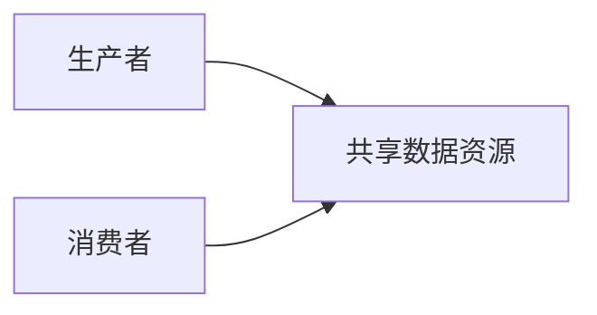

[TOC]


# Java黑马20

## JavaSE基础

### 快捷键

查看类的结构：Alt+7

自动补全：ctrl+alt+v

自动添加构造器：alt+insert

### 常用API

#### 日期类

##### Date类

- `public Date()`：无参构造方法

分配一个Date对象，并初始化，以便它代表它被分配的时间，精确到毫秒

``` java
Date d=new Date();
System.out.println(d);//输出Sun Aug 09 09:29:39 CST 2020，说明println中的toStirng被重写了
```

- `public Date(long date)`：无参构造方法

分配一个Date对象，并将其初始化为表示从标准基准时间起指定的毫秒数

``` java
Date d=new Date(1000*60*60);//基准时间后一个小时
System.out.println(d);//输出Thu Jan 01 09:00:00 CST 1970，因为时区的原因所以是09点而不是01点
```

- `public long getTime()`：获取的是日期对象从1970年1月1日00:00:00到现在的毫秒值。

``` java
//创建一个日期类对象
Date d=new Date();
//getTime输出的是毫秒值，通过运算处理输出当前时间距离1970年的年数
System.out.println(d.getTime()*1.0/1000/60/60/24/365+"years");
```

- `public void setTime(long time)`：将时间设置为1970年1月1日00:00:00加上给定的毫秒值后的时间

``` java
Date d=new Date();
long time1=1000*60*60;
d.setTime(time1);
System.out.println(d);//Thu Jan 01 09:00:00 CST 1970,because of the timezone
long time2=System.currentTimeMillis();//get current time presented by millis
d.setTime(time2);
System.out.println(d);//Tue Jun 30 16:09:39 CST 2020 output the current time, because d was set to currentTimeMillis
```

##### SimpleDateFormat类

是一个具体的类，可以以区域设置敏感的方式**格式化和解析日期**

日期和时间格式又日期和时间模式字符串指定，在日期和时间模式字符串中，从‘A’到‘Z’以及从‘a’到‘z’引号的字母被解释为表示日期或时间字符串的组件的模式字母。

- `public SimpleDateFormat()：`无参构造方法，构造一个`SimpleDateFormat`，使用默认模式和日期格式
- `public SimpleDateFormat(String pattern)`：有参构造方法，构造一个`SimpleDateFormat`，使用给定的模式和默认的日期格式
- `public final String format(Date date)`：格式化方法，将日期格式化成日期/时间字符串，从**Date到String**

``` java
Date d=new Date();

//无参构造方法得到模式化字符串
SimpleDateFormat sdf1=new SimpleDateFormat();
String s1=sdf1.format(d);
System.out.println(s1);//输出2020/5/6 上午10:59

//有参构造方法得到的自定义格式的模式化字符串
SimpleDateFormat sdf2=new SimpleDateFormat("yyyy年MM月dd日 HH:mm:ss");
String s2=sdf2.format(d);
System.out.println(s2);//输出2020年05月06日 10:59:45
```

- `public Date parse(String source)`：解析方法，从给定字符串的开始解析文本以生成日期，从**String到Date**

``` java
public static void main(String[] args) throws ParseException //必须要抛出异常
{
    String s="2048-08-09 11:11:11";
    SimpleDateFormat sdf=new SimpleDateFormat("yyyy-MM-dd HH:mm:ss");//sdf中的格式如果匹配了字符串s，则通过parse解析为原始的Date对象
    Date d=sdf.parse(s);
    System.out.println(d);//输出Sun Aug 09 11:11:11 CST 2048
}
```

##### 案例：日期工具类

``` java
//日期工具类
public class DateUtils {
    private DateUtils() {}
    /*
        把日期转为指定格式的字符串
        返回值类型：String
        参数：Date date, String format
     */
    public static String dateToString(Date date, String format) {
        SimpleDateFormat sdf = new SimpleDateFormat(format);
        String s = sdf.format(date);
        return s;
    }
    /*
        把字符串解析为指定格式的日期
        返回值类型：Date
        参数：String s, String format
     */
    public static Date stringToDate(String s, String format) throws ParseException {
        SimpleDateFormat sdf = new SimpleDateFormat(format);
        Date d = sdf.parse(s);
        return d;
    }
}
//测试类
public class DateDemo {
    public static void main(String[] args) throws ParseException {
        //创建日期对象
        Date d = new Date();

        String s1 = DateUtils.dateToString(d, "yyyy年MM月dd日 HH:mm:ss");
        System.out.println(s1);

        String s2 = DateUtils.dateToString(d, "yyyy年MM月dd日");
        System.out.println(s2);

        String s3 = DateUtils.dateToString(d, "HH:mm:ss");
        System.out.println(s3);
        System.out.println("--------");

        String s = "2048-08-09 12:12:12";
        Date dd = DateUtils.stringToDate(s, "yyyy-MM-dd HH:mm:ss");
        System.out.println(dd);
    }
}
```

##### Calendar类   

`Calendar`类为某一时刻和一组日历字段之间的转换提供了一些方法，并位操作日历字段提供了一些方法

`Calendar`提供了一个类方法`getInstance`用于获取`Calendar`对象，其日历字段已使用当前日期和时间初始化：

`Calendar rightNow= Calendar. getinstance();`

- `public int get(int field)`：返回给定日历字段的值

``` java
//用当前日期和时间初始化由getInstance得到的Calendar对象
Calendar c = Calendar.getInstance();
System.out.println(c);
//获取Calendar对象的年月日值
int year = c.get(Calendar.YEAR);
int month = c.get(Calendar.MONTH)+1;//MONTH从0开始，所以加1
int date = c.get(Calendar.DATE);
System.out.println(year + "年" + month + "月" + date + "日");//输出2020年5月30日
```

- `public abstract void add(int field,int amount)`：根据日历的规则，将指定的时间量添加或减去给定的日历字段

``` java
Calendar c=Calendar.getInstance();
//10年后的5天前
c.add(Calendar.YEAR,10);
c.add(Calendar.DATE,-5);
//获取Calendar对象的年月日值
int year = c.get(Calendar.YEAR);
int month = c.get(Calendar.MONTH)+1;//MONTH从0开始，所以加1
int date = c.get(Calendar.DATE);
System.out.println(year + "年" + month + "月" + date + "日");//输出2030年6月25日
```

- `public final void set(int year,int month,int date)`：设置当前日历的年月日

``` java
c.set(2048, 12, 11);
int year = c.get(Calendar.YEAR);
int month = c.get(Calendar.MONTH) + 1;
int date = c.get(Calendar.DATE);
System.out.println(year + "年" + month + "月" + date + "日");//输出2049年1月11日
```

##### 案例：二月天

获取任意一年的二月有多少天

``` java
//键盘录入任意的年份
Scanner sc = new Scanner(System.in);
System.out.println("请输入年：");
int year = sc.nextInt();

//设置日历对象的年、月、日
Calendar c = Calendar.getInstance();
c.set(year, 2, 1);

//3月1日往前推一天，就是2月的最后一天
c.add(Calendar.DATE, -1);

//获取这一天输出即可
int date = c.get(Calendar.DATE);
System.out.println(year + "年的2月份有" + date + "天");

```

### 异常

#### JVM的默认处理方案

如果程序出现了问题，我们没有做任何处理，最终JVM会做默认的处理：

1. 把异常的名称，异常原因及异常出现的位置等信息输出在了控制台
2. 程序停止执行

#### 异常处理

如果程序出现了问题，我们需要自己来处理，有两种方案

+ `try ... catch ...`
+ `throws`

##### try ... catch ...

格式：

``` java
try{
    可能出现异常的代码;
}catch(异常类名 变量名){
    异常处理代码;
}
```

**执行流程：**

1. 程序从try里面的代码开始执行
2. 出现异常，会自动生成一个异常类对象，该异常对象将被提交给Java运行时系统
3. 当Java运行时系统接收到异常对象时，会到catch中去找匹配的异常类，找到后进行异常的处理执行完毕之后，程序还可以继续往下执行

``` java
public static void main(String[] args) {
    System.out.println("开始");
    method();
    System.out.println("结束");
}

public static void method() {
    try {
        int[] arr = {1, 2, 3};
        System.out.println(arr[3]);
        System.out.println("这里能够访问到吗");
    } catch (ArrayIndexOutOfBoundsException e) {
        //System.out.println("你访问的数组索引不存在，请回去修改为正确的索引");
        e.printStackTrace();
    }
}

```

##### Throwable的成员方法

- `public String getMessage()`：返回此throwable的详细消息字符串

``` java
try{
    ...
}catch (ArrayIndexOutOfBoundsException e){
    System.out.println(e.getMessage());
	//输出Index 3 out of bounds for length 3
}
```

- `public String toString()`：返回此可抛出的简短描述

``` java
try{
    ...
}catch (ArrayIndexOutOfBoundsException e){
    System.out.println(e.toString());   	//输出java.lang.ArrayIndexOutOfBoundsException: Index 3 out of bounds for length 3
}
```

- `public void printStackTrace()`：把异常的错误信息输出在控制台上

``` java
try{
    ...
}catch (ArrayIndexOutOfBoundsException e){
    e.printStackTrace();
  /*输出java.lang.ArrayIndexOutOfBoundsException: Index 3 out of bounds for length 3
  at com.itheima_02.ExceptionDemo02.method(ExceptionDemo02.java:18)
  at com.itheima_02.ExceptionDemo02.main(ExceptionDemo02.java:11)*/

}
```

##### 编译时异常和运行时异常的区别

`Java`中的异常被分为两大类：**编译时异常**和**运行时异常**，也被称为**受检异常**和**非受检异常**

所有的`RuntimeException`类及其子类被称为运行时异常，其他的异常都是编译时异常

**编译时异常**：必须显示处理，否则程序就会发生错淏，无法通过编译

``` java
//编译时异常
public static void method2() {
    try {
        String s = "2048-08-09";
        SimpleDateFormat sdf = new SimpleDateFormat("yyyy-MM-dd");
        Date d = sdf.parse(s);//可以正常运行，但是必须要用先处理异常，只是系统提示可能会出错，所以需要处理
        System.out.println(d);
    } catch (ParseException e) {
        e.printStackTrace();
    }
}
```

**运行时异常**：无需显示处理，也可以和编译时异常样处理

``` java
//运行时异常
public static void method() {
    try {
        int[] arr = {1, 2, 3};
        System.out.println(arr[3]);//不用try...catch处理也能通过编译，但是运行时会出错
    } catch (ArrayIndexOutOfBoundsException e) {
        e.printStackTrace();
    }
}
```

##### 异常处理之throws

虽然我们通过`try...catch...`可以对异常进行处理，但是并不是所有的情况我们都有权限进行异常的处理，也就是说，有些时候可能出现的异常是我们处理不了的，这个时候该怎么办呢？
针对这种情况，Java提供了`throws`的处理方案

格式：

`throws 异常类名`

**注意：这个格式是跟在方法的括号后面的**

- 编译时异常必须要进行处理，两种处理方案：try...catch...或者throws，如果采用throws这种方案，将来谁调用谁处理

  ``` java
  //编译时异常虽然可以抛出，但是还是要用try catch处理
  try {
          method2();
  }catch (ParseException e) {
          e.printStackTrace();
      }
      System.out.println("结束");
  }
  
  //编译时异常
  public static void method2() throws ParseException {
      String s = "2048-08-09";
      SimpleDateFormat sdf = new SimpleDateFormat("yyyy-MM-dd");
      Date d = sdf.parse(s);
      System.out.println(d);
  }
  
  ```

- 运行时异常可以不处理，出现问题后，需要我们回来修改代码

  ``` java
  //运行时异常
  public static void method() throws ArrayIndexOutOfBoundsException {
      int[] arr = {1, 2, 3};
      System.out.println(arr[3]);
  }
  
  ```

##### 自定义异常

  格式：

``` java
public class 异常类名 extends Exception{
    无参构造
    带参构造
}
```

范例：

``` java
public class Teacher {
    //用throws并不代表方法体一定会出现异常
    public void checkScore(int score) throws ScoreException {
        if(score<0 || score>100) {
            //用throw表明一定抛出了某种异常
			//throw new ScoreException();
            //因为ScoreException直接继承自Exception，表示编译时异常，因此方法名后需要用throws抛出
            throw new ScoreException("你给的分数有误，分数应该在0-100之间");
        } else {
            System.out.println("成绩正常");
        }
    }
}
//直接继承自Exception就是checked exception，继承自RuntimeException就是runtime的exception
public class ScoreException extends Exception {
    public ScoreException() {}
    public ScoreException(String message) {
        super(message);
    }
}
public class Demo {
    public static void main(String[] args) {
        Scanner sc = new Scanner(System.in);
        System.out.println("请输入分数：");

        int score = sc.nextInt();

        Teacher t = new Teacher();
        try {
            t.checkScore(score);
        } catch (ScoreException e) {
            e.printStackTrace();
        }
    }
}
```

##### throws和throw的区别

**throws**

- 用在**方法声明后面**，跟的是**异常类名**
- 表示抛出异常，由该**方法的调用者来处理**
- 表示出现异常的一种可能性，并不一定会发生这些异常

**throw**

- 用在**方法体内**，跟的是**异常对象名**
- 表示抛出异常，由**方法体内的语句处理**
- 执行`throw`一定抛出了某种异常

### 集合

集合类的特点：提供一种**存储空间可变**的存储模型，存储的数据容量可以随时发生改变


#### Collection

##### Collection集合概述：

- 是单例集合的顶层接口，它表示一组对象，这些对象也称为Collection的元素
- JDK不提供此接口的任何直接实现，它提供更具体的子接口（如Set和List）实现

创建`Collection`集合的对象：

- 多态的方式
- 具体的实现类ArrayList

``` java
Collection<String> c=new ArrayList<String>();
c.add("hello");
c.add("world");
System.out.println(c);//输出[hello, world]，重写了toString方法
```

##### Collection集合的常用方法

- `boolean add(E e)`——添加元素

``` java
Collection<String> c = new ArrayList<String>();
//调用add方法永远都是返回true
c.add("hello");
c.add("world");
c.add("java");
System.out.println(c);
```

- `boolean remove(Object o)`：从集合中移除指定的元素

- `void clear()`：清空集合中的元素

- `boolean contains(Object o)`：判断集合中是否存在指定的元素

- `boolean isEmpty()`：判断集合是否为空

- `int size()`：集合的长度，也就是集合中元素的个数

##### Collection的遍历

`Iterator`：迭代器，集合的专用遍历方法

`Iterator<E> iterator()`：返回此集合中元素的迭代器，通过集合的`iterator()`方法得到

迭代器是通过集合的`iterator()`方法得到的，所以我们说它是依赖于集合而存在的

`iterator`中的常用方法：

- `E next()`：返回迭代中的下一个元素
- `boolean hasNext()`：如果迭代具有更多元素，则返回`true`

  ``` java
//通过多态的方法得到的interator对象
Iterator<String> it = c.iterator();
while(it.hasNext()){
    //System.out.println(it.next());
    String s=it.next();
    System.out.println(s);
}
  ```

##### 集合的使用步骤


##### 案例：Collection集合存储学生对象并存储

需求：创建一个存储学生对象的集合，存储3个学生对象，使用程序实现在控制台遍历该集合

``` java
//创建Collection集合对象
Collection<Student> c = new ArrayList<Student>();

//创建学生对象
Student s1 = new Student("林青霞", 30);
Student s2 = new Student("张曼玉", 35);
Student s3 = new Student("王祖贤", 33);

//把学生添加到集合
c.add(s1);
c.add(s2);
c.add(s3);

//遍历集合(迭代器方式)
Iterator<Student> it = c.iterator();
while (it.hasNext()) {
    Student s = it.next();
    System.out.println(s.getName() + "," + s.getAge());
}

```

#### List集合

**List集合概述**

- 有序集合（也称为序列），用户可以精确控制列表中每个元素的插入位置。用户可以通过整数索引访问元素，并搜索列表中的元素
- 与Set集合不同，列表通常允许重复的元素

**List集合特点**

- 有序：存储和取出的元素顺序一致
- 可重复：存储的元素可以重复

``` java
//创建集合对象
List<String> list = new ArrayList<String>();

//添加元素
list.add("hello");
list.add("world");
list.add("java");
list.add("world");

//输出集合对象
  System.out.println(list);

//迭代器的方式遍历
Iterator<String> it = list.iterator();
while (it.hasNext()) {
    String s = it.next();
    System.out.println(s);
}
```

##### List集合特有的方法

- `void add(int index,E element)`：在此集合中的指定位置插入指定的元素
- `E remove(int index)`：删除指定索引处的元素，返回被删除的元素
- `E set(int index,E element)`：修改指定索引处的元素，返回被修改的元素
- `E get(int index)`：返回指定索引处的元素

``` java
//通过list的size()和get()方法来遍历集合元素
for(int i=0; i<list.size(); i++) {
    String s = list.get(i);
    if(s.equals("world")) {
        list.add("javaee");
    }
}
```

##### 并发修改异常

`ConcurrentModification Exception`

``` java
Iterator<String> it = list.iterator();
while (it.hasNext()) {
    String s = it.next();
    if(s.equals("world")) {
        list.add("javaee");
    }
}
//抛出ConcurrentModification异常
```

**产生原因：**迭代器遍历的过程中，通过集合对象修改了集合中元素的长度，造成了迭代器获取元素中判断预期修改值和实际修改值不一致

``` JAVA
//并发修改异常的源码分析
public interface List<E> {
    Iterator<E> iterator();
    boolean add(E e);
}

public abstract class AbstractList<E> {
    protected int modCount = 0;
}
//ArrayList实现了List接口，所以要重写List接口中的add()方法和iterator()方法
public class ArrayList<E> extends AbstractList<E> implements List<E> {
//ArrayList中的get方法没有对modCount进行判断
    public E get(int index) {
        Objects.checkIndex(index, size);
        return elementData(index);
    }
//add方法对modCount进行了加一操作
    public boolean add(E e) {
        modCount++;
        add(e, elementData, size);
        return true;
    }

    public Iterator<E> iterator() {
        return new Itr();
    }

    private class Itr implements Iterator<E> {
        int expectedModCount = modCount;
        /*
            modCount:实际修改集合的次数
            expectedModCount:预期修改集合的次数
        */
//next方法调用了checkForComodification方法
        public E next() {
            checkForComodification();
            int i = cursor;
            if (i >= size)
                throw new NoSuchElementException();
            Object[] elementData = ArrayList.this.elementData;
            if (i >= elementData.length)
                throw new ConcurrentModificationException();
            cursor = i + 1;
            return (E) elementData[lastRet = i];
        }
//checkForComodification方法对modCount进行了判断，因为add对modCount进行了加一操作，所以造成modCount和expectedModCount不一致，故抛出异常
        final void checkForComodification() {
            if (modCount != expectedModCount)
                throw new ConcurrentModificationException();
        }
    }

}
```

**解决方案：**

用for循环遍历，然后用集合对象做对应的操作即可

##### Listlterator列表迭代器

- 通过List集合的listliterator()方法得到，所以说它是List集合特有的迭代器
- 用于允许程序员沿任一方向遍历列表的列表迭代器，在迭代期间修改列表，并获取列表中迭代器的当前位置

##### Listlterator中的常用方法

- `E next()`：返回迭代中的下一个元素
- `boolean hasNext()`：如果迭代具有更多元素，则返回`true`
- `E previous()`：返回列表中的上一个元素
- `boolean hasPrevious()`：如果此列表迭代器在相反方向遍历列表时具有更多元素，则返回`true`

``` java
ListIterator<String> lit = list.listIterator();
向前遍历列表
while (lit.hasPrevious()) {
    String s = lit.previous();
    System.out.println(s );
}
```

- `void add(E e)`：将指定的元素插入列表

``` java
//通过列表迭代器遍历时修改元素不会抛出异常
List<String> list = new ArrayList<String>();
...
<String> lit = list.listIterator();
while (lit.hasNext()) {
    String s = lit.next();
    if(s.equals("world")) {
        lit.add("javaee");
    }
}
```

``` java
//ListIterator源码分析
public interface List<E> {
    Iterator<E> iterator();
    ListIterator<E> listIterator();
}

public abstract class AbstractList<E> {
    protected int modCount = 0;
}

public class ArrayList<E> extends AbstractList<E> implements List<E> {
    public Iterator<E> iterator() {
        return new Itr();
    }

    private class Itr implements Iterator<E> {
        ...
    }

    public ListIterator<E> listIterator() {
        return new ListItr(0);
    }

    private class ListItr extends Itr implements ListIterator<E> {
        public void add(E e) {
            checkForComodification();

            try {
                int i = cursor;
                ArrayList.this.add(i, e);
                cursor = i + 1;
                lastRet = -1;
                //异常处理中将modCount赋值给了expectedModCount，两者相等了
                expectedModCount = modCount;
            } catch (IndexOutOfBoundsException ex) {
                throw new ConcurrentModificationException();
            }
        }
    }
}
```

##### 增强for循环

增强for：简化数组和`Collection`集合的遍历

- 实现`Iterable`接口的类允许其对象成为增强型for语句的目标
- 它是JDK5之后出现的，其内部原理是—个`Iterator`迭代器

###### 增强for的格式：

```java
for(元素数据类型 变量名:数组或者 Collection集合){
	//在此处使用变量即可，该变量就是元素
}
```

范例：

```java
int arr={1,2,3,4,5};
for(int i:arr){
    System.out.println(i);
}
```

``` java
int[] arr = {1,2,3,4,5};
for(int i : arr) {
    System.out.println(i);
}
System.out.println("--------");

String[] strArray = {"hello","world","java"};
for(String s : strArray) {
    System.out.println(s);
}
System.out.println("--------");

List<String> list = new ArrayList<String>();
list.add("hello");
list.add("world");
list.add("java");

for(String s : list) {
    System.out.println(s);
}
System.out.println("--------");

//如何验证增强for内部原理是一个Iterator迭代器
/*如果抛出异常说明内部是一个Iterator迭代器
for(String s : list) {
    if(s.equals("world")) {
        list.add("javaee"); //ConcurrentModificationException
    }
}
*/
```

##### List集合子类特点

List集合常用子类：`ArrayList`, `LinkedList`

- `ArrayList`：底层数据结构是**数组**，查询快，增删慢
- `LinkedList`：底层数据结构是**链表**，查询慢，增删快

##### LinkedList集合的特有功能

- `public void addFirst(E e)`：在该列表开头插入指定的元素
- `public void addLast(E e)`：将指定的元素追加到此列表的未尾
- `public E getFirst()`：返回此列表中的第一个元素
- `public E getLastO()`：返回此列表中的最后个元素
- `public E removeFirst()`：从此列表中删除并返回第一个元素
- `public E removeLast()`：从此列表中删除并返回最后一个元素

#### Set集合

##### Set集合特点

- 不包含重复元素的集合
- 没有带索引的方法，所以不能使用普通for循环遍历

Set接口实现Collection接口，`HashSet`和`TreeSet`是Set接口的具体实现类，所以可以用HashSet来实例化Set集合建立Set对象：`Set<E> set=new HashSet<E>();`

`HashSet`对集合的迭代顺序不做任何保证

###### Set集合存储字符串并遍历

``` java
//创建集合对象
Set<String> set = new HashSet<String>();

//添加元素
set.add("hello");
set.add("world");
set.add("java");
//不包含重复元素的集合
set.add("world");

//遍历
for(String s : set) {
    System.out.println(s);
}//HashSet对集合的迭代顺序不作任何保证，所以不是按添加顺序输出的
```

##### 哈希值

哈希值是JDK根据对象的**地址**或者**字符串**或者**数字**算岀来的int类型的**数值**

`Object`类中有一个方法可以获取对象的哈希值

- `public int hashCode()`：返回对象的哈希码值

###### 对象的哈希值特点

- 同一个对象多次调用`hashCode()`方法返回的哈希值是相同的
- 默认情况下，不同对象的哈希值是不同的。而重写`hashCode()`方法，可以实现让不同对象的哈希值相同

``` java
//创建学生对象
Student s1 = new Student("林青霞",30);

//同一个对象多次调用hashCode()方法返回的哈希值是相同的
System.out.println(s1.hashCode()); //1060830840
System.out.println(s1.hashCode()); //1060830840
System.out.println("--------");

Student s2 = new Student("林青霞",30);

//默认情况下，不同对象的哈希值是不相同的
//通过方法重写，可以实现不同对象的哈希值是相同的
System.out.println(s2.hashCode()); //2137211482
System.out.println("--------");

System.out.println("hello".hashCode()); //99162322
System.out.println("world".hashCode()); //113318802
System.out.println("java".hashCode()); //3254818

System.out.println("world".hashCode()); //113318802
System.out.println("--------");

System.out.println("重地".hashCode()); //1179395
System.out.println("通话".hashCode()); //1179395
```

##### HashSet集合概述和特点

###### HashSet集合特点：

- 底层数据结构是哈希表
- 对集合的迭代顺序不作任何保证，也就是说不保证存储和取出的元素顺序一致
- 没有带索引的方法，所以不能使用普通for循环遍历
- 由于是Set集合，所以是不包含重复元素的集合

###### HashSet存储字符串并遍历

``` java
//创建集合对象
HashSet<String> set = new HashSet<String>();

//添加元素
set.add("hello");
set.add("world");
set.add("java");
//不包含重复元素的集合
set.add("world");

//遍历
for(String s : set) {
    System.out.println(s);
}//HashSet对集合的迭代顺序不作任何保证，所以不是按添加顺序输出的
```

##### HashSet集合保证元素唯一性源码分析

HashSet集合添加一个元素的过程


``` java
//创建集合对象
HashSet<String> hs = new HashSet<String>();

//添加元素
hs.add("hello");
hs.add("world");
hs.add("java");
----------------------------------------------

public boolean add(E e) {
    return map.put(e, PRESENT)==null;
}

static final int hash(Object key) {
    int h;
    return (key == null) ? 0 : (h = key.hashCode()) ^ (h >>> 16);
}

public V put(K key, V value) {
    return putVal(hash(key), key, value, false, true);
}

//hash值和元素的hashCode()方法相关
final V putVal(int hash, K key, V value, boolean onlyIfAbsent,
                   boolean evict) {
    Node<K,V>[] tab; Node<K,V> p; int n, i;

    //如果哈希表未初始化，就对其进行初始化
    if ((tab = table) == null || (n = tab.length) == 0)
        n = (tab = resize()).length;

    //根据对象的哈希值计算对象的存储位置，如果该位置没有元素，就存储元素
    if ((p = tab[i = (n - 1) & hash]) == null)
        tab[i] = newNode(hash, key, value, null);
    else {
        Node<K,V> e; K k;
        /*
            存入的元素和以前的元素比较哈希值
                如果哈希值不同，会继续向下执行，把元素添加到集合
                如果哈希值相同，会调用对象的equals()方法比较
                    如果返回false，会继续向下执行，把元素添加到集合
                    如果返回true，说明元素重复，不存储
        */
        if (p.hash == hash &&
            ((k = p.key) == key || (key != null && key.equals(k))))
            e = p;
        else if (p instanceof TreeNode)
            e = ((TreeNode<K,V>)p).putTreeVal(this, tab, hash, key, value);
        else {
            for (int binCount = 0; ; ++binCount) {
                if ((e = p.next) == null) {
                    p.next = newNode(hash, key, value, null);
                    if (binCount >= TREEIFY_THRESHOLD - 1) // -1 for 1st
                        treeifyBin(tab, hash);
                    break;
                }
                if (e.hash == hash &&
                    ((k = e.key) == key || (key != null && key.equals(k))))
                    break;
                p = e;
            }
        }
        if (e != null) { // existing mapping for key
            V oldValue = e.value;
            if (!onlyIfAbsent || oldValue == null)
                e.value = value;
            afterNodeAccess(e);
            return oldValue;
        }
    }
    ++modCount;
    if (++size > threshold)
        resize();
    afterNodeInsertion(evict);
    return null;
}
```

Hash集合存储元素：

要保证元素唯一性，需要重写`hashCode()`和`equals()`

重写操作：按住`alt`+`insert`选择`equals`和`hashCode`选择默认的

##### 常见数据结构之哈希表


##### 案例：HashSet集合存储学生对象并遍历

需求：创建一个存储学生对象的集合，存储多个学生对象，使用程序实现在控制台遍历该集合

要求：学生对象的成员变量值相同，我们就认为是同一个对象

思路：

1. 定义学生类
2. 创建 HashSet集合对象
3. 创建学生对象
4. 把学生添加到集合
5. 遍历集合（增强for）
6. 在学生类中重写两个方法

``` java
//创建HashSet集合对象
HashSet<Student> hs = new HashSet<Student>();

//创建学生对象
Student s1 = new Student("林青霞", 30);
Student s2 = new Student("张曼玉", 35);
Student s3 = new Student("王祖贤", 33);

Student s4 = new Student("王祖贤", 33);

//把学生添加到集合
hs.add(s1);
hs.add(s2);
hs.add(s3);
hs.add(s4);

//遍历集合(增强for)
for (Student s : hs) {
    System.out.println(s.getName() + "," + s.getAge());
}
/*为了保证hashSet不存储重复对象，需要在Student类中重写equals和hashCode两个方法。
IDEA中快捷操作：
alt+insert，选择equals和hashCode然后一直next最后finish
*/
@Override
public boolean equals(Object o) {
    if (this == o) return true;
    if (o == null || getClass() != o.getClass()) return false;

    Student student = (Student) o;

    if (age != student.age) return false;
    return name != null ? name.equals(student.name) : student.name == null;
}

@Override
public int hashCode() {
    int result = name != null ? name.hashCode() : 0;
    result = 31 * result + age;
    return result;
}
```

##### LinkedHashSet集合概述和特点

###### LinkedHashSet集合特点：

- 哈希表和链表实现的Set接口，具有可预测的迭代次序
- 由链表保证元素有序，也就是说元素的存和取出顺序是一致的
- 由哈希表保证元素唯一，也就是说没有重复的元素

``` java
//创建集合对象
LinkedHashSet<String> linkedHashSet = new LinkedHashSet<String>();

//添加元素
linkedHashSet.add("hello");
linkedHashSet.add("world");
linkedHashSet.add("java");
linkedHashSet.add("world");

//遍历集合
for(String s : linkedHashSet) {
    System.out.println(s);
}
```

##### TreeSet集合概述和特点

###### <a name="jump">TreeSet集合特点</a>

- 元素有序，这里的顺序不是指存储和取出的顺序，而是按照一定的规则进行排序，具体排序方式取决于构造方法：
  - `TreeSet()`：根据其元素的**自然排序Comparable**进行排序
  - `TreeSet(Comparator comparator)`：根据指定的**比较器Comparator**进行排序
- 没有带索引的方法，所以不能使用普通for循环遍历
- 由于是Set集合，所以不包含重复元素的集合

``` java
//创建集合对象，不能存储int，因为集合里面只能存储引用类型，所以基本类型存储的时候要用其包装类型
TreeSet<Integer> ts = new TreeSet<Integer>();

//添加元素
ts.add(10);
ts.add(40);
ts.add(30);
ts.add(50);
ts.add(20);

ts.add(30);//不包含重复元素

//遍历集合，输出自然排序，即10，20，30，40，50
for(Integer i : ts) {
    System.out.println(i);
}
```

###### 自然排序Comparable的使用

- 用`TreeSet`集合存储自定义对象，无参构造方法使用的是自然排序对元素进行排序的
- 自然排序，就是让元素所属的类实现`Comparable`接口，重写 `comparTo(T o)`方法
- 重写方法时，一定要注意排序规则必须按照要求的主要条件和次要条件来写

存储学生对象并遍历，创建TreeSet集合使用无参构造方法

要求：按照年龄从小到大排序，年龄相同时，按照姓名的字母顺序排序

``` java
/*Comparable<T>接口对实现它的每个类的对象强加一个整体排序，这个排序被称为类的自然排序，类的compareTo方法被称为其自然比较方法*/
public class Student implements Comparable<Student> {
    private String name;
    private int age;

    public Student() {
    }

    public Student(String name, int age) {
        this.name = name;
        this.age = age;
    }

    public String getName() {
        return name;
    }

    public void setName(String name) {
        this.name = name;
    }

    public int getAge() {
        return age;
    }

    public void setAge(int age) {
        this.age = age;
    }
/*Student类实现了Comparable接口，所以要重写compareTo方法来实现整体排序*/
    @Override
    public int compareTo(Student s) {
//        return 0;
//        return 1;正序
//        return -1;倒序
        //按照年龄从小到大排序
       int num = this.age - s.age;
//        int num = s.age - this.age;
        //年龄相同时，按照姓名的字母顺序排序，字符串已经实现了自然排序，所以可以调用compareTo方法
       int num2 = num==0?this.name.compareTo(s.name):num;
        return num2;
    }
}
//创建集合对象
TreeSet<Student> ts = new TreeSet<Student>();

//创建学生对象
Student s1 = new Student("xishi", 29);
Student s2 = new Student("wangzhaojun", 28);
Student s3 = new Student("diaochan", 30);
Student s4 = new Student("yangyuhuan", 33);

Student s5 = new Student("linqingxia",33);
Student s6 = new Student("linqingxia",33);

//把学生添加到集合
ts.add(s1);
ts.add(s2);
ts.add(s3);
ts.add(s4);
ts.add(s5);
ts.add(s6);

//遍历集合
for (Student s : ts) {
    System.out.println(s.getName() + "," + s.getAge());
}
```

###### <a name="比较器排序">比较器排序</a>Comparator的使用

- 用`TreeSet`集合存储自定义对象，带参构造方法使用的是比较器排序对元素进行排序的
- 比较器排序，就是让集合构造方法接受`Comparator`的实现类对象，重写`compare(To1，To2)`方法
- 重写方法时，一定要注意排序规则必须按照要求的主要条件和次要条件来写

``` java
/*创建集合对象，比较器排序中TreeSet要的是Comparator接口的实现类对象，我们可以写一个类去实现Comparator，但也可以通过匿名内部类的方式*/
TreeSet<Student> ts = new TreeSet<Student>(new Comparator<Student>() {
    @Override
    public int compare(Student s1, Student s2) {
        //this.age - s.age
        //s1,s2
        int num = s1.getAge() - s2.getAge();
        int num2 = num == 0 ? s1.getName().compareTo(s2.getName()) : num;
        return num2;
    }
});

//创建学生对象
Student s1 = new Student("xishi", 29);
Student s2 = new Student("wangzhaojun", 28);
Student s3 = new Student("diaochan", 30);
Student s4 = new Student("yangyuhuan", 33);

Student s5 = new Student("linqingxia",33);
Student s6 = new Student("linqingxia",33);

//把学生添加到集合
ts.add(s1);
ts.add(s2);
ts.add(s3);
ts.add(s4);
ts.add(s5);
ts.add(s6);

//遍历集合
for (Student s : ts) {
    System.out.println(s.getName() + "," + s.getAge());
}
```

###### 案例：不重复的随机数

需求：编写一个程序，获取10个1-20之间的随机数，要求随机数不能重复，并在控制台输出

``` java
//创建Set集合对象
//Set<Integer> set = new HashSet<Integer>();
Set<Integer> set = new TreeSet<Integer>();

//创建随机数对象
Random r = new Random();

//判断集合的长度是不是小于10
while (set.size()<10) {
    //产生一个随机数，添加到集合
    int number = r.nextInt(20) + 1;
    set.add(number);
}

//遍历集合
for(Integer i : set) {
    System.out.println(i);
}
```

#### 泛型

##### 泛型概述

- 是JDK5中引入的特性，它提供了编译时类型安全检测机制，该机制允许在编译时检测到非法的类型
- 它的本质是参数化类型，也就是说所操作的数据类型被指定为一个参数
- 一提到参数，最熟悉的就是定义方法时有形参，然后调用此方法时传递实参。那么参数化类型怎么理解呢？
- 顾名思义，就是将类型由原来的具体的类型参数化，然后在使用/调用时传入具体的类型这种参数类型可以用在类、方法和接口中，分别被称为泛型类、泛型方法、泛型接口

##### 泛型定义格式：

- <类型>：指定一种类型的格式。这里的类型可以看成是形参
- <类型1，类型2…>：指定多种类型的格式，多种类型之问用逗号隔开。这里的类型可以看成是形参
- 将来具体调用时候给定的类型可以看成是实参，并且实参的类型只能是**引用数据类型**

##### 泛型的好处
- 把运行时期的问题提前到了编译期间
- 避免了强制类型转换

``` java
//没有用泛型创建集合对象
Collection c = new ArrayList();
//添加元素
c.add("hello");
c.add("world");
c.add("java");
c.add(100);
//遍历集合
Iterator it = c.iterator();
while (it.hasNext()) {
    String s = (String)it.next();/*运行时会出现ClassCastException,Integer不能转换为String，不使用泛型就隐含了类型转换的异常*/
    System.out.println(s);
}

//使用了泛型创建集合对象
Collection<String> c = new ArrayList<String>();
//添加元素
c.add("hello");
c.add("world");
c.add("java");
c.add(100);//这一句在编译的时候就会提示错误
//遍历集合
Iterator<String> it = c.iterator();
while (it.hasNext()) {
    String s = it.next();//泛型中说明了String类型，因此不用再强制类型转换
    System.out.println(s);
}
```

##### 泛型类

###### 泛型类的定义格式

- 格式：`修饰符 class 类名 <类型> { }`
- 范例：`public class Generic<T>{ }`此处T可以随便写为任意标识，常见的如T、E、K、V等形式的参数常用于表示泛型

``` java
//定义泛型类
public class Generic<T> {
    private T t;

    public T getT() {
        return t;
    }

    public void setT(T t) {
        this.t = t;
    }
}
Generic<String> g1 = new Generic<String>();
g1.setT("林青霞");
System.out.println(g1.getT());

Generic<Integer> g2 = new Generic<Integer>();
g2.setT(30);
System.out.println(g2.getT());

Generic<Boolean> g3 = new Generic<Boolean>();
g3.setT(true);
System.out.println(g3.getT());
```

##### 泛型方法

格式：`修饰符 <类型> 返回值类型 方法名(类型变量名){ }`
范例：`public <T> void show(T t){ }`

``` java
/*方法重载
public class Generic {
    public void show(String s) {
        System.out.println(s);
    }

    public void show(Integer i) {
        System.out.println(i);
    }

    public void show(Boolean b) {
        System.out.println(b);
    }
}
*/

//泛型类改进
//public class Generic<T> {
//    public void show(T t) {
//        System.out.println(t);
//    }
//}
////用泛型类改进，但是<>中还是要标明对象类型
//Generic<String> g1 = new Generic<String>();
//g1.show("林青霞");
//
//Generic<Integer> g2 = new Generic<Integer>();
//g2.show(30);
//
//Generic<Boolean> g3 = new Generic<Boolean>();
//g3.show(true);

//泛型方法改进
public class Generic {
    public <T> void show(T t) {
        System.out.println(t);
    }
}
//可以不用<>中标明类型，直接用对象调用方法
Generic g = new Generic();
g.show("林青霞");
g.show(30);
g.show(true);
g.show(12.34);
```

##### 泛型接口

格式：`修饰符 interface 接口名 <类型> { }`
范例：`public interface Generic<T>{ }`

``` java
//定义泛型类接口
public interface Generic<T> {
    void show(T t);
}
//定义泛型类的实现类，类中重写show方法
public class GenericImpl<T> implements Generic<T> {
    @Override
    public void show(T t) {
        System.out.println(t);
    }
}
//创建泛型类接口的实现类对象
Generic<String> g1 = new GenericImpl<String>();
g1.show("林青霞");
Generic<Integer> g2 = new GenericImpl<Integer>();
g2.show(30);
```

##### 类型通配符

为了表示各种泛型List的父类，可以使用类型通配符

- 类型通配符：`<?>`
- `List<?>`：表示元素类型末知的List，它的元素可以匹配任何的类型
- 这种带通配符的`List`仅表它是各种泛型`List`的父类，并不能把元素添加到其中

如果说我们不希望`List<?>`是任何泛型`List`的父类，只希望它代表某一类泛型List的父类，可以使用类型通配符的上限

- 类型通配符上限：`<? extends 类型>`
- `List<? extends Number>`：它表示的类型是`Number`或者其子类型

除了可以指定类型通配符的上限，我们也可以指定类型通配符的下限

- 类型通配符下限：`<? super 类型>`
- `List<? super Number>`：它表示的类型是`Number`或者其父类型

``` java
//类型通配符：<?>
List<?> list1 = new ArrayList<Object>();
List<?> list2 = new ArrayList<Number>();
List<?> list3 = new ArrayList<Integer>();
System.out.println("--------");

//类型通配符上限：<? extends 类型>
List<? extends Number> list4 = new ArrayList<Object>();//上限是Number，所以Object报错
List<? extends Number> list5 = new ArrayList<Number>();
List<? extends Number> list6 = new ArrayList<Integer>();
System.out.println("--------");

//类型通配符下限：<? super 类型>
List<? super Number> list7 = new ArrayList<Object>();
List<? super Number> list8 = new ArrayList<Number>();
List<? super Number> list9 = new ArrayList<Integer>();//下限是Number，所以Integer报错
```

##### 可变参数

可变参数又称参数个数可变，用作方法的形参出现，那么方法参数个数就是可变的了

格式：`修饰符 返回值类型 方法名(数据类型…变量名){ }`

范例：`public static int sum(int...a){ }`

###### 可变参数注意事项：

- 这里的变量其实是一个数组
- 如果一个方法有多个参数，包含可变参数，可变参数要放在最后

``` java
public static void main(String[] args) {
    System.out.println(sum(10, 20));
    System.out.println(sum(10, 20, 30));
    System.out.println(sum(10, 20, 30, 40));

    System.out.println(sum(10,20,30,40,50));
    System.out.println(sum(10,20,30,40,50,60));
    System.out.println(sum(10,20,30,40,50,60,70));
    System.out.println(sum(10,20,30,40,50,60,70,80,90,100));

}
//多个参数时，可变参数要放在最后
//public static int sum(int b,int... a) {
//    return 0;
//}

  public static int sum(int... a) {
//      System.out.println(a);
//      return 0;
      int sum = 0;

      for(int i : a) {
          sum += i;
      }

      return sum;
  }

//public static int sum(int a, int b) {
//    return a + b;
//}
//
//public static int sum(int a, int b, int c) {
//    return a + b + c;
//}
//
//public static int sum(int a, int b, int c, int d) {
//    return a + b + c + d;
//}
```

##### 可变参数的使用

`Arrays`工具类中有一个**静态方法**：

- `public static <T> List<T> asList(T... a)`：返回由指定数组支持的固定大小的列表

- 返回的集合不能做增删操作，可以做修改操作

``` java
List<String> list = Arrays.asList("hello", "world", "java");
  list.add("javaee"); //UnsupportedOperationException
  list.remove("world"); //UnsupportedOperationException
list.set(1,"javaee");//可以修改

System.out.println(list);
```

`List`接口中有一个**静态方法**：

- `public static <E> List<E> of(E... elements)`：返回包含任意数量元素的不可变列表

- 返回的集合不能做增删改操作

``` java
List<String> list = List.of("hello", "world", "java", "world");
  list.add("javaee");//UnsupportedOperationException
  list.remove("java");//UnsupportedOperationException
  list.set(1,"javaee");//UnsupportedOperationException

System.out.println(list);
```

Set接口中有一个**静态方法**：

- `public static <E> Set<E> of(E... elements)` ：返回一个包含任意数量元素的不可变集合

- 在给元素的时候，不能给重复的元素
- 返回的集合不能做增删操作，没有修改的方法

``` java
/*Set<String> set = Set.of("hello", "world", "java","world"); //IllegalArgumentException,元素不能重复*/
Set<String> set = Set.of("hello", "world", "java");
set.add("javaee");//UnsupportedOperationException
set.remove("world");//UnsupportedOperationException
System.out.println(set);
```

#### Map

##### Map集合概述和使用

- `Interface Map<K,V>`	K：键的类型；V：值的类型

- 将键映射到值的对象；不能包含重复的键；每个键可以映射到最多一个值

- 举例：学生的学号和姓名

  - itheima001	林青霞
  - itheima002	张曼玉
  - itheima003	王祖贤

##### 创建Map集合的对象

- 多态的方式
- 具体的实现类`HashMap`

``` java
//创建集合对象
Map<String,String> map = new HashMap<String,String>();

//V put(K key, V value) 将指定的值与该映射中的指定键相关联
map.put("itheima001","林青霞");
map.put("itheima002","张曼玉");
map.put("itheima003","王祖贤");
map.put("itheima003","柳岩");
/*put第一次见到一个键是添加操作，第二次添加同一个键则是修改操作*/
//输出集合对象
System.out.println(map);
```

##### Map集合的基本功能

- `V put(K key,V value)`：添加元素

- `V remove(Objet key)`：根据键删除键值对应的元素

- `void clear()`：移除所有的键值对元素

- `boolean containsKey(object key)`：判断集合是否包含指定的键

- `boolean containsValue(Object value)`：判断集合是否包含指定的值

- `boolean isEmpty()`：判断集合是否为空

- `int size()`：集合的长度，也就是集合中键值对的个数

##### Map集合的获取功能

- `V get(Object key)`：根据键获取值
- `Set<K> keySet`()：获取所有键的集合

- `Collection<V> values()`：获取所有值的集合

- `Set<Map.Entry<K, V>> entry Set()`：获取所有键值对对象的集合

``` java
//创建集合对象
Map<String, String> map = new HashMap<String, String>();

//添加元素
map.put("张无忌", "赵敏");
map.put("郭靖", "黄蓉");
map.put("杨过", "小龙女");

//V get(Object key):根据键获取值
  System.out.println(map.get("张无忌"));
  System.out.println(map.get("张三丰"));

//Set<K> keySet():获取所有键的集合，因为键是不重复的，所以返回的是Set集合
  Set<String> keySet = map.keySet();
  for(String key : keySet) {
      System.out.println(key);
  }

//Collection<V> values():获取所有值的集合，因为值可能重复，所以返回的是Collection集合
Collection<String> values = map.values();
for(String value : values) {
    System.out.println(value);
}
```

##### Map集合的遍历(方式1)

我们刚才存储的元素都是成对出现的，所以我们把Map看成是—个夫妻对的集合

遍历思路：

- 把所有的丈夫给集中起来

- 遍历丈夫的集合，获取到每一个丈夫

- 根据丈夫去找对应的妻子

转换为Map集合中的操作

- 获取所有键的集合，用 keySet()方法实现

- 遍历键的集合，获取到每一个键。用增强for实现

- 根据键去找值。用get(Object key)方法实现

``` java
//创建集合对象
Map<String, String> map = new HashMap<String, String>();

//添加元素
map.put("张无忌", "赵敏");
map.put("郭靖", "黄蓉");
map.put("杨过", "小龙女");

//获取所有键的集合。用keySet()方法实现
Set<String> keySet = map.keySet();
//遍历键的集合，获取到每一个键。用增强for实现
for (String key : keySet) {
    //根据键去找值。用get(Object key)方法实现
    String value = map.get(key);
    System.out.println(key + "," + value);
}
```

##### Map集合的遍历(方式2)

我们刚才存储的元素都是成对出现的，所以我们把Map看成是一个夫妻对的集合

遍历思路

- 获取所有结婚证的集合

+ 遍历结婚证的集合，得到每一个结婚证

+ 根据结婚证获取丈夫和妻子

转换为Map集合中的操作

+ 获取所有键值对对象的集合
  + Set<Map.Entry<K,V>> entryset()：获取所有键值对对象的集合

+ 遍历键值对对象的集合，得到每一个键值对对象
  + 用增强for实现，得到每一个Map.Entry

+ 根据键值对对象获取键和值
  + 用getKey()得到键
  + 用getvalue()得到值

``` java
//创建集合对象
Map<String, String> map = new HashMap<String, String>();

//添加元素
map.put("张无忌", "赵敏");
map.put("郭靖", "黄蓉");
map.put("杨过", "小龙女");

//获取所有键值对对象的集合
Set<Map.Entry<String, String>> entrySet = map.entrySet();
//遍历键值对对象的集合，得到每一个键值对对象
for (Map.Entry<String, String> me : entrySet) {
    //根据键值对对象获取键和值
    String key = me.getKey();
    String value = me.getValue();
    System.out.println(key + "," + value);
}
```

##### 案例：HashMap集合存储学生对象并遍历

需求：创建一个HashMap集合，键是学号(String)，值是学生对象(Student)。存储三个键值对元素，并谝历

``` java
//创建HashMap集合对象
HashMap<String, Student> hm = new HashMap<String, Student>();

//创建学生对象
Student s1 = new Student("林青霞", 30);
Student s2 = new Student("张曼玉", 35);
Student s3 = new Student("王祖贤", 33);

//把学生添加到集合
hm.put("itheima001", s1);
hm.put("itheima002", s2);
hm.put("itheima003", s3);

//方式1：键找值
Set<String> keySet = hm.keySet();
for (String key : keySet) {
    Student value = hm.get(key);
    System.out.println(key + "," + value.getName() + "," + value.getAge());
}
System.out.println("--------");

//方式2：键值对对象找键和值
Set<Map.Entry<String, Student>> entrySet = hm.entrySet();
for (Map.Entry<String, Student> me : entrySet) {
    String key = me.getKey();
    Student value = me.getValue();
    System.out.println(key + "," + value.getName() + "," + value.getAge());
}
```

##### 案例：HashMap集合存储学生对象并遍历

需求：创建—个`HashMap`集合，键是学生对象(Student)，值是居住地(String)。存储多个键值对元素，并遍历。要求保证键的唯一性：**如果学生对象的成员变量值相同，我们就认为是同一个对象**

思路

- 定义学生类

- 创建HashMap集合对象创建学生对象

- 把学生添加到集合

- 遍历集合

- 在学生类中重写两个方法
  - `hash Code()` 
  - `equals()`

``` java
//在Student类中重写两个方法
@Override
public boolean equals(Object o) {
    if (this == o) return true;
    if (o == null || getClass() != o.getClass()) return false;

    Student student = (Student) o;

    if (age != student.age) return false;
    return name != null ? name.equals(student.name) : student.name == null;
}

@Override
public int hashCode() {
    int result = name != null ? name.hashCode() : 0;
    result = 31 * result + age;
    return result;
}

//创建HashMap集合对象
HashMap<Student, String> hm = new HashMap<Student, String>();

//创建学生对象
Student s1 = new Student("林青霞", 30);
Student s2 = new Student("张曼玉", 35);
Student s3 = new Student("王祖贤", 33);
Student s4 = new Student("王祖贤", 33);

//把学生添加到集合
hm.put(s1, "西安");
hm.put(s2, "武汉");
hm.put(s3, "郑州");
hm.put(s4, "北京");

//遍历集合
Set<Student> keySet = hm.keySet();
for (Student key : keySet) {
    String value = hm.get(key);
    System.out.println(key.getName() + "," + key.getAge() + "," + value);
}
```

##### 案例：Array List集合存储 

`HashMap`元素并遍历需求：创建一个 `ArrayList`集合，存储三个元素，每一个元素都是`HashMap`，每一个 `HashMap`的键和值都是`String`，并遍历

思路

1. 创建`ArrayList`集合
2. 创建`HashMap`集合，并添加键值对元素
3. 把`HashMap`作为元素添加到`ArrayList`集合
4. 遍历`ArrayList`集合

``` java
//创建ArrayList集合
ArrayList<HashMap<String, String>> array = new ArrayList<HashMap<String, String>>();

//创建HashMap集合，并添加键值对元素
HashMap<String, String> hm1 = new HashMap<String, String>();
hm1.put("孙策", "大乔");
hm1.put("周瑜", "小乔");
//把HashMap作为元素添加到ArrayList集合
array.add(hm1);

HashMap<String, String> hm2 = new HashMap<String, String>();
hm2.put("郭靖", "黄蓉");
hm2.put("杨过", "小龙女");
//把HashMap作为元素添加到ArrayList集合
array.add(hm2);

HashMap<String, String> hm3 = new HashMap<String, String>();
hm3.put("令狐冲", "任盈盈");
hm3.put("林平之", "岳灵珊");
//把HashMap作为元素添加到ArrayList集合
array.add(hm3);

//遍历ArrayList集合
for (HashMap<String, String> hm : array) {
    Set<String> keySet = hm.keySet();
    for (String key : keySet) {
        String value = hm.get(key);
        System.out.println(key + "," + value);
    }
}
```

##### 案例：HashMap集合存储ArrayList元素并遍历

需求：创建一个`HashMap`集合，存储三个键值对元素，每个键值对元素的键是`String`，值是`ArrayList`，每一个`ArrayList`的元素是`String`，并遍历

思路：

1. 创建 `HashMap`集合
2. 创建 `ArrayList`堞集合，并添加元素
3. 把 `ArrayList`作为元素添加到 `HashMap`集合
4. 遍历 `HashMap`集合

``` java
//创建HashMap集合
HashMap<String, ArrayList<String>> hm = new HashMap<String, ArrayList<String>>();

//创建ArrayList集合，并添加元素
ArrayList<String> sgyy = new ArrayList<String>();
sgyy.add("诸葛亮");
sgyy.add("赵云");
//把ArrayList作为元素添加到HashMap集合
hm.put("三国演义",sgyy);

ArrayList<String> xyj = new ArrayList<String>();
xyj.add("唐僧");
xyj.add("孙悟空");
//把ArrayList作为元素添加到HashMap集合
hm.put("西游记",xyj);

ArrayList<String> shz = new ArrayList<String>();
shz.add("武松");
shz.add("鲁智深");
//把ArrayList作为元素添加到HashMap集合
hm.put("水浒传",shz);

//遍历HashMap集合
Set<String> keySet = hm.keySet();
for(String key : keySet) {
    System.out.println(key);
    ArrayList<String> value = hm.get(key);
    for(String s : value) {
        System.out.println("\t" + s);
    }
}
```

##### 案例：统计字符串中每个字符出现的次数

需求：键盘录入一个字符串，要求统计字符串中每个字符串出现的次数。

举例：键盘录入" aababcabcdabcde"

在控制台输出："a(5)b(4)C(3)d(2)e(1)"
分析:

1. 我们可以把结果分成几个部分来看："a(5)b(4)C(3)d(2)e(1)"
2. 每一个部分可以看成是：字符和字符对应的次数组成
3. 这样的数据，我们可以通过 `HashMap`集合来存储，键是字符，值是字符出现的次数

注意：键是字符，类型应该是`Character`；值是字符出现的次数，类型应该是`Integer`

思路：

1. 键盘录入一个字符串
2. 创建`HashMap`集合，键是`Character`，值是 `Integer`
3. 遍历字符串，得到每一个字符
4. 拿得到的每一个字符作为键到`HashMap`集合中去找对应的值，看其返回值
   1. 如果返回值是`null`：说明该字符在`HashMap`集合中不存在，就把该字符作为键，1作为值存储
   2. 如果返回值不是`null`：说明该字符在`HashMap`集合中存在，把值加1，然后重新存储该字符和对应的值
5. 遍历`HashMap`集合，得到键和值，按照要求进行拼接
6. 输出结果

``` java
//键盘录入一个字符串
Scanner sc = new Scanner(System.in);
System.out.println("请输入一个字符串：");
String line = sc.nextLine();

//创建HashMap集合，键是Character，值是Integer
HashMap<Character, Integer> hm = new HashMap<Character, Integer>();
/*TreeMap<Character, Integer> hm = new TreeMap<Character, Integer>();用TreeMap可以实现对键值的排序*/

//遍历字符串，得到每一个字符
for (int i = 0; i < line.length(); i++) {
    char key = line.charAt(i);

    //拿得到的每一个字符作为键到HashMap集合中去找对应的值，看其返回值
    Integer value = hm.get(key);

    if (value == null) {
        //如果返回值是null：说明该字符在HashMap集合中不存在，就把该字符作为键，1作为值存储
        hm.put(key,1);
    } else {
        //如果返回值不是null：说明该字符在HashMap集合中存在，把该值加1，然后重新存储该字符和对应的值
        value++;
        hm.put(key,value);
    }
}

//遍历HashMap集合，得到键和值，按照要求进行拼接
StringBuilder sb = new StringBuilder();

Set<Character> keySet = hm.keySet();
for(Character key : keySet) {
    Integer value = hm.get(key);
    sb.append(key).append("(").append(value).append(")");
}

String result = sb.toString();

//输出结果
System.out.println(result);
```

#### Collections

##### Colllections概述和使用

`Collections`类是针对集合操作的工具类

##### Collections类的常用方法

- `public static <T extends Comparable<？super T>> void sort(List<T>list)`：将指定的列表按升序排序

- `public static void reverse(List<> list)`：反转指定列表中元素的顺序

- `public static void shuffle(list<>list)`：使用默认的随机源随机排列指定的列表

``` java
//创建集合对象
List<Integer> list = new ArrayList<Integer>();

//添加元素
list.add(30);
list.add(20);
list.add(50);
list.add(10);
list.add(40);

//public static <T extends Comparable<? super T>> void sort(List<T> list)：将指定的列表按升序排序
  Collections.sort(list);

//public static void reverse​(List<?> list)：反转指定列表中元素的顺序
  Collections.reverse(list);

//public static void shuffle​(List<?> list)：使用默认的随机源随机排列指定的列表
Collections.shuffle(list);

System.out.println(list);
```

##### 案例：ArrayList存储学生对象并排序

需求：ArrayList存储学生对象，使用Collections对 ArrayList进行排序

要求：按照年龄从小到大排序，年龄相同时，按照姓名的字母顺序排序

思路

1. 定义学生类
2. 创建 ArrayList集合对象
3. 创建学生对象
4. 把学生添加到集合
5. 使用 Collections对 ArrayList集合排序
   遍历集合

``` java
//创建ArrayList集合对象
ArrayList<Student> array = new ArrayList<Student>();

//创建学生对象
Student s1 = new Student("linqingxia", 30);
Student s2 = new Student("zhangmanyu", 35);
Student s3 = new Student("wangzuxian", 33);
Student s4 = new Student("liuyan", 33);

//把学生添加到集合
array.add(s1);
array.add(s2);
array.add(s3);
array.add(s4);

//使用Collections对ArrayList集合排序
//sort(List<T> list, Comparator<? super T> c)，通过匿名内部类的方式实现comprator接口
Collections.sort(array, new Comparator<Student>() {
    @Override
    public int compare(Student s1, Student s2) {
        //按照年龄从小到大排序，年龄相同时，按照姓名的字母顺序排序
        int num = s1.getAge() - s2.getAge();
        int num2 = num == 0 ? s1.getName().compareTo(s2.getName()) : num;
        return num2;
    }
});

//遍历集合
for (Student s : array) {
    System.out.println(s.getName() + "," + s.getAge());
}
```

##### 案例：模拟斗地主

**需求**：通过程序实现斗地主过程中的洗牌，发牌和看牌，同时要求对牌进行排序

**思路**：

1. 创建HashMap，键是编号，值是牌
2. 创建ArrayList，存储编号
3. 创建花色数组和点数数组
4. 从0开始往HashMap里面存储编号，并存储对应的牌。同时往ArrayList埋里面存储编号
5. 洗牌（洗的是编号），用Collections的 Shuffle()方法实现
6. 发牌（发的也是编号，为了保证编号是排序的，创建TreeSet集合接收）
7. 定义方法看牌（遍历TreeSet集合，获取编号，到HashMap集合找对应的牌）
8. 调用看牌方法

``` java
public static void main(String[] args) {
    //创建HashMap，键是编号，值是牌
    HashMap<Integer, String> hm = new HashMap<Integer, String>();

    //创建ArrayList，存储编号
    ArrayList<Integer> array = new ArrayList<Integer>();

    //创建花色数组和点数数组
    String[] colors = {"♦", "♣", "♥", "♠"};
    String[] numbers = {"3", "4", "5", "6", "7", "8", "9", "10", "J", "Q", "K", "A", "2"};

    //从0开始往HashMap里面存储编号，并存储对应的牌。同时往ArrayList里面存储编号
    int index = 0;

    for (String number : numbers) {
        for (String color : colors) {
            hm.put(index, color + number);
            array.add(index);
            index++;
        }
    }
    hm.put(index, "小王");
    array.add(index);
    index++;
    hm.put(index, "大王");
    array.add(index);

    //洗牌(洗的是编号)，用Collections的shuffle()方法实现
    Collections.shuffle(array);

    //发牌(发的也是编号，为了保证编号是排序的，创建TreeSet集合接收)
    TreeSet<Integer> lqxSet = new TreeSet<Integer>();
    TreeSet<Integer> lySet = new TreeSet<Integer>();
    TreeSet<Integer> fqySet = new TreeSet<Integer>();
    TreeSet<Integer> dpSet = new TreeSet<Integer>();

    for (int i = 0; i < array.size(); i++) {
        int x = array.get(i);
        if (i >= array.size() - 3) {
            dpSet.add(x);
        } else if (i % 3 == 0) {
            lqxSet.add(x);
        } else if (i % 3 == 1) {
            lySet.add(x);
        } else if (i % 3 == 2) {
            fqySet.add(x);
        }
    }

    //调用看牌方法
    lookPoker("林青霞", lqxSet, hm);
    lookPoker("柳岩", lySet, hm);
    lookPoker("风清扬", fqySet, hm);
    lookPoker("底牌", dpSet, hm);
}

//定义方法看牌(遍历TreeSet集合，获取编号，到HashMap集合找对应的牌)
public static void lookPoker(String name, TreeSet<Integer> ts, HashMap<Integer, String> hm) {
    System.out.print(name + "的牌是：");
    for (Integer key : ts) {
        String poker = hm.get(key);
        System.out.print(poker + " ");
    }
    System.out.println();
}
```

### File

#### <a name="File类的构造方法">File类概述和构造方法</a>

File：它是文件和目录路径名的抽象表示

- 文件和目录是可以通过File封装成对象的


- 对于File而言，其封装的并不是一个真正存在的文件，仅仅是一个路径名而已。它可以是存在的，也可以是不存在的。将来是要通过具体的操作把这个路径的内容转换为具体存在的

`File(String pathname)`：通过将给定的路径名字符串转换为抽象路径名来创建新的File实例

``` java
//File(String pathname)：通过将给定的路径名字符串转换为抽象路径名来创建新的 File实例。
File f1 = new File("E:\\itcast\\java.txt");
System.out.println(f1);
```

`File(String parent, String child)`：从父路径名字符串和子路径名字符串创建新的File实例

``` java
//File(String parent, String child)：从父路径名字符串和子路径名字符串创建新的 File实例。
File f2 = new File("E:\\itcast","java.txt");
System.out.println(f2);
//输出E:\itcast\java.txt
```

`File(File parent, String child)`：从父抽象路径名和子路径名字符串创建新的Flie实例

``` java
//File(File parent, String child)：从父抽象路径名和子路径名字符串创建新的 File实例。
File f3 = new File("E:\\itcast");
File f4 = new File(f3,"java.txt");
System.out.println(f4);
//输出E:\itcast\java.txt
```

#### File类创建功能

- `public boolean createNewFile()`：当具有该名称的文件不存在时，创建一个由该抽象路径名命名的新空文件。

  + 如果文件不存在，就创建文件，并返回`true`

  + 如果文件存在，就不创建文件，并返回`false`

- `public boolean mkdir()`：创建由此抽象路径名命名的目录

  - 如果目录不存在，就创建目录，并返回`true`
  - 如果目录存在，就不创建目录，并返回`false`

- `public boolean mkdirs()`：创建由此抽象路径名命名的目录，包括任何必需但不存在的父目录

  - 如果目录不存在，就创建目录，并返回`true`
  - 如果目录存在，就不创建目录，并返回`false`

``` java
//需求1：我要在E:\\itcast目录下创建一个文件java.txt
File f1 = new File("E:\\itcast\\java.txt");
//File f1 = new File("myFile\\java.txt");可以在IDEA当前目录下创建文件
System.out.println(f1.createNewFile());
System.out.println("--------");

//需求2：我要在E:\\itcast目录下创建一个目录JavaSE
File f2 = new File("E:\\itcast\\JavaSE");
System.out.println(f2.mkdir());
System.out.println("--------");

//需求3：我要在E:\\itcast目录下创建一个多级目录JavaWEB\\HTML
File f3 = new File("E:\\itcast\\JavaWEB\\HTML");
//System.out.println(f3.mkdir());
System.out.println(f3.mkdirs());
System.out.println("--------");

//需求4：我要在E:\\itcast目录下创建一个文件javase.txt
File f4 = new File("E:\\itcast\\javase.txt");
//System.out.println(f4.mkdir());
System.out.println(f4.createNewFile());//不能有和文件名相同的文件目录，不然无法成功创建文件
```

#### File类判断和获取功能

- `public boolean isDirectory()`：测试此抽象路径名表示的File是否为目录

- `public boolean isFile()`：测试此抽象路径名表示的File是否为文件

- `public boolean exists()`：测试此抽象路径名表示的File是否存在

- `public String getAbsolutePath()`：返回此抽象路径名的绝对路径名字符串

- `public String getPath()`：将此抽象路径名转换为路径名字符串

- `public String getName()`：返回由此抽象路径名表示的文件或目录的名称

- `public String[] list()`：返回此抽象路径名表示的目录中的文件和目录的名称字符串数组

- `public File[] listFiles()`：返回此抽象路径名表示的目录中的文件和目录的File对象数组

``` java
//创建一个File对象
File f = new File("myFile\\java.txt");

  public boolean isDirectory()：测试此抽象路径名表示的File是否为目录
  public boolean isFile()：测试此抽象路径名表示的File是否为文件
  public boolean exists()：测试此抽象路径名表示的File是否存在
System.out.println(f.isDirectory());
System.out.println(f.isFile());
System.out.println(f.exists());

  public String getAbsolutePath()：返回此抽象路径名的绝对路径名字符串
  public String getPath()：将此抽象路径名转换为路径名字符串
  public String getName()：返回由此抽象路径名表示的文件或目录的名称
System.out.println(f.getAbsolutePath());//返回绝对路径
System.out.println(f.getPath());//返回file对象所封装的路径
System.out.println(f.getName());
System.out.println("--------");

  public String[] list()：返回此抽象路径名表示的目录中的文件和目录的名称字符串数组
  public File[] listFiles()：返回此抽象路径名表示的目录中的文件和目录的File对象数组
File f2 = new File("E:\\itcast");

String[] strArray = f2.list();
for(String str : strArray) {
    System.out.println(str);//输出目录或者文件名字
}
System.out.println("--------");

File[] fileArray = f2.listFiles();
for(File file : fileArray) {
      //System.out.println(file);输出路径
      System.out.println(file.getName());
    if(file.isFile()) {
        System.out.println(file.getName());
    }
}
```

#### File类删除功能

`public boolean delete()`：删除由此抽象路径名表示的文件或目录

绝对路径和相对路径的区别

- 绝对路径：完整的路径名，不需要任何其他信息就可以定位它所表示的文件。例如：E:\\\itcast\\\java.txt

- 相对路径：必须使用取自其他路径名的信息进行解释。例如：myFile\\\java.txt

**删除目录时的注意事项：**

如果一个目录中有内容（目录，文件)，不能直接删除。应该先删除目录中的内容，最后才能删除目录

``` java
//File f1 = new File("E:\\itcast\\java.txt");
//需求1：在当前模块目录下创建java.txt文件
File f1 = new File("myFile\\java.txt");
//System.out.println(f1.createNewFile());

//需求2：删除当前模块目录下的java.txt文件
System.out.println(f1.delete());
System.out.println("--------");

//需求3：在当前模块目录下创建itcast目录
File f2 = new File("myFile\\itcast");
//System.out.println(f2.mkdir());

//需求4：删除当前模块目录下的itcast目录
System.out.println(f2.delete());
System.out.println("--------");

//需求5：在当前模块下创建一个目录itcast,然后在该目录下创建一个文件java.txt
File f3 = new File("myFile\\itcast");
//System.out.println(f3.mkdir());
File f4 = new File("myFile\\itcast\\java.txt");
//System.out.println(f4.createNewFile());

//需求6：删除当前模块下的目录itcast
System.out.println(f4.delete());
System.out.println(f3.delete());
```

 #### 递归

递归概述：以编程的角度来看，递归指的是方法定义中调用方法本身的现象

递归解决问题的思路

- 把—个复杂的问题层层转化为一个与原问题相似的规模较小的冋题来求解

- 递归策略只需少量的程序就可描述出解题过程所需要的多次重复计算

递归解决问题要找到两个内容：

- 递归出口：否则会出现内存溢出

- 递归规则：与原问题相似的规模较小的问题

``` java
public static int f(int n) {
    if(n==1 || n==2) {
        return 1;
    } else {
        return f(n - 1) + f(n - 2);
    }
}
```

#### 案例：遍历目录

需求：给定一个路径（E:\\\itcast），请通过递归完成遍历该目录下的所有内容，并把所有文件的绝对路径输出在控制台

思路：

1. 根据给定的路径创建一个`File`对象
2. 定义一个方法，用于获取给定目录下的所有内容，参数为第1步创建的File对象
3. 获取给定的`File`目录下所有的文件或者目录的File数组
4. 遍历该`File`数组，得到每个File对象
5. 判断该`File`对象是否是目录
   1. 是：递归调用
   2. 不是：获取绝对路径输出在控制台
6. 调用方法

``` java
//根据给定的路径创建一个File对象
File srcFile = new File("E:\\itcast");
//File srcFile = new File("E:\\itheima");
//调用方法
getAllFilePath(srcFile);

//定义一个方法，用于获取给定目录下的所有内容，参数为第1步创建的File对象
public static void getAllFilePath(File srcFile) {
    //获取给定的File目录下所有的文件或者目录的File数组
    File[] fileArray = srcFile.listFiles();
    //遍历该File数组，得到每一个File对象
    if(fileArray != null) {
        for(File file : fileArray) {
            //判断该File对象是否是目录
            if(file.isDirectory()) {
                //是：递归调用
                getAllFilePath(file);
            } else {
                //不是：获取绝对路径输出在控制台
                System.out.println(file.getAbsolutePath());
            }
        }
    }
}
```

### 字节流

#### IO流概述和分类

- IO：输入/输出(Input/Output)

- 流：是一种抽象概念，是对数据传输的总称。也就是说数据在设备间的传输称为流，流的本质是数据传输

- IO流就是用来处理设备间数据传输问题的
  - 常见的应用：文件复制；文件上传；文件下载

IO流分类：

- 按照数据的流向
  - 输入流：读数据
  - 输出流：写数据

- 按照数据类型来分
  - 字节流
    - 字节输入流；字节输出流
  - 字符流
    - 字符输入流；字符输出流

一般来说，我们说IO流的分类是按照数据类型来分的，那么这两种流都在什么情况下使用呢？

>  如果数据通过 Window自带的记事本软件打开，我们还可以读懂里面的内容，就使用字符流否则使用字节流。如果你不知道该使用哪种类型的流，就使用字节流

#### 字节流写数据

字节流抽象基类

- `InputStream`：这个抽象类是表示字节输入流的所有类的超类
- `OutputStream`：这个抽象类是表示字节输出流的所有类的超类
- 子类名特点：子类名称都是以其父类名作为子类名的后缀

`FileOutputStream`：文件输出流用于将数据写入File

- `FileOutputStream(String name)`：创建文件输出流以指定的名称写入文件

使用字节输出流写数据的步骤：

- 创建字节输出流对象
  1. 调用系统功能创健了文件
  2. 创建字节输出流对象
  3. 让字节输出流对象指向文件
- 调用字节输出流对象的写数据方法
- 释放资源（关闭此文件输出流并释放与此流相关联的任何系统资源

``` java
//创建字节输出流对象
//FileOutputStream(String name)：创建文件输出流以指定的名称写入文件
FileOutputStream fos = new FileOutputStream("myByteStream\\fos.txt");
/*
    做了三件事情：
        A:调用系统功能创建了文件
        B:创建了字节输出流对象
        C:让字节输出流对象指向创建好的文件
 */

//void write​(int b)：将指定的字节写入此文件输出流
fos.write(97);//输出a
fos.write(57);//输出9
fos.write(55);

//最后都要释放资源
//void close()：关闭此文件输出流并释放与此流相关联的任何系统资源。
fos.close();
```

#### <a name="字节流写数据">字节流写数据的3种方式</a>

- `void write(int b)`：将指定的字节写入此文件输出流，一次写—个字节数据

- `void write(byte[] b)`：将 b.length字节从指定的字节数组写入此文件输出流，一次写一个字节数组数据

- `void write(byte[] b, int off, int len)`：将len字节从指定的字节数组开始，从偏移量off开始写入此文件输出流，一次写一个字节数组的部分数据

``` java
//FileOutputStream(String name)：创建文件输出流以指定的名称写入文件
FileOutputStream fos = new FileOutputStream("myByteStream\\fos.txt");
//new File(name)
//FileOutputStream fos = new FileOutputStream(new File("myByteStream\\fos.txt"));

//FileOutputStream(File file)：创建文件输出流以写入由指定的 File对象表示的文件
//File file = new File("myByteStream\\fos.txt");
//FileOutputStream fos2 = new FileOutputStream(file);
//FileOutputStream fos2 = new FileOutputStream(new File("myByteStream\\fos.txt"));

//void write(int b)：将指定的字节写入此文件输出流
//fos.write(97);
//fos.write(98);
//fos.write(99);
//fos.write(100);
//fos.write(101);

//void write(byte[] b)：将 b.length字节从指定的字节数组写入此文件输出流
//byte[] bys = {97, 98, 99, 100, 101};
//byte[] getBytes()：返回字符串对应的字节数组
byte[] bys = "abcde".getBytes();
//fos.write(bys);

//void write(byte[] b, int off, int len)：将 len字节从指定的字节数组开始，从偏移量off开始写入此文件输出流
//fos.write(bys,0,bys.length);
fos.write(bys,1,3);
//释放资源
fos.close();
```

#### 字节流写数据的两个小问题

1. 字节流写数据如何实现换行呢？
   1. ​    window:`\r\n`
   2. ​    linux:`\n`
   3. ​    mac:`\r`

2. 字节流写数据如何实现追加写入呢？
       `public FileOutputStream(String name,boolean append)`
           创建文件输出流以指定的名称写入文件。
           如果第二个参数为`true` ，则字节将写入文件的末尾而不是开头

``` java
//创建字节输出流对象
//FileOutputStream fos = new FileOutputStream("myByteStream\\fos.txt");
FileOutputStream fos = new FileOutputStream("myByteStream\\fos.txt",true);

//写数据
for (int i = 0; i < 10; i++) {
    fos.write("hello".getBytes());
    fos.write("\r\n".getBytes());
}

//释放资源
fos.close();
```

#### 字节流写数据加异常处理

`finally`：在异常处理时提供`finally`块来执行所有清除操作。比如说lO流中的释放资源

特点：**被`finally`控制的语句一定会执行**，除非JVM退出

```
try{
	可能出现异常的代码;
} catch(异常类名变量名){
	异常的处理代码;
}finally{
	执行所有清除操作;
}
```

``` java
//加入finally来实现释放资源
FileOutputStream fos = null;
try {
    fos = new FileOutputStream("myByteStream\\fos.txt");
      fos = new FileOutputStream("Z:\\myByteStream\\fos.txt");
    fos.write("hello".getBytes());
} catch (IOException e) {
    e.printStackTrace();
} finally {
    if(fos != null) {
        try {
            fos.close();//close清楚操作要放在finally中，因为如果放在try中，当close前面的内容出现异常，后面的close不会再执行，而放在finally中保证了close一定会执行从而执行清楚操作
        } catch (IOException e) {
            e.printStackTrace();
        }
    }
}
```

#### 字节流读数据(一次读一个字节数据)

``` java
//创建字节输入流对象
//FileInputStream(String name)
FileInputStream fis = new FileInputStream("myByteStream\\fos.txt");

//调用字节输入流对象的读数据方法
//int read()：从该输入流读取一个字节的数据

/*
//第一次读取数据
int by = fis.read();
System.out.println(by);
System.out.println((char)by);

//第二次读取数据
by = fis.read();
System.out.println(by);
System.out.println((char)by);

//再多读取两次
by = fis.read();
System.out.println(by);
by = fis.read();
System.out.println(by);

//如果达到文件的末尾， -1
*/

/*
int by = fis.read();
while (by != -1) {
    System.out.print((char)by);
    by = fis.read();
}
*/

//优化上面的程序
int by;
/*
    fis.read()：读数据
    by=fis.read()：把读取到的数据赋值给by
    by != -1：判断读取到的数据是否是-1
 */
while ((by=fis.read())!=-1) {
    System.out.print((char)by);
}

//释放资源
fis.close();
```

#### 字节流读数据(一次读一个字节数组数据)

使用字节输入流读数据的步骚：

1. 创建字节输入流对象
2. 调用字节输入流对象的读数据方法
3. 释放资源

``` java
//创建字节输入流对象
FileInputStream fis = new FileInputStream("myByteStream\\fos.txt");

//调用字节输入流对象的读数据方法
//int read(byte[] b)：从该输入流读取最多 b.length个字节的数据到一个字节数组
/*
byte[] bys = new byte[5];

//第一次读取数据
int len = fis.read(bys);//read返回的是实际读取的数据的个数
System.out.println(len);
//String(byte[] bytes)
//System.out.println(new String(bys));
System.out.println(new String(bys,0,len));

//第二次读取数据
len = fis.read(bys);
System.out.println(len);
//System.out.println(new String(bys));
System.out.println(new String(bys,0,len));

//第三次读取数据
len = fis.read(bys);
System.out.println(len);
//String(byte[] bytes, int offset, int length)
System.out.println(new String(bys,0,len));

//再多读取两次
len = fis.read(bys);
System.out.println(len);
len = fis.read(bys);
System.out.println(len);
*/

/*
    hello\r\n
    world\r\n

    第一次：hello
    第二次：\r\nwor
    第三次：ld\r\nr

 */

byte[] bys = new byte[1024]; //1024及其整数倍
int len;
while ((len=fis.read(bys))!=-1) {
    System.out.print(new String(bys,0,len));//读了多少数据长度len就转换多少数据成为String
}

//释放资源
fis.close();
```

#### 复制文本文件

需求：把“E:\\\itcast\\\窗里窗外.txt”复制到模块目录下的“窗里窗外.txt”

分析：

1. 复制文本文件，其实就把文本文件的内容从一个文件中读取出来(**数据源**)，然后写入到另一个文件中(**目的地**)
2. 数据源：E:\\\itcast\\\窗里窗外.txt --- 读数据 --- `InputStream` --- `FileInputStream` 
3. 目的地：myByteStream\\\窗里窗外.txt --- 写数据 --- `OutputStream` --- `FileOutputStream`

``` java
//根据数据源创建字节输入流对象
FileInputStream fis = new FileInputStream("E:\\itcast\\窗里窗外.txt");
//根据目的地创建字节输出流对象
FileOutputStream fos = new FileOutputStream("myByteStream\\窗里窗外.txt");

//读写数据，复制文本文件(一次读取一个字节，一次写入一个字节)
int by;
while ((by=fis.read())!=-1) {
    fos.write(by);
}

//释放资源
fos.close();
fis.close();
```

#### 案例：复制图片

需求：把"E:\\itcast\\mn.jpg"复制到模块目录下的"mn.jpg"

思路：

1. 根据数据源创建字节输入流对象
2. 根据目的地创建字节输出流对象
3. 读写数据，复制图片（次读取一个字节数组，一次写入一个字节数组
4. 释放资源

``` java
//根据数据源创建字节输入流对象
FileInputStream fis = new FileInputStream("E:\\itcast\\mn.jpg");
//根据目的地创建字节输出流对象
FileOutputStream fos = new FileOutputStream("myByteStream\\mn.jpg");

//读写数据，复制图片(一次读取一个字节数组，一次写入一个字节数组)
byte[] bys = new byte[1024];
int len;
while ((len=fis.read(bys))!=-1) {
    fos.write(bys,0,len);
}

//释放资源
fos.close();
fis.close();
```

#### 字节缓冲流

字节缓冲流：

- `BufferedOutputStream`，继承自`FilterOutputStream`，该类实现缓冲输出流。通过设置这样的输出流，应用程序可以向底层输出流写入字节，而不必为写入的每个字节导致底层系统的调用。（`FileOutputStream`每次写的时候会导致底层系统的调用，而`BufferedOutputStream`可以向像`FileOutputStream`这样的输出流写数据）

- `BufferedInputStream`，创建`BufferedInputStream`将创建一个内部缓冲区数组。当从流中读取或跳过字节时，内部缓冲区将根据需要从所包含的输入流中重新填充，一次很多字节

构造方法：

- 字节缓冲输出流：`BufferedOutputStream(OutputStream out)`
- 字节缓冲输入流：`BufferedInputstrea(InputStream in)`

**为什么缓冲输出流的构造方法需要的是字节流对象，而不是具体的文件或者路径呢？**

> 字节缓冲流**仅仅提供缓冲区**，而真正的读写数据还得依靠基本的字节流对象进行操作

``` java
//字节缓冲输出流：BufferedOutputStream(OutputStream out)
/*
FileOutputStream fos = new FileOutputStream("myByteStream\\bos.txt");
BufferedOutputStream bos = new BufferedOutputStream(fos);
上面两步可以合成下面一步
*/
BufferedOutputStream bos = new BufferedOutputStream(new FileOutputStream("myByteStream\\bos.txt"));
//写数据
bos.write("hello\r\n".getBytes());
bos.write("world\r\n".getBytes());
//释放资源
bos.close();
```

``` java
//字节缓冲输入流：BufferedInputStream(InputStream in)
BufferedInputStream bis = new BufferedInputStream(new FileInputStream("myByteStream\\bos.txt"));

//一次读取一个字节数据
int by;
while ((by=bis.read())!=-1) {
    System.out.print((char)by);
}

//一次读取一个字节数组数据
byte[] bys = new byte[1024];
int len;
while ((len=bis.read(bys))!=-1) {
    System.out.print(new String(bys,0,len));
}

//释放资源
bis.close();
```

####  编码表

基础知识：

- 计算机中储存的信息都是用二进制数表示的；我们在屏幕上看到的英文、汉字等字符是进制数转换之后的结果

- 按照某种规则，将字符存储到计算机中，称为编码。反之，将存储在计算机中的二进制数按照某种规则解析显示出来，称为解码。这里强调—下：按照A编码存储，必须按照A编码解析，这样才能显示正确的文本符号。否则就会导致乱码现象
  - 字符编码：就是一套自然语言的字符与二进制数之间的对应规则(A,65)

什么是字符集

+ 是一个系统支持的所有字符的集合，包括各国家文字、标点符号、图形符号、数字等
+ 计算机要准确的存储和识别各种字符集符号，就需要进行字符编码，一套字符集必然至少有一套字符编码。 常见字符集有`ASCII`字符集、`GBXXX`字符集、`Unicode`字符集等

常见的字符集 

+ `ASCII`字符集： 
  + `ASCII`(American Standard Code for Information Interchange，美国信息交换标准代码)：是基于拉丁字母的一套电脑编码系统，用于显示现代英语，主要包括控制字符(回车键、退格、 换行键等)和可显示字符(英文大小写字符、阿拉伯数字和西文符号) 
  + 基本的ASCII字符集，使用7位表示一个字符，共128字符。ASCII的扩展字符集使用8位表示一个字符，共 256字符，方便支持欧洲常用字符。是一个系统支持的所有字符的集合，包括各国家文字、标点符号、 图形符号、数字等
+ `GBXXX`字符集： 
  + GB2312：简体中文码表。一个小于127的字符的意义与原来相同，但两个大于127的字符连在一起时，就表示一个汉字，这样大约可以组合了包含7000多个简体汉字，此外数学符号、罗马希腊的字母、日文的假名等都编进去了，连在ASCII里本来就有的数字、标点、字母都统统重新编了两个字节长的编码，这就是常说的"全角"字符，而原来在127号以下的那些就叫"半角"字符了
  + GBK：最常用的中文码表。是在GB2312标准基础上的扩展规范，使用了双字节编码方案，共收录了 21003个汉字，完全兼容GB2312标准，同时支持繁体汉字以及日韩汉字等
  + GB18030：最新的中文码表。收录汉字70244个，采用多字节编码，每个字可以由1个、2个或4个字节组成。支持中国国内少数民族的文字，同时支持繁体汉字以及日韩汉字等
+ `Unicode`字符集： 
  + 为表达任意语言的任意字符而设计，是业界的种标准，也称为统-码、标隹万国码。它最多使用4个字节的数字来表达每个字母、符号，或者文字。有三种编码方案，UTF-8、UTF-16和UTF-32.最为常用的UTF-8编码
  + UTF-8编码：可以用来表示Unicode标准中任意字符，它是电子邮件、网页及其他存储或传送文字的应用 中，优先采用的编码。互联网工程工作小组（IETF）要求所有互联网协议都必须支持UTF-8编码。它使用 一至四个字节为每个字符编码 
  + 编码规则： 
    1. 128个US-ASCII字符，只需一个字节编码 
    2. 拉丁文等字符，需要二个字节编码 
    3. 大部分常用字（含中文），使用三个字节编码 
    4. 其他极少使用的Unicode辅助字符，使用四字节编码
  + 小结：采用何种规则编码，就要采用对应规则解码，否则就会出现乱码

### 字符流

#### 为什么会出现字符流

**字符流的介绍**

> 由于字节流操作中文不是特别的方便，所以Java就提供字符流
> 字符流 = 字节流 + 编码表

**中文的字节存储方式**

> 用字节流复制文本文件时，文本文件也会有中文，但是没有问题，原因是最终底层操作会自动进行字节拼接成中文，如何识别是中文的呢？
>
> > 汉字在存储的时候，无论选择哪种编码存储，第一个字节都是负数

**一个汉字存储**
> 如果是GBK编码，占用2个字节
> 如果是UTF-8编码，占用3个字节


``` java
//FileInputStream fis = new FileInputStream("myCharStream\\a.txt");
//
//int by;
//while ((by = fis.read()) != -1) {
//    System.out.print((char) by);
//}
//
//fis.close();

//String s = "abc"; //[97, 98, 99]
//无论采取哪一种编码，汉字存储的第一个字节一定是负数，读写数据的时候根据接收到的字节判断，如果是负数，说明是汉字，而且编码是GBK的，那么再拼接一个字节，如果编码是UTF-8的，则再拼两个字节
  String s = "中国";  //[-28, -72, -83, -27, -101, -67]
//byte[] bys = s.getBytes();
//byte[] bys = s.getBytes("UTF-8"); //输出[-28, -72, -83, -27, -101, -67]
  byte[] bys = s.getBytes("GBK"); //输出[-42, -48, -71, -6]
  System.out.println(Arrays.toString(bys));
```

#### 字符串中的编码解码问题

编码

- `byte[] getBytes()`：使用平台的默认字符集将该String编码为一系列字节，将结果存储到新的字节数组中

- `byte[] getBytes(String charsetName)`：使用指定的字符集将该String编码为一系列字节，将结果存储到新的字节数组中

  ``` java
  //通过默认字符集将"中国"编码成字节数组然后再解码
  String s="中国";
  byte[] bys=s.getBytes();
  System.out.println(Arrays.toString(bys));
  String ss=new String(bys);
  System.out.println(ss);
  ----输出----
  [-28, -72, -83, -27, -101, -67]
  中国
  ```

解码

- `String(byte[] bytes)`：通过使用平台的默认字符集解码指定的字节数组来构造新的String 

- `String(byte[] bytes, String charsetName)`：通过指定的字符集解码指定的字节数组来构造新的String

  ``` java
  //通过指定的字符集GBK将"中国"编码成字节数组然后再解码
  String s="中国";
  byte[] bys=s.getBytes("GBK");//GBK是两个字符一个字节
  System.out.println(Arrays.toString(bys));
  String ss=new String(bys,"GBK");
  System.out.println(ss);
  ----输出----
  [-42, -48, -71, -6]
  中国
  ```

  ``` Java
  //通过指定的字符集UTF-8将"中国"编码成字节数组然后再解码
  String s="中国";
  byte[] bys=s.getBytes("UTF-8");
  String ss=new String(bys,"UTF-8");
  System.out.println(Arrays.toString(bys));
  System.out.println(ss);
  ----输出----
  [-28, -72, -83, -27, -101, -67]
  中国
  ```

#### 字符流中编码解码问题

字符流抽象基类

- `Reader`：字符输入流的抽象类

- `Writer`：字符输出流的抽象类

字符流中和编码解码问题相关的两个类

- `InputStreamReader`

  - `InputStreamReader(InputStream in)` 创建一个使用默认字符集的`InputStreamReader`

    ``` java
    InputStreamReader isr = new InputStreamReader(new FileInputStream("myCharStream\\osw.txt"));
    ```

  - `InputStreamReader(InputStream in, String charsetName)` 创建一个使用命名字符集的`InputStreamReader`

    ``` java
    InputStreamReader isr = new InputStreamReader(new FileInputStream("myCharStream\\osw.txt"),"GBK");
            //一次读取一个字符数据
            int ch;
            while ((ch=isr.read())!=-1) {
                System.out.print((char)ch);
            }
    
            isr.close();
    ```

- `OutputStreamWriter`

  - `OutputStreamWriter(OutputStream out)` 创建一个使用默认字符编码的`OutputStreamWriter`

    ``` java
    /*
    FileOutputStream fos = new FileOutputStream("myCharStream\\osw.txt");
    OutputStreamWriter osw = new OutputStreamWriter(fos);
    //上面两句可以合并为下面一句
    */
    OutputStreamWriter osw = new OutputStreamWriter(new FileOutputStream("myCharStream\\osw.txt"));
    ```

  - `OutputStreamWriter(OutputStream out, String charsetName)` 创建一个使用命名字符集的`OutputStreamWriter`

    ``` java
    OutputStreamWriter osw = new OutputStreamWriter(new FileOutputStream("myCharStream\\osw.txt"),"GBK");
    osw.write("中国");
    osw.close();
    ```

#### 字符流写数据的5种方式

| 方法名                                      | 说明                 |
| :------------------------------------------ | :------------------- |
| `void write(int c)`                         | 写一个字符           |
| `void write(char[] cbuf)`                   | 写入一个字符数组     |
| `void write(char[] cbuf, int off, int len)` | 写入字符数组的一部分 |
| `void write(String str)`                    | 写一个字符串         |
| `void write(String str, int off, int len)`  | 写一个字符串的一部分 |

``` java
//写入一个字符
OutputStreamWriter osw = new OutputStreamWriter(new FileOutputStream("myCharStream\\osw.txt"));
osw.write(97);
osw.flush();//如果不刷新流，那么数据还在缓冲区里面
```

``` java
//写入一个字符数组
OutputStreamWriter osw = new OutputStreamWriter(new FileOutputStream("myCharStream\\osw.txt"));
char[] chs = {'a', 'b', 'c', 'd', 'e'};
osw.write(chs);
osw.flush();
```

``` java
//写入一个字符数组的一部分
OutputStreamWriter osw = new OutputStreamWriter(new FileOutputStream("myCharStream\\osw.txt"));
char[] chs = {'a', 'b', 'c', 'd', 'e'};
osw.write(chs, 0, chs.length);
//osw.write(chs, 1, 3);
osw.flush();
```

``` java
//写入一个字符串
OutputStreamWriter osw = new OutputStreamWriter(new FileOutputStream("myCharStream\\osw.txt"));
osw.write("abcde");
osw.flush();
```

``` java
//写一个字符串的一部分
OutputStreamWriter osw = new OutputStreamWriter(new FileOutputStream("myCharStream\\osw.txt"));   
osw.write("abcde", 0, "abcde".length());
//osw.write("abcde", 1, 3);
osw.close();//close先刷新，再关闭流
```

| 方法      | 说明                                                         |
| --------- | ------------------------------------------------------------ |
| `flush()` | 刷新流，还可以继续写数据                                     |
| `close()` | 关闭流，释放资源，但是在关闭之前会先扁新流。一旦关闭，就不能再写数据 |

#### 字符流读数据的2种方式

| 方法                  | 说明                   |
| --------------------- | ---------------------- |
| int read()            | 一次读一个字符数据     |
| int read(char[] cbuf) | 一次读一个字符数组数据 |

``` java
//int read()：一次读一个字符数据
InputStreamReader isr = new InputStreamReader(new FileInputStream("myCharStream\\ConversionStreamDemo.java"));
int ch;
while ((ch=isr.read())!=-1) {
    System.out.print((char)ch);
}
isr.close();
```

``` java
//int read(char[] cbuf)：一次读一个字符数组数据
InputStreamReader isr = new InputStreamReader(new FileInputStream("myCharStream\\ConversionStreamDemo.java"));
char[] chs = new char[1024];
int len;
while ((len = isr.read(chs)) != -1) {
    System.out.print(new String(chs, 0, len));
}
//释放资源
isr.close();
```

#### 案例：复制Java文件

需求：把模块目录下的"ConversionStreamDemo.java”复制到模块目录下的"Copy.java"

思路：

1. 根据数据源创建字符输入流对象
2. 根据目的地创建字符输出流对象
3. 读写数据，复制文件
4. 释放资源

``` java
//根据数据源创建字符输入流对象
InputStreamReader isr = new InputStreamReader(new FileInputStream("myCharStream\\ConversionStreamDemo.java"));
//根据目的地创建字符输出流对象
OutputStreamWriter osw = new OutputStreamWriter(new FileOutputStream("myCharStream\\Copy.java"));

//读写数据，复制文件
/*一次读写一个字符数据
  int ch;
  while ((ch=isr.read())!=-1) {
      osw.write(ch);
  }
*/
//一次读写一个字符数组数据
char[] chs = new char[1024];
int len;
while ((len=isr.read(chs))!=-1) {
    osw.write(chs,0,len);
}
//释放资源
osw.close();
isr.close();
```

#### 案例：复制Java文件改进版

需求：把模块目录下的"ConversionStreamDemo.java”复制到模块目录下的"Copy.java"

分析：

1. **转换流的名字比较长，而我们常见的操作都是按照本地默认编码实现的，一般情况下不需要指定编码**，所以，为了简化书写，转换流提供了对应的子类

2. `FileReader`：用于读取字符文件的便捷类

   `FileReader(String fileName)`

3. `FileWriter`：用于写入字符文件的便捷类

   `FileWriter(String fileName)`

4. 数据源和目的地的分析

   数据源：myCharStream\\ConversionStreamDemo.java --- 读数据 --- Reader --- InputStreamReader --- FileReader

   目的地： myCharStream\\ Copy.java --- 写数据 --- Writer --- OutputStreamWriter --- FileWriter

思路：

1. 根据数据源创建字符输入流对象
2. 根据目的地创建字符输出流对象
3. 读写数据，复制文件
4. 释放资源

``` java
//根据数据源创建字符输入流对象
FileReader fr = new FileReader("myCharStream\\ConversionStreamDemo.java");
//根据目的地创建字符输出流对象
FileWriter fw = new FileWriter("myCharStream\\Copy.java");

//读写数据，复制文件
/*
int ch;
while ((ch=fr.read())!=-1) {
    fw.write(ch);
}
*/
char[] chs = new char[1024];
int len;
while ((len=fr.read(chs))!=-1) {
    fw.write(chs,0,len);
}

//释放资源
fw.close();
fr.close();
```

#### 字符缓冲流

字符缓冲流：

- `BufferedWriter`：将文本写入字符输出流，缓冲字符，以提供单个字符，数组和字符串的高效写入，可以指定缓冲区大小，或者可以接受默认大小。默认值足够大，可用于大多数用途
- `BufferedReader`：从字符输入流读取文本，缓冲字符，以提供字符，数组和行的高效读取，可以指定缓冲区大小，或者可以使用默认大小。 默认值足够大，可用于大多数用途

构造方法：

- `BufferedWriter(Writer out)`

  ```java
  //BufferedWriter：将文本写入字符输出流，缓冲字符，以提供单个字符，数组和字符串的高效写入，可以指定缓冲区大小，或者可以接受默认大小。默认值足够大，可用于大多数用途
  /*
  BufferedWriter(Writer out)
  FileWriter fw = new FileWriter("myCharStream\\bw.txt");
  BufferedWriter bw = new BufferedWriter(fw);
  //上面两个可以合并为下面一个
  */
  BufferedWriter bw = new BufferedWriter(new FileWriter("myCharStream\\bw.txt"));
  bw.write("hello\r\n");
  bw.write("world\r\n");
  bw.close();
  ```

- `BufferedReader(Reader in)`

  ``` java
  //BufferedReader：从字符输入流读取文本，缓冲字符，以提供字符，数组和行的高效读取，可以指定缓冲区大小，或者可以使用默认大小。 默认值足够大，可用于大多数用途
  BufferedReader br = new BufferedReader(new FileReader("myCharStream\\bw.txt"));
  //一次读取一个字符数据
  /*
  int ch;
  while ((ch=br.read())!=-1) {
      System.out.print((char)ch);
  }
  */
  //一次读取一个字符数组数据
  char[] chs = new char[1024];
  int len;
  while ((len=br.read(chs))!=-1) {
      System.out.print(new String(chs,0,len));
  }
  br.close();
  ```

#### 案例：字符缓冲流复制Java文件

需求：把模块目录下的“ConversionStreamDemo.java” 复制到模块目录下的“Copy.java”

思路：

1. 根据数据源创建字符缓冲输入流对象
2. 根据目的地创建字符缓冲输出流对象
3. 读写数据，复制文件
4. 释放资源

``` java
//根据数据源创建字符缓冲输入流对象
BufferedReader br = new BufferedReader(new FileReader("myCharStream\\ConversionStreamDemo.java"));
//根据目的地创建字符缓冲输出流对象
BufferedWriter bw = new BufferedWriter(new FileWriter("myCharStream\\Copy.java"));

//读写数据，复制文件
/*
//一次读写一个字符数据
int ch;
while ((ch=br.read())!=-1) {
    bw.write(ch);
}
*/
//一次读写一个字符数组数据
char[] chs = new char[1024];
int len;
while ((len=br.read(chs))!=-1) {
    bw.write(chs,0,len);
}

//释放资源
bw.close();
br.close();
```

#### 字符缓冲流特有功能

`BufferedWriter`：

- `void newLine()`：写一行行分隔符，行分隔符字符串由系统属性定义

  ``` java
  //创建字符缓冲输出流对象
  BufferedWriter bw = new BufferedWriter(new FileWriter("myCharStream\\bw.txt"));
  
  //写数据
  for (int i = 0; i < 10; i++) {
      bw.write("hello" + i);
      //bw.write("\r\n");
      bw.newLine();
      bw.flush();
  }
  //释放资源
  bw.close();
  ```

`BufferedReader`：

- `public String readLine()` ：读一行文字。 结果包含行的内容的字符串，不包括任何行终止字符，如果流的结尾已经到达，则为null 

  ``` java
  //创建字符缓冲输入流
  BufferedReader br = new BufferedReader(new FileReader("myCharStream\\bw.txt"));
  //public String readLine()：读一行文字。
  /*
  //第一次读取数据
  String line = br.readLine();
  System.out.println(line);
  
  //第二次读取数据
  line = br.readLine();
  System.out.println(line);
  
  //在多读两次
  line = br.readLine();
  System.out.println(line);
  
  line = br.readLine();
  System.out.println(line);
  */
  //readline()一次读一行的内容，但是它只读内容，不读换行的符号
  String line;
  while ((line=br.readLine())!=null) {
      System.out.println(line);
  }
  br.close();
  ```

#### 案例：复制Java文件(字符缓冲流特有功能改进版)

需求：把模块目录下的“ConversionStreamDemo.java” 复制到模块目录下的“Copy.java”

思路：

1. 根据数据源创建字符缓冲输入流对象
2. 根据目的地创建字符缓冲输出流对象
3. 读写数据，复制文件
   - 使用字符缓冲流特有功能实现
4. 释放资源

```java
//根据数据源创建字符缓冲输入流对象
BufferedReader br = new BufferedReader(new FileReader("myCharStream\\ConversionStreamDemo.java"));
 //根据目的地创建字符缓冲输出流对象
BufferedWriter bw = new BufferedWriter(new FileWriter("myCharStream\\Copy.java"));
 //读写数据，复制文件
 //使用字符缓冲流特有功能实现
String line;
while ((line=br.readLine())!=null) {
     bw.write(line);
     bw.newLine();
     bw.flush();
 }
 //释放资源
 bw.close();
 br.close();
```

#### IO流小结


#### 案例：集合到文件

需求：把ArrayList集合中的字符串数据写入到文本文件。要求：每一个字符串元素作为文件中的一行数据

思路：

1. 创建ArrayList集合
2. 往集合中存储字符串元素
3. 创建字符缓冲输出流对象
4. 遍历集合，得到每一个字符串数据
5. 调用字符缓冲输出流对象的方法写数据
6. 释放资源

``` java
//创建ArrayList集合
ArrayList<String> array = new ArrayList<String>();
//往集合中存储字符串元素
array.add("hello");
array.add("world");
array.add("java");
//创建字符缓冲输出流对象
BufferedWriter bw = new BufferedWriter(new FileWriter("myCharStream\\array.txt"));
//遍历集合，得到每一个字符串数据
for(String s : array) {
    //调用字符缓冲输出流对象的方法写数据
    bw.write(s);
    bw.newLine();
    bw.flush();
}
//释放资源
bw.close();
```

#### 案例：文件到集合

需求：把文本文件中的数据读取到集合中，并遍历集合。要求：文件中每一行数据是一个集合元素

思路：

1. 创建字符缓冲输入流对象
2. 创建ArrayList集合对象
3. 调用字符缓冲输入流对象的方法读数据
4. 把读取到的字符串数据存储到集合中
5. 释放资源
6. 遍历集合

``` java
//创建字符缓冲输入流对象
BufferedReader br = new BufferedReader(new FileReader("myCharStream\\array.txt"));

//创建ArrayList集合对象
ArrayList<String> array = new ArrayList<String>();

//调用字符缓冲输入流对象的方法读数据
String line;
while ((line=br.readLine())!=null) {
    //把读取到的字符串数据存储到集合中
    array.add(line);
}

//释放资源
br.close();

//遍历集合
for(String s : array) {
    System.out.println(s);
}
```

#### 案例：点名器

需求：我有一个文件里面存储了班级同学的姓名，每一个姓名占一行，要求通过程序实现随机点名器

思路：

1. 创建字符缓冲输入流对象
2. 创建ArrayList集合对象
3. 调用字符缓冲输入流对象的方法读数据
4. 把读取到的字符串数据存储到集合中
5. 释放资源
6. 使用Random产生一个随机数，随机数的范围在：[0,集合的长度)
7. 把第6步产生的随机数作为索引到ArrayList集合中获取值
8. 把第7步得到的数据输出在控制台

``` java
//创建字符缓冲输入流对象
BufferedReader br = new BufferedReader(new FileReader("myCharStream\\names.txt"));

//创建ArrayList集合对象
ArrayList<String> array = new ArrayList<String>();

//调用字符缓冲输入流对象的方法读数据
String line;
while ((line=br.readLine())!=null) {
    //把读取到的字符串数据存储到集合中
    array.add(line);
}

//释放资源
br.close();

//使用Random产生一个随机数，随机数的范围在：[0,集合的长度)
Random r = new Random();
int index = r.nextInt(array.size());

//把第6步产生的随机数作为索引到ArrayList集合中获取值
String name = array.get(index);

//把第7步得到的数据输出在控制台
System.out.println("幸运者是：" + name);
```

#### 案例：集合到文件(改进版)

需求：把ArrayList集合中的学生数据写入到文本文件。要求：每一个学生对象的数据作为文件中的一行数据

格式：学号,姓名,年龄,居住地 

举例：itheima001,林青霞,30,西安

思路：

1. 定义学生类
2. 创建ArrayList集合
3. 创建学生对象
4. 把学生对象添加到集合中
5. 创建字符缓冲输出流对象
6. 遍历集合，得到每一个学生对象
7. 把学生对象的数据拼接成指定格式的字符串
8. 调用字符缓冲输出流对象的方法写数据
9. 释放资源

``` java
//创建ArrayList集合
ArrayList<Student> array = new ArrayList<Student>();

//创建学生对象
Student s1 = new Student("itheima001", "林青霞", 30, "西安");
Student s2 = new Student("itheima002", "张曼玉", 35, "武汉");
Student s3 = new Student("itheima003", "王祖贤", 33, "郑州");

//把学生对象添加到集合中
array.add(s1);
array.add(s2);
array.add(s3);

//创建字符缓冲输出流对象
BufferedWriter bw = new BufferedWriter(new FileWriter("myCharStream\\students.txt"));

//遍历集合，得到每一个学生对象
for (Student s : array) {
    //把学生对象的数据拼接成指定格式的字符串
    StringBuilder sb = new StringBuilder();
    sb.append(s.getSid()).append(",").append(s.getName()).append(",").append(s.getAge()).append(",").append(s.getAddress());

    //调用字符缓冲输出流对象的方法写数据
    bw.write(sb.toString());
    bw.newLine();
    bw.flush();
}
//释放资源
bw.close();
```

#### 案例：文件到集合(改进版)

需求：把文本文件中的数据读取到集合中，并遍历集合。

要求：文件中每一行数据是一个学生对象的成员变量值

举例：itheima001,林青霞,30,西安

思路：

1. 定义学生类
2. 创建字符缓冲输入流对象
3. 创建ArrayList集合对象
4. 调用字符缓冲输入流对象的方法读数据
5. 把读取到的字符串数据用split()进行分割，得到一个字符串数组
6. 创建学生对象
7. 把字符串数组中的每一个元素取出来对应的赋值给学生对象的成员变量值
8. 把学生对象添加到集合
9. 释放资源
10. 遍历集合

``` java
//创建字符缓冲输入流对象
BufferedReader br = new BufferedReader(new FileReader("myCharStream\\students.txt"));

//创建ArrayList集合对象
ArrayList<Student> array = new ArrayList<Student>();

//调用字符缓冲输入流对象的方法读数据
String line;
while ((line = br.readLine()) != null) {
    //把读取到的字符串数据用split()进行分割，得到一个字符串数组
    String[] strArray = line.split(",");

    //创建学生对象
    Student s = new Student();
    //把字符串数组中的每一个元素取出来对应的赋值给学生对象的成员变量值
    //itheima001,林青霞,30,西安
    s.setSid(strArray[0]);
    s.setName(strArray[1]);
    s.setAge(Integer.parseInt(strArray[2]));
    s.setAddress(strArray[3]);

    //把学生对象添加到集合
    array.add(s);
}

//释放资源
br.close();

//遍历集合
for (Student s : array) {
    System.out.println(s.getSid() + "," + s.getName() + "," + s.getAge() + "," + s.getAddress());
}
```

#### 案例：集合到文件数据排序改进版【应用】

案例需求 

键盘录入5个学生信息(姓名,语文成绩,数学成绩,英语成绩)。要求按照成绩总分从高到低写入文本文件 

格式：姓名,语文成绩,数学成绩,英语成绩 

举例：林青霞,98,99,100

分析步骤 

1. 定义学生类 
2.  创建[TreeSet集合](#jump)，通过[比较器排序](#比较器排序)进行排序 
3. 键盘录入学生数据 
4. 创建学生对象，把键盘录入的数据对应赋值给学生对象的成员变量 
5. 把学生对象添加到TreeSet集合 
6. 创建字符缓冲输出流对象
7. 遍历集合，得到每一个学生对象 
8. 把学生对象的数据拼接成指定格式的字符串
9. 调用字符缓冲输出流对象的方法写数据 
10. 释放资源

``` java
//创建TreeSet集合，通过比较器排序进行排序
TreeSet<Student> ts = new TreeSet<Student>(new Comparator<Student>() {
    @Override
    public int compare(Student s1, Student s2) {
        //成绩总分从高到低
        int num = s2.getSum() - s1.getSum();
        //次要条件
        int num2 = num == 0 ? s1.getChinese() - s2.getChinese() : num;
        int num3 = num2 == 0 ? s1.getMath() - s2.getMath() : num2;
        int num4 = num3 == 0 ? s1.getName().compareTo(s2.getName()) : num3;
        return num4;
    }
});

//键盘录入学生数据
for (int i = 0; i < 5; i++) {
    Scanner sc = new Scanner(System.in);
    System.out.println("请录入第" + (i + 1) + "个学生信息：");
    System.out.println("姓名：");
    String name = sc.nextLine();
    System.out.println("语文成绩：");
    int chinese = sc.nextInt();
    System.out.println("数学成绩：");
    int math = sc.nextInt();
    System.out.println("英语成绩：");
    int english = sc.nextInt();

    //创建学生对象，把键盘录入的数据对应赋值给学生对象的成员变量
    Student s = new Student();
    s.setName(name);
    s.setChinese(chinese);
    s.setMath(math);
    s.setEnglish(english);

    //把学生对象添加到TreeSet集合
    ts.add(s);
}

//创建字符缓冲输出流对象
BufferedWriter bw = new BufferedWriter(new FileWriter("myCharStream\\ts.txt"));

//遍历集合，得到每一个学生对象
for (Student s : ts) {
    //把学生对象的数据拼接成指定格式的字符串
    //格式：姓名,语文成绩,数学成绩,英语成绩
    StringBuilder sb = new StringBuilder();
    sb.append(s.getName()).append(",").append(s.getChinese()).append(",").append(s.getMath()).append(",").append(s.getEnglish()).append(",").append(s.getSum());

      调用字符缓冲输出流对象的方法写数据
    bw.write(sb.toString());
    bw.newLine();
    bw.flush();
}

//释放资源
bw.close();
```

#### 案例：复制单级文件夹

需求：把“E:\\itcast”这个文件夹复制到模块目录下

分析：

1. 数据源目录：E:\\itcast
2. 目的地目录：myCharStream\\itcast
3. 获取数据源目录下的所有文件的File对象
   - 数据源文件：E:\\itcast\\窗里窗外.txt
   - 目的地文件： myCharStream\\itcast\\窗里窗外.txt
4. 复制文件

思路：

1. 创建数据源目录File对象，路径是E:\\itcast
2. 获取数据源目录File对象的名称
3. 创建目的地目录File对象，路径由(模块名+第2步获取的名称)组成，通过[File类的构造方法](#File类的构造方法)中的`File(String parent, String child)`来实现
4. 判断第3步创建的File是否存在，如果不存在，就创建
5. 获取数据源目录下所有文件的File数组
6. 遍历File数组，得到每一个File对象，该File对象，其实就是数据源文件
7. 获取数据源文件File对象的名称
8. 创建目的地文件File对象，路径由(目的地目录+第7步获取的名称)组成
9. 复制文件

由于不清楚数据源目录下的文件都是什么类型的，所以采用字节流复制文件

``` java
public static void main(String[] args) throws IOException {
    //创建数据源目录File对象，路径是E:\\itcast
    File srcFolder = new File("E:\\itcast");

    //获取数据源目录File对象的名称(itcast)
    String srcFolderName = srcFolder.getName();

    //创建目的地目录File对象，路径名是模块名+itcast组成(myCharStream\\itcast)
    File destFolder = new File("myCharStream",srcFolderName);

    //判断目的地目录对应的File是否存在，如果不存在，就创建
    if(!destFolder.exists()) {
        destFolder.mkdir();
    }

    //获取数据源目录下所有文件的File数组
    File[] listFiles = srcFolder.listFiles();

    //遍历File数组，得到每一个File对象，该File对象，其实就是数据源文件
    for(File srcFile : listFiles) {
        //数据源文件：E:\\itcast\\mn.jpg
        //获取数据源文件File对象的名称(mn.jpg)
        String srcFileName = srcFile.getName();
        //创建目的地文件File对象，路径名是目的地目录+mn.jpg组成(myCharStream\\itcast\\mn.jpg)
        File destFile = new File(destFolder,srcFileName);
        //复制文件
        copyFile(srcFile,destFile);
    }
}

private static void copyFile(File srcFile, File destFile) throws IOException {
    BufferedInputStream bis = new BufferedInputStream(new FileInputStream(srcFile));
    BufferedOutputStream bos = new BufferedOutputStream(new FileOutputStream(destFile));

    byte[] bys = new byte[1024];
    int len;
    while ((len=bis.read(bys))!=-1) {
        bos.write(bys,0,len);
    }

    bos.close();
    bis.close();
}
```

#### 案例：复制多级文件夹

需求：把“E:\\\itcast”这个文件夹复制到 F盘目录下

分析：

1. 数据源：E:\\\itcast
2. 目的地：F:\\\
3. 判断数据源是目录还是文件
   - 是文件：直接复制，用字节流
   - 是目录：
     1.  在目的地下创建该目录
     2.  遍历获取该目录下的所有文件的File数组，得到每一个File对象
     3.  回到3继续(递归)

 思路：

1. 创建数据源File对象，路径是E:\\itcast
2. 创建目的地File对象，路径是F:\\
3. 写方法实现文件夹的复制，参数为数据源File对象和目的地File对象
4. 判断数据源File是否是文件
   - 是文件：直接复制，用字节流
   - 不是文件：
     1.  在目的地下创建该目录
     2.  遍历获取该目录下的所有文件的File数组，得到每一个File对象
     3.  回到3继续(递归)

 ``` java
public static void main(String[] args) throws IOException {
    //创建数据源File对象，路径是E:\\itcast
    File srcFile = new File("E:\\itcast");
    //创建目的地File对象，路径是F:\\
    File destFile = new File("F:\\");

    //写方法实现文件夹的复制，参数为数据源File对象和目的地File对象
    copyFolder(srcFile,destFile);
}

//复制文件夹
private static void copyFolder(File srcFile, File destFile) throws IOException {
    //判断数据源File是否是目录
    if(srcFile.isDirectory()) {
        //在目的地下创建和数据源File名称一样的目录
        String srcFileName = srcFile.getName();
        File newFolder = new File(destFile,srcFileName); //F:\\itcast
        if(!newFolder.exists()) {
            newFolder.mkdir();
        }

        //获取数据源File下所有文件或者目录的File数组
        File[] fileArray = srcFile.listFiles();

        //遍历该File数组，得到每一个File对象
        for(File file : fileArray) {
            //把该File作为数据源File对象，递归调用复制文件夹的方法
            copyFolder(file,newFolder);
        }
    } else {
        //说明是文件，直接复制，用字节流
        File newFile = new File(destFile,srcFile.getName());
        copyFile(srcFile,newFile);
    }
}

//字节缓冲流复制文件
private static void copyFile(File srcFile, File destFile) throws IOException {
    BufferedInputStream bis = new BufferedInputStream(new FileInputStream(srcFile));
    BufferedOutputStream bos = new BufferedOutputStream(new FileOutputStream(destFile));

    byte[] bys = new byte[1024];
    int len;
    while ((len = bis.read(bys)) != -1) {
        bos.write(bys, 0, len);
    }

    bos.close();
    bis.close();
}
 ```

#### 复制文件的异常处理

 基本做法：

``` java
try{        
    可能出现异常的代码;
}catch(异常类名 变量名){        
    异常的处理代码;
}finally{        
    执行所有清除操作;
}
//手动释放资源
```

``` java
//try...catch...finally
private static void method2() {
    FileReader fr = null;
    FileWriter fw = null;
    try {
        fr = new FileReader("fr.txt");
        fw = new FileWriter("fw.txt");

        char[] chs = new char[1024];
        int len;
        while ((len = fr.read()) != -1) {
            fw.write(chs, 0, len);
        }
    } catch (IOException e) {
        e.printStackTrace();
    } finally {
        if(fw!=null) {
            try {
                fw.close();
            } catch (IOException e) {
                e.printStackTrace();
            }
        }
        if(fr!=null) {
            try {
                fr.close();
            } catch (IOException e) {
                e.printStackTrace();
            }
        }
    }
}
```

JDK7改进方案：

``` java
try(定义流对象){
    可能出现异常的代码;
}catch(异常类名 变量名){
    异常的处理代码;
} 
//自动释放资源
```

``` java
//JDK7的改进方案，当把定义流对象写在try()中就不需要写关闭流close操作
private static void method3() {
    try(FileReader fr = new FileReader("fr.txt");
        FileWriter fw = new FileWriter("fw.txt");){
        char[] chs = new char[1024];
        int len;
        while ((len = fr.read()) != -1) {
            fw.write(chs, 0, len);
        }
    } catch (IOException e) {
        e.printStackTrace();
    }
}
```

JDK9改进方案：

``` java
定义输入流对象;
定义输出流对象;
try(输入流对象;输出流对象){
    可能出现异常的代码;
}catch(异常类名 变量名){
    异常的处理代码;
} 
//自动释放资源
```

``` java
//JDK9的改进方案，还是要抛出异常，因为定义流对象的时候可能会产生异常
private static void method4() throws IOException {
    FileReader fr = new FileReader("fr.txt");
    FileWriter fw = new FileWriter("fw.txt");
    try(fr;fw){
        char[] chs = new char[1024];
        int len;
        while ((len = fr.read()) != -1) {
            fw.write(chs, 0, len);
        }
    } catch (IOException e) {
        e.printStackTrace();
    }
}
```

### 特殊操作流

#### 标准输入输出流

`System`类中有两个静态的成员变量：

- `public static final InputStream in`：标准输入流。通常该流对应于键盘输入或由主机环境或用户指定的另一个输入源
- `public static final PrintStream out`：标准输出流。通常该流对应于显示输出或由主机环境或用户指定的另一个输出目标

自己实现键盘录入数据：

- `BufferedReader br = new BufferedReader(new InputStreamReader(System.in));`

写起来太麻烦，Java就提供了一个类实现键盘录入

- `Scanner sc = new Scanner(System.in);`

``` java
public static void main(String[] args) throws IOException {
    //public static final InputStream in：标准输入流
	//InputStream is = System.in;
	
	//int by;
	//while ((by=is.read())!=-1) {
	//    System.out.print((char)by);
	//}
	
	//如何把字节流转换为字符流？用转换流
	//InputStreamReader isr = new InputStreamReader(is);
	////使用字符流能不能够实现一次读取一行数据呢？可以
	////但是，一次读取一行数据的方法是字符缓冲输入流的特有方法
	//BufferedReader br = new BufferedReader(isr);
	
    BufferedReader br = new BufferedReader(new InputStreamReader(System.in));

    System.out.println("请输入一个字符串：");
    String line = br.readLine();
    System.out.println("你输入的字符串是：" + line);

    System.out.println("请输入一个整数：");
    int i = Integer.parseInt(br.readLine());
    System.out.println("你输入的整数是：" + i);

    //自己实现键盘录入数据太麻烦了，所以Java就提供了一个类供我们使用
    Scanner sc = new Scanner(System.in);
}
```

输出语句的本质：是一个标准的输出流

- `PrintStream ps = System.out;`
- `PrintStream`类有的方法，`System.out`都可以使用

``` java
//public static final PrintStream out：标准输出流
PrintStream ps = System.out;

//能够方便地打印各种数据值
/*
ps.print("hello");
ps.print(100);
ps.println("hello");
ps.println(100);
*/
//System.out的本质是一个字节输出流
System.out.println("hello");
System.out.println(100);

System.out.println();
//System.out.print();print必须有参数

```

#### 打印流

打印流分类：

- 字节打印流：`PrintStream`
- 字符打印流：`PrintWriter`

打印流的特点：

- 只负责输出数据，不负责读取数据
- 永远不会抛出`IOException`
- 有自己的特有方法

字节打印流

- `PrintStream(String fileName)`：使用指定的文件名创建新的打印流
- 使用继承父类的方法([write()](#字节流写数据))写数据，查看的时候会转码；使用自己的特有方法(print())写数据，查看的数据原样输出
- 可以改变输出语句的目的地
  - `public static void setOut(PrintStream out)`：重新分配“标准”输出流

``` java
//PrintStream​(String fileName)：使用指定的文件名创建新的打印流
PrintStream ps = new PrintStream("myOtherStream\\ps.txt");

//写数据
//字节输出流有的方法
ps.write(97);//输出a

//使用特有方法写数据
ps.print(97);//输出97，使用print不会转码成a
ps.println();
ps.print(98);
ps.println(97);
ps.println(98);

//释放资源
ps.close();
```

#### 字符打印流

字符打印流的构造方法

  `PrintWriter(String  fileName)`  ：  使用指定的文件名创建一个新的`PrintWriter`，而不需要自动执行刷新  

  `PrintWriter(Writer  out, boolean autoFlush)`  ： 创建一个新的`PrintWriter`：

+ `out`：字符输出流 

+ `autoFlush`： 一个布尔值，如果为真，则`println` ， `printf` ，或`format`方法将刷新输出缓冲区

``` java
//PrintWriter(String fileName) ：使用指定的文件名创建一个新的PrintWriter，而不需要自动执行行刷新
  PrintWriter pw = new PrintWriter("myOtherStream\\pw.txt");
/*
  pw.write("hello");
  pw.write("\r\n");
  pw.flush();
*/
  pw.println("hello");
  pw.flush();

//PrintWriter(Writer out, boolean autoFlush)：创建一个新的PrintWriter，不需要刷新
PrintWriter pw = new PrintWriter(new FileWriter("myOtherStream\\pw.txt"),true);
//PrintWriter pw = new PrintWriter(new FileWriter("myOtherStream\\pw.txt"),false);
pw.println("hello");
pw.close();
```

#### 案例：复制Java文件(打印流改进版)

需求：把模块目录下的PrintStreamDemo.java 复制到模块目录下的 Copy.java

思路：

1. 根据数据源创建字符输入流对象
2. 根据目的地创建字符输出流对象
3. 读写数据，复制文件
4. 释放资源

``` java
/*
//根据数据源创建字符输入流对象
BufferedReader br = new BufferedReader(new FileReader("myOtherStream\\PrintStreamDemo.java"));
//根据目的地创建字符输出流对象
BufferedWriter bw = new BufferedWriter(new FileWriter("myOtherStream\\Copy.java"));

//读写数据，复制文件
String line;
while ((line=br.readLine())!=null) {
    bw.write(line);
    bw.newLine();
    bw.flush();
}

//释放资源
bw.close();
br.close();
*/

//根据数据源创建字符输入流对象
BufferedReader br = new BufferedReader(new FileReader("myOtherStream\\PrintStreamDemo.java"));
//根据目的地创建字符输出流对象
PrintWriter pw = new PrintWriter(new FileWriter("myOtherStream\\Copy.java"),true);

//读写数据，复制文件
String line;
while ((line=br.readLine())!=null) {
    pw.println(line);
}

//释放资源
pw.close();
br.close();
```

#### 对象序列化流

对象序列化：就是将对象保存到磁盘中，或者在网络中传输对象

这种机制就是使用一个字节序列表示一个对象，该字节序列包含：对象的类型、对象的数据和对象中存储的属性等信息，字节序列写到文件之后，相当于文件中持久保存了一个对象的信息，反之，该字节序列还可以从文件中读取回来，重构对象，对它进行反序列化

要实现序列化和反序列化就要使用**对象序列化流**和**对象反序列化流**：

- 对象序列化流：`ObjectOutputStream`
- 对象反序列化流：`ObjectInputStream`

对象序列化流： `ObjectOutputStream`

+ 将Java对象的原始数据类型和图形写入`OutputStream`。 可以使用`ObjectInputStream`读取（重构）对象。 可以通过使用流的文件来实现对象的持久存储。 如果流是网络套接字流，则可以在另一个主机上或另一个进程中重构对象 

构造方法：

+ `ObjectOutputStream(OutputStream out)`：创建一个写入指定的`OutputStream`的`ObjectOutputStream`

序列化对象的方法：

+ `void writeObject(Object obj)`：将指定的对象写入`ObjectOutputStream`

**注意：**

- 一个对象要想被序列化，该对象所属的类必须必须实现**Serializable** 接口
- `Serializable`是一个**标记接口**，实现该接口，不需要重写任何方法

``` java
public static void main(String[] args) throws IOException {
    //ObjectOutputStream(OutputStream out)：创建一个写入指定的OutputStream的ObjectOutputStream
    ObjectOutputStream oos = new ObjectOutputStream(new FileOutputStream("myOtherStream\\oos.txt"));

    //创建对象
    Student s = new Student("林青霞",30);

    //void writeObject(Object obj)：将指定的对象写入ObjectOutputStream
    oos.writeObject(s);

    //释放资源
    oos.close();
}
//学生类要实现Serializable接口，不用重写方法，因为Serializable是一个标记接口
public class Student implements Serializable {
    ...
}
```

#### 队列的反序列化流

对象反序列化流： `ObjectInputStream`

+ `ObjectInputStream`反序列化先前使用`ObjectOutputStream`编写的原始数据和对象

构造方法：

+ `ObjectInputStream(InputStream in)`：创建从指定的`InputStream`读取的`ObjectInputStream`

反序列化对象的方法：

+ `Object readObject()：从ObjectInputStream`读取一个对象

``` java
public static void main(String[] args) throws IOException, ClassNotFoundException {
    //ObjectInputStream(InputStream in)：创建从指定的InputStream读取的ObjectInputStream
    ObjectInputStream ois = new ObjectInputStream(new FileInputStream("myOtherStream\\oos.txt"));

    //Object readObject()：从ObjectInputStream读取一个对象
    Object obj = ois.readObject();

    Student s = (Student) obj;
    System.out.println(s.getName() + "," + s.getAge());

    ois.close();
}
```

#### 对象序列化流的3个问题

用对象序列化流序列化了一个对象后，假如我们修改了对象所属的类文件，读取数据会不会出问题呢？

+ 会出问题，会抛出**InvalidClassException**异常

如果出问题了，如何解决呢？

- 重新序列化

- 给对象所属的类加一个**serialVersionUID** 
  `private static final long serialVersionUID = 42L;`

如果一个对象中的某个成员变量的值不想被序列化，又该如何实现呢？

- 给该成员变量加**transient**关键字修饰，该关键字标记的成员变量不参与序列化过程

``` java
public static void main(String[] args) throws IOException, ClassNotFoundException {
  //write();
    read();
}

//反序列化
private static void read() throws IOException, ClassNotFoundException {
    ObjectInputStream ois = new ObjectInputStream(new FileInputStream("myOtherStream\\oos.txt"));
    Object obj = ois.readObject();
    Student s = (Student) obj;
    System.out.println(s.getName() + "," + s.getAge());
    ois.close();
}

//序列化
private static void write() throws IOException {
    ObjectOutputStream oos = new ObjectOutputStream(new FileOutputStream("myOtherStream\\oos.txt"));
    Student s = new Student("林青霞", 30);
    oos.writeObject(s);
    oos.close();
}

//学生类
public class Student implements Serializable {
    private static final long serialVersionUID = 42L;//给对象所属的类加一个serialVersionUID，这样保证序列化ID在修改类后不会改变
    private String name;
    private transient int age;//如果不想要某个成员变量被序列化，可以加上transient，这样反序列化后age的值为默认值0
	...
}
```

#### **Properties**

`Properties`概述：

- 是一个`Map`体系的集合类
- `Properties`可以保存到流中或从流中加载
- 属性列表中的每个键及其对应的值都是一个字符串

练习： `Properties`作为`Map`集合的使用

``` java
//创建集合对象
//Properties<String,String> prop = new Properties<String,String>(); //错误，Properties类没有实现泛型
Properties prop = new Properties();

//存储元素
prop.put("itheima001", "林青霞");
prop.put("itheima002", "张曼玉");
prop.put("itheima003", "王祖贤");

//遍历集合
Set<Object> keySet = prop.keySet();
for (Object key : keySet) {
    Object value = prop.get(key);
    System.out.println(key + "," + value);
}
```

`Properties`作为集合的特有方法

| **方法名**                                    | **说明**                                                     |
| --------------------------------------------- | ------------------------------------------------------------ |
| Object  setProperty(String key, String value) | 设置集合的键和值，都是String类型，底层调用  Hashtable方法 put |
| String  getProperty(String key)               | 使用此属性列表中指定的键搜索属性                             |
| Set<String>  stringPropertyNames()            | 从该属性列表中返回一个不可修改的键集，其中键及其对应的值是字符串 |

``` java
public static void main(String[] args) {
    //创建集合对象
    Properties prop = new Properties();

    //Object setProperty(String key, String value)：设置集合的键和值，都是String类型，底层调用Hashtable方法put
    prop.setProperty("itheima001", "林青霞");
    /*底层是调用put方法
        Object setProperty(String key, String value) {
            return put(key, value);
        }

        Object put(Object key, Object value) {
            return map.put(key, value);
        }
     */
    prop.setProperty("itheima002", "张曼玉");
    prop.setProperty("itheima003", "王祖贤");

    //String getProperty(String key)：使用此属性列表中指定的键搜索属性
      System.out.println(prop.getProperty("itheima001"));
      System.out.println(prop.getProperty("itheima0011"));
      System.out.println(prop);

    //Set<String> stringPropertyNames()：从该属性列表中返回一个不可修改的键集，其中键及其对应的值是字符串
    Set<String> names = prop.stringPropertyNames();
    for (String key : names) {
          System.out.println(key);
        String value = prop.getProperty(key);
        System.out.println(key + "," + value);
    }
}
```

#### Properties

Properties和IO流结合的方法：

| **方法名**                                     | **说明**                                                     |
| ---------------------------------------------- | ------------------------------------------------------------ |
| void  load(InputStream inStream)               | 从输入字节流读取属性列表（键和元素对），将文件中的数据加载到集合中 |
| void  load(Reader reader)                      | 从输入字符流读取属性列表（键和元素对），将文件中的数据加载到集合中 |
| void  store(OutputStream out, String comments) | 将此属性列表（键和元素对）写入此  Properties表中，以适合于使用  load(InputStream)方法的格式写入输出字节流，将集合中的数据存储到文件中 |
| void  store(Writer writer, String comments)    | 将此属性列表（键和元素对）写入此  Properties表中，以适合使用  load(Reader)方法的格式写入输出字符流，将集合中的数据存储到文件中 |

``` java
public static void main(String[] args) throws IOException {
    //把集合中的数据保存到文件
    //myStore();
    //把文件中的数据加载到集合
    myLoad();
}

private static void myLoad() throws IOException {
    Properties prop = new Properties();
    //void load(Reader reader)：
    FileReader fr = new FileReader("myOtherStream\\fw.txt");
    prop.load(fr);
    fr.close();
    System.out.println(prop);
}

private static void myStore() throws IOException {
    Properties prop = new Properties();

    prop.setProperty("itheima001","林青霞");
    prop.setProperty("itheima002","张曼玉");
    prop.setProperty("itheima003","王祖贤");

    //void store(Writer writer, String comments)：
    FileWriter fw = new FileWriter("myOtherStream\\fw.txt");
    prop.store(fw,null);
    fw.close();
}
```

#### 案例：游戏次数

需求：请写程序实现猜数字小游戏只能试玩3次，如果还想玩，提示：游戏试玩已结束，想玩请充值(www.itcast.cn)

分析：

1. 写一个游戏类，里面有一个猜数字的小游戏
2. 写一个测试类，在测试类调用猜数字小游戏
3. 玩过几次游戏，次数应该记录下来，用文件保存，而且文件应该一开始就提供，初始次数为0
4. 每次玩的时候，先从文件中读取，看玩了几次
   - 如果到3次了，给出提示
   - 如果不到3次，把次数+1，重新写回文件，开始玩游戏

思路：

1. 写一个游戏类，里面有一个猜数字的小游戏
2. 写一个测试类，测试类中有main()方法，main()方法中写如下代码：
   - 从文件中读取数据到Properties集合，用load()方法实现
     -  文件已经存在：game.txt
     -  里面有一个数据值：count=0
   - 通过Properties集合获取到玩游戏的次数
   - 判断次数是否到到3次了
     -  如果到了，给出提示：游戏试玩已结束，想玩请充值(www.itcast.cn)
     -  如果不到3次：
       -  次数+1，重新写回文件，用Properties的store()方法实现
       -  玩游戏

``` java
public static void main(String[] args) throws IOException {
    //从文件中读取数据到Properties集合，用load()方法实现
    Properties prop = new Properties();

    FileReader fr = new FileReader("myOtherStream\\game.txt");
    prop.load(fr);
    fr.close();

    //通过Properties集合获取到玩游戏的次数
    String count = prop.getProperty("count");
    int number = Integer.parseInt(count);

    //判断次数是否到到3次了
    if(number >= 3) {
        //如果到了，给出提示：游戏试玩已结束，想玩请充值(www.itcast.cn)
        System.out.println("游戏试玩已结束，想玩请充值(www.itcast.cn)");
    } else {
        //玩游戏
        GuessNumber.start();

        //次数+1，重新写回文件，用Properties的store()方法实现
        number++;
        prop.setProperty("count",String.valueOf(number));
        FileWriter fw = new FileWriter("myOtherStream\\game.txt");
        prop.store(fw,null);
        fw.close();
    }
}
//猜数字游戏类
public class GuessNumber {
    private GuessNumber() {
    }

    public static void start() {
        //要完成猜数字的游戏，首先需要有一个要猜的数字，使用随机数生成该数字，范围1到100
        Random r = new Random();
        int number = r.nextInt(100) + 1;

        while (true) {
            //使用程序实现猜数字，每次均要输入猜测的数字值，需要使用键盘录入实现
            Scanner sc = new Scanner(System.in);

            System.out.println("请输入你要猜的数字：");
            int guessNumber = sc.nextInt();

            //比较输入的数字和系统产生的数据，需要使用分支语句。这里使用if..else..if..格式，根据不同情况进行猜测结果显示
            if (guessNumber > number) {
                System.out.println("你猜的数字" + guessNumber + "大了");
            } else if (guessNumber < number) {
                System.out.println("你猜的数字" + guessNumber + "小了");
            } else {
                System.out.println("恭喜你猜中了");
                break;
            }
        }
    }
}
```

### 多线程

#### 实现多线程

##### 进程

进程：是正在运行的程序

- 是系统进行资源分配和调用的独立单位
- 每一个进程都有它自己的内存空间和系统资源

##### 线程

线程：是进程中的单个顺序控制流，是一条执行路径

- 单线程：一个进程如果只有一条执行路径，则称为单线程程序
- 多线程：一个进程如果有多条执行路径，则称为多线程程序

举例

- 记事本程序：在弹出框中要先设置好选项才能继续编辑文本
- 扫雷程序：至少两个执行路径，一条是计时，一条是扫雷

##### 多线程的实现方式1

方案1：继承Thread类

1. 定义一个类MyThread继承Thread类
2. 在MyThread类中重写run()方法
3. 创建MyThread类的对象
4. 启动线程

两个小问题：

- 为什么要重写run()方法？
  - 因为并不是所有的代码都要被线程执行，所以run()是用来封装被线程执行的代码
- run()方法和start()方法的区别？
  - run()：封装线程执行的代码，直接调用，相当于普通方法的调用
  - start()：启动线程；然后由JVM调用此线程的run()方法

``` java
public class MyThread extends Thread {
    @Override
    public void run() {
        for(int i=0; i<100; i++) {
            System.out.println(i);
        }
    }
}

public class MyThreadDemo {
    public static void main(String[] args) {
        MyThread my1 = new MyThread();
        MyThread my2 = new MyThread();
//run()方法不会启动多线程，直接调用run方法相当于普通调用
//        my1.run();
//        my2.run();

        //void start() 导致此线程开始执行; Java虚拟机调用此线程的run方法
        my1.start();
        my2.start();
    }
}
```

##### 设置和获取线程名称

`Thread`类中设置和获取线程名称的方法

- `void setName(String name)`：将此线程的名称更改为等于参数 `name`
- `String getName()`：返回此线程的名称
- 通过构造方法也可以设置线程名称

如何获取`main()`方法所在的线程名称?

- `public static Thread currentThread()`：返回对当前正在执行的线程对象的引用

``` java
public class MyThread extends Thread {

    public MyThread() {}
    //自定义的线程类没有带参构造方法，可以自己写一个带参构造方法，通过super调用父类的带参构造方法传入name参数
    public MyThread(String name) {
        super(name);
    }

    @Override
    public void run() {
        for (int i = 0; i < 100; i++) {
            System.out.println(getName()+":"+i);//输出默认的线程名称：Thread-0，Thread-1
        }
    }
}

/*
private String name;
//设置默认线程名
public Thread() {
    this(null, null, "Thread-" + nextThreadNum(), 0);
}

public Thread(String name) {
    this(null, null, name, 0);
}

public Thread(ThreadGroup group, Runnable target, String name,
                  long stackSize) {
    this(group, target, name, stackSize, null, true);
}

private Thread(ThreadGroup g, Runnable target, String name,
                   long stackSize, AccessControlContext acc,
                   boolean inheritThreadLocals) {
    this.name = name;
}

public final synchronized void setName(String name) {
    this.name = name;
}

public final String getName() {
    return name;
}
//默认线程名编号
private static int threadInitNumber; //0,1,2
private static synchronized int nextThreadNum() {
    return threadInitNumber++;//0,1,...
}
*/
```

##### 线程调度

线程有两种调度模型

- **分时调度模型：**所有线程轮流使用 CPU 的使用权，平均分配每个线程占用 CPU 的时间片
- **抢占式调度模型：**优先让优先级高的线程使用 CPU，如果线程的优先级相同，那么会随机选择一个，优先级高的线程获取的 CPU 时间片相对多一些，Java使用的是抢占式调度模型

假如计算机只有一个 CPU，那么 CPU 在某一个时刻只能执行一条指令，线程只有得到CPU时间片，也就是使用权，才可以执行指令。所以说多线程程序的执行是有**随机性**，因为谁抢到CPU的使用权是不一定的

Thread类中设置和获取线程优先级的方法

- `public final int getPriority()`：返回此线程的优先级
- `public final void setPriority(int newPriority)`：更改此线程的优先级
  - 线程默认优先级是**5**；线程优先级的范围是：**1-10**
  - 线程优先级高仅仅表示线程获取的CPU时间片的几率高，但是要在次数比较多，或者多次运行的时候才能看到你想要的效果

``` java
ThreadPriority tp1 = new ThreadPriority();
ThreadPriority tp2 = new ThreadPriority();
ThreadPriority tp3 = new ThreadPriority();

tp1.setName("高铁");
tp2.setName("飞机");
tp3.setName("汽车");

//public final int getPriority()：返回此线程的优先级
//System.out.println(tp1.getPriority()); //5
//System.out.println(tp2.getPriority()); //5
//System.out.println(tp3.getPriority()); //5

//public final void setPriority(int newPriority)：更改此线程的优先级
//tp1.setPriority(10000); //IllegalArgumentException
//System.out.println(Thread.MAX_PRIORITY); //10
//System.out.println(Thread.MIN_PRIORITY); //1
//System.out.println(Thread.NORM_PRIORITY); //5

//设置正确的优先级
tp1.setPriority(5);
tp2.setPriority(10);
tp3.setPriority(1);

tp1.start();
tp2.start();
tp3.start();
```

##### 线程控制

| **方法名**                      | **说明**                                                     |
| :------------------------------ | ------------------------------------------------------------ |
| static void  sleep(long millis) | 使当前正在执行的线程停留（暂停执行）指定的毫秒数             |
| void join()                     | 等待这个线程死亡，等待这个线程完毕其他线程才能执行           |
| void setDaemon(boolean on)      | 将此线程标记为守护线程，当运行的线程都是守护线程时，Java虚拟机将退出(如果主线程都执行完，剩下的都是守护线程时，Java虚拟机会退出) |

- `static void  sleep(long millis)`：使当前正在执行的线程停留（暂停执行）指定的毫秒数  

``` java
public class ThreadSleep extends Thread {
    @Override
    public void run() {
        for (int i = 0; i < 100; i++) {
            System.out.println(getName() + ":" + i);
            //让线程暂停1000毫秒
            try {
                Thread.sleep(1000);
            } catch (InterruptedException e) {
                e.printStackTrace();
            }
        }
    }
}
public static void main(String[] args) {
    ThreadSleep ts1 = new ThreadSleep();
    ThreadSleep ts2 = new ThreadSleep();
    ThreadSleep ts3 = new ThreadSleep();

    ts1.setName("曹操");
    ts2.setName("刘备");
    ts3.setName("孙权");

    ts1.start();
    ts2.start();
    ts3.start();
}
```

- `void join()`  ：等待这个线程死亡，等待这个线程完毕其他线程才能执行

``` java
public static void main(String[] args) {
    ThreadJoin tj1 = new ThreadJoin();
    ThreadJoin tj2 = new ThreadJoin();
    ThreadJoin tj3 = new ThreadJoin();

    tj1.setName("康熙");
    tj2.setName("四阿哥");
    tj3.setName("八阿哥");

    tj1.start();
    //tj1死了以后其他线程才能执行
    try {
        tj1.join();
    } catch (InterruptedException e) {
        e.printStackTrace();
    }
    tj2.start();
    tj3.start();
}
```

- `void setDaemon(boolean on)` ：将此线程标记为守护线程，当运行的线程都是守护线程时，Java虚拟机将退出(如果主线程都执行完，剩下的都是守护线程时，Java虚拟机会退出)

``` java
public static void main(String[] args) {
    ThreadDaemon td1 = new ThreadDaemon();
    ThreadDaemon td2 = new ThreadDaemon();

    td1.setName("关羽");
    td2.setName("张飞");

    //设置主线程为刘备
    Thread.currentThread().setName("刘备");

    //设置守护线程
    td1.setDaemon(true);
    td2.setDaemon(true);

    td1.start();
    td2.start();

    for(int i=0; i<10; i++) {
        System.out.println(Thread.currentThread().getName()+":"+i);
    }
}
```

##### 线程的生命周期


##### 多线程的实现方式2

方式2：实现`Runnable`接口

1. 定义一个类`MyRunnable`实现`Runnable`接口
2. 在`MyRunnable`类中重写`run()`方法
3. 创建`MyRunnable`类的对象
4. 创建`Thread`类的对象，把`MyRunnable`对象作为构造方法的参数
5. 启动线程

多线程的实现方案有两种

1. 继承`Thread`类
2. 实现`Runnable`接口

相比继承`Thread`类，实现`Runnable`接口的好处

- 避免了`Java`单继承的局限性
- 适合多个相同程序的代码去处理同一个资源的情况，把线程和程序的代码、数据有效分离，较好的体现了面向对象的设计思想

``` java
//创建一个实现Runnable的类，比直接继承Thread来实现多线程相比，这个类还可以继承其他类
public class MyRunnable implements Runnable {

    @Override
    public void run() {
        for(int i=0; i<100; i++) {
            System.out.println(Thread.currentThread().getName()+":"+i);
        }
    }
}
public class MyRunnableDemo {
    public static void main(String[] args) {
        //创建MyRunnable类的对象
        MyRunnable my = new MyRunnable();//MyRunnable类可以看做给所有线程的一个资源

        //创建Thread类的对象，把MyRunnable对象作为构造方法的参数
        //Thread(Runnable target)
//        Thread t1 = new Thread(my);
//        Thread t2 = new Thread(my);
        //Thread(Runnable target, String name)
        Thread t1 = new Thread(my,"高铁");
        Thread t2 = new Thread(my,"飞机");

        //启动线程
        t1.start();
        t2.start();
    }
}
```

#### 线程同步

##### 案例：卖票

需求：某电影院目前正在上映国产大片，共有100张票，而它有3个窗口卖票，请设计一个程序模拟该电影院卖票

思路：

1. 定义一个类SellTicket实现Runnable接口，里面定义一个成员变量：private int tickets = 100;
2. 在SellTicket类中重写run()方法实现卖票，代码步骤如下
   1. 判断票数大于0，就卖票，并告知是哪个窗口卖的
   2. 卖了票之后，总票数要减1
   3. 票没有了，也可能有人来问，所以这里用死循环让卖票的动作一直执行
3. 定义一个测试类SellTicketDemo，里面有main方法，代码步骤如下
   1. 创建SellTicket类的对象
   2. 创建三个Thread类的对象，把SellTicket对象作为构造方法的参数，并给出对应的窗口名称
   3. 启动线程

``` java
//定义一个类SellTicket实现Runnable接口，里面定义一个成员变量：private int tickets = 100;
public class SellTicket implements Runnable {
    private int tickets = 100;

    //在SellTicket类中重写run()方法实现卖票，代码步骤如下

    @Override
    public void run() {
//        A:判断票数大于0，就卖票，并告知是哪个窗口卖的
//        B:卖了票之后，总票数要减1
//        C:票没有了，也可能有人来问，所以这里用死循环让卖票的动作一直执行

        while (true) {
            if (tickets > 0) {
                System.out.println(Thread.currentThread().getName() + "正在出售第" + tickets + "张票");
                tickets--;
            }
        }
    }
}
public class SellTicketDemo {
    public static void main(String[] args) {
        //创建SellTicket类的对象
        SellTicket st = new SellTicket();

        //创建三个Thread类的对象，把SellTicket对象作为构造方法的参数，并给出对应的窗口名称
        Thread t1 = new Thread(st,"窗口1");
        Thread t2 = new Thread(st,"窗口2");
        Thread t3 = new Thread(st,"窗口3");

        //启动线程
        t1.start();
        t2.start();
        t3.start();
    }
}
```

##### 卖票案例的思考

刚才讲解了电影院卖票程序，好像没有什么问题。但是在实际生活中，售票时出票也是需要时间的，

所以，在出售一张票的时候，需要一点时间的延迟，接下来我们去修改卖票程序中卖票的动作：

每次出票时间100毫秒，用`sleep()`方法实现

卖票出现了问题

- 相同的票出现了多次
- 出现了负数的票

问题原因：

- 线程执行的随机性导致的

``` java
public class SellTicket implements Runnable {
    private int tickets = 100;

    @Override
    public void run() {
        //相同的票出现了多次
		/*
        while (true) {
            //tickets = 100;
            //t1,t2,t3
            //假设t1线程抢到CPU的执行权
            if (tickets > 0) {
                //通过sleep()方法来模拟出票时间
                try {
                    Thread.sleep(100);
                    //t1线程休息100毫秒
                    //t2线程抢到了CPU的执行权，t2线程就开始执行，执行到这里的时候，t2线程休息100毫秒
                    //t3线程抢到了CPU的执行权，t3线程就开始执行，执行到这里的时候，t3线程休息100毫秒
                } catch (InterruptedException e) {
                    e.printStackTrace();
                }
                //假设线程按照顺序醒过来
                //t1抢到CPU的执行权，在控制台输出：窗口1正在出售第100张票
                System.out.println(Thread.currentThread().getName() + "正在出售第" + tickets + "张票");
                //t2抢到CPU的执行权，在控制台输出：窗口2正在出售第100张票
                //t3抢到CPU的执行权，在控制台输出：窗口3正在出售第100张票
                tickets--;
                //如果这三个线程还是按照顺序来，这里就执行了3次--的操作，最终票就变成了97
            }
        }
		*/

        //出现了负数的票
        while (true) {
            //tickets = 1;
            //t1,t2,t3
            //假设t1线程抢到CPU的执行权
            if (tickets > 0) {
                //通过sleep()方法来模拟出票时间
                try {
                    Thread.sleep(100);
                    //t1线程休息100毫秒
                    //t2线程抢到了CPU的执行权，t2线程就开始执行，执行到这里的时候，t2线程休息100毫秒
                    //t3线程抢到了CPU的执行权，t3线程就开始执行，执行到这里的时候，t3线程休息100毫秒
                } catch (InterruptedException e) {
                    e.printStackTrace();
                }
                //假设线程按照顺序醒过来
                //t1抢到了CPU的执行权，在控制台输出：窗口1正在出售第1张票
                //假设t1继续拥有CPU的执行权，就会执行tickets--;操作，tickets = 0;
                //t2抢到了CPU的执行权，在控制台输出：窗口1正在出售第0张票
                //假设t2继续拥有CPU的执行权，就会执行tickets--;操作，tickets = -1;
                //t3抢到了CPU的执行权，在控制台输出：窗口3正在出售第-1张票
                //假设t2继续拥有CPU的执行权，就会执行tickets--;操作，tickets = -2;
                System.out.println(Thread.currentThread().getName() + "正在出售第" + tickets + "张票");
                tickets--;
            }
        }
    }
}
```

##### 卖票案例数据安全问题的解决

为什么出现问题?(这也是我们判断多线程程序是否会有数据安全问题的标准)

- 是否是多线程环境
- 是否有共享数据
- 是否有多条语句操作共享数据

如何解决多线程安全问题呢?

- 基本思想：让程序没有安全问题的环境

怎么实现呢?

- 把多条语句操作共享数据的代码给锁起来，让任意时刻只能有一个线程执行即可
- Java提供了同步代码块的方式来解决

##### 同步代码块

锁多条语句操作共享数据，可以使用同步代码块实现 

- 格式：

``` java
synchronized(任意对象) { 
    多条语句操作共享数据的代码 
}
```

- `synchronized(任意对象)`：就相当于给代码加锁了，任意对象就可以看成是一把锁

同步的好处和弊端 

- 好处：解决了多线程的数据安全问题
- 弊端：当线程很多时，因为每个线程都会去判断同步上的锁，这是很耗费资源的，无形中会降低程序的运行效率

``` java
public class SellTicket implements Runnable {
    private int tickets = 100;
    private Object obj = new Object();

    @Override
    public void run() {
        while (true) {
            //tickets = 100;
            //t1,t2,t3
            //假设t1抢到了CPU的执行权
            //假设t2抢到了CPU的执行权
            synchronized (obj) {
                //t1进来后，就会把这段代码给锁起来
                if (tickets > 0) {
                    try {
                        Thread.sleep(100);
                        //t1休息100毫秒
                    } catch (InterruptedException e) {
                        e.printStackTrace();
                    }
                    //窗口1正在出售第100张票
                    System.out.println(Thread.currentThread().getName() + "正在出售第" + tickets + "张票");
                    tickets--; //tickets = 99;
                }
            }
            //t1出来了，这段代码的锁就被释放了
        }
    }
}
```

##### 同步方法

同步普通方法：就是把`synchronized`关键字加到方法上

- 格式：
  - ​    修饰符 **synchronized** 返回值类型 方法名(方法参数) {  }

同步普通方法的锁对象是什么呢?

- **this**

``` java
public class SellTicket implements Runnable {
    private int tickets = 100;
    private Object obj = new Object();
    private int x = 0;

    @Override
    public void run() {
        while (true) {
            if (x % 2 == 0) {
                //同步普通方法的锁对象是this
                synchronized (this) {
                    if (tickets > 0) {
                        try {
                            Thread.sleep(100);
                        } catch (InterruptedException e) {
                            e.printStackTrace();
                        }
                        System.out.println(Thread.currentThread().getName() + "正在出售第" + tickets + "张票");
                        tickets--;
                    }
                }
            } else {
                sellTicket();
            }
            x++;
        }
    }

    private synchronized void sellTicket() {
        if (tickets > 0) {
            try {
                Thread.sleep(100);
            } catch (InterruptedException e) {
                e.printStackTrace();
            }
            System.out.println(Thread.currentThread().getName() + "正在出售第" + tickets + "张票");
            tickets--;
        }
    }

}
```

同步静态方法：就是把`synchronized`关键字加到静态方法上

- 格式：
  -  修饰符 static **synchronized** 返回值类型 方法名(方法参数) {  }

同步静态方法的锁对象是什么呢?

- 类名.class

``` java
public class SellTicket implements Runnable {
    private static int tickets = 100;
    private Object obj = new Object();
    private int x = 0;

    @Override
    public void run() {
        while (true) {
            if (x % 2 == 0) {
                //this是非静态方法的锁对象，静态的内容是和类相关的
                synchronized (SellTicket.class) {
                    if (tickets > 0) {
                        try {
                            Thread.sleep(100);
                        } catch (InterruptedException e) {
                            e.printStackTrace();
                        }
                        System.out.println(Thread.currentThread().getName() + "正在出售第" + tickets + "张票");
                        tickets--;
                    }
                }
            } else {
                sellTicket();
            }
            x++;
        }
    }

    private static synchronized void sellTicket() {
        if (tickets > 0) {
            try {
                Thread.sleep(100);
            } catch (InterruptedException e) {
                e.printStackTrace();
            }
            System.out.println(Thread.currentThread().getName() + "正在出售第" + tickets + "张票");
            tickets--;
        }
    }
}
```

##### 线程安全的类

`StringBuffer`

- 线程安全，可变的字符序列
- 从版本JDK 5开始，被`StringBuilder` 替代。 通常应该使用`StringBuilder`类，因为它支持所有相同的操作，但它更快，因为它不执行同步，`StringBuilder` 是线程不安全的

`Vector`

- 从Java 2平台v1.2开始，该类改进了List接口，使其成为Java Collections Framework的成员。 与新的集合实现不同， Vector被同步。 如果不需要线程安全的实现，建议使用ArrayList代替Vector

`Hashtable`

- 该类实现了一个哈希表，它将键映射到值。 任何非null对象都可以用作键或者值
- 从Java 2平台v1.2开始，该类进行了改进，实现了Map接口，使其成为Java Collections Framework的成员。 与新的集合实现不同， Hashtable被同步。 如果不需要线程安全的实现，建议使用HashMap代替Hashtable

```java
/*
    线程安全的类：
        StringBuffer
        Vector
        Hashtable
 */
public class ThreadDemo {
    public static void main(String[] args) {
        StringBuffer sb = new StringBuffer();
        StringBuilder sb2 = new StringBuilder();

        Vector<String> v = new Vector<String>();
        ArrayList<String> array = new ArrayList<String>();

        Hashtable<String,String> ht = new Hashtable<String, String>();
        HashMap<String,String> hm = new HashMap<String, String>();
		//Vector和Hashtable在多线程环境中被替代了，通过调用下面的方法来使得ArrayList和HashMap安全，
        //static <T> List<T> synchronizedList(List<T> list) 返回由指定列表支持的同步（线程安全）列表
        //在方法的内部通过同步代码块使得集合变为安全的
        List<String> list=Collections.synchronizedList(new ArrayList<>());
        Map map = Collections.synchronizedMap(new HashMap<String,String>());
        Set<String> set=Collections.synchronizedSet(new HashSet<String>());
    }
}
```

##### Lock锁

虽然我们可以理解同步代码块和同步方法的锁对象问题，但是我们并没有直接看到在哪里加上了锁，在哪里释放了锁，

为了更清晰的表达如何加锁和释放锁，JDK5以后提供了一个新的锁对象Lock

Lock实现提供比使用synchronized方法和语句可以获得更广泛的锁定操作

Lock中提供了获得锁和释放锁的方法

- void lock()：获得锁
- void unlock()：释放锁

Lock是接口不能直接实例化，这里采用它的实现类ReentrantLock来实例化

ReentrantLock的构造方法

- ReentrantLock()：创建一个ReentrantLock的实例

``` java
public class SellTicket implements Runnable {
    private int tickets = 100;
    private Lock lock = new ReentrantLock();

    @Override
    public void run() {
        while (true) {
            try {
                lock.lock();
                if (tickets > 0) {
                    try {
                        Thread.sleep(100);
                    } catch (InterruptedException e) {
                        e.printStackTrace();
                    }
                    System.out.println(Thread.currentThread().getName() + "正在出售第" + tickets + "张票");
                    tickets--;
                }
            } finally {
                lock.unlock();//一般要用try...finally来操作，因为try中的代码可以在执行的时候会出错，所以为了保证锁会被释放，必须要在finally里面释放锁
            }
        }
    }
}
```

#### 生产者消费者

##### 生产者消费者问题概述

生产者消费者模式是一个十分经典的多线程协作的模式，弄懂生产者消费者问题能够让我们对多线程编程的理解更加深刻

所谓生产者消费者问题，实际上主要是包含了两类线程：

- 一类是生产者线程用于生产数据
- 一类是消费者线程用于消费数据

为了解耦生产者和消费者的关系，通常会采用共享的数据区域，就像是一个仓库

- 生产者生产数据之后直接放置在共享数据区中，并不需要关心消费者的行为
- 消费者只需要从共享数据区中去获取数据，并不需要关心生产者的行为



为了体现生产和消费过程中的等待和唤醒，Java就提供了几个方法供我们使用，这几个方法在Object类中

Object类的等待和唤醒方法： 

| **方法名**        | **说明**                                                     |
| ----------------- | ------------------------------------------------------------ |
| void wait()       | 导致当前线程等待，直到另一个线程调用该对象的notify()方法或notifyAll()方法 |
| void  notify()    | 唤醒正在等待对象监视器的单个线程                             |
| void  notifyAll() | 唤醒正在等待对象监视器的所有线程                             |

##### 案例：生产者消费者

生产者消费者案例中包含的类：

- 奶箱类(Box)：定义一个成员变量，表示第x瓶奶，提供存储牛奶和获取牛奶的操作
- 生产者类(Producer)：实现Runnable接口，重写run()方法，调用存储牛奶的操作
- 消费者类(Customer)：实现Runnable接口，重写run()方法，调用获取牛奶的操作
- 测试类(BoxDemo)：里面有main方法，main方法中的代码步骤如下
  1. 创建奶箱对象，这是共享数据区域
  2. 创建生产者对象，把奶箱对象作为构造方法参数传递，因为在这个类中要调用存储牛奶的操作
  3. 创建消费者对象，把奶箱对象作为构造方法参数传递，因为在这个类中要调用获取牛奶的操作
  4. 创建2个线程对象，分别把生产者对象和消费者对象作为构造方法参数传递
  5. 启动线程

``` java
public class Box {
    //定义一个成员变量，表示第x瓶奶
    private int milk;
    //定义一个成员变量，表示奶箱的状态
    private boolean state = false;

    //提供存储牛奶和获取牛奶的操作
    public synchronized void put(int milk) {
        //如果有牛奶，等待消费
        if(state) {
            try {
                wait();
            } catch (InterruptedException e) {
                e.printStackTrace();
            }
        }

        //如果没有牛奶，就生产牛奶
        this.milk = milk;
        System.out.println("送奶工将第" + this.milk + "瓶奶放入奶箱");

        //生产完毕之后，修改奶箱状态
        state = true;

        //唤醒其他等待的线程
        notifyAll();
    }

    public synchronized void get() {
        //如果没有牛奶，等待生产
        if(!state) {
            try {
                wait();
            } catch (InterruptedException e) {
                e.printStackTrace();
            }
        }

        //如果有牛奶，就消费牛奶
        System.out.println("用户拿到第" + this.milk + "瓶奶");

        //消费完毕之后，修改奶箱状态
        state = false;

        //唤醒其他等待的线程
        notifyAll();
    }
}
//定义生产者类
public class Producer implements Runnable {
    private Box b;

    public Producer(Box b) {
        this.b = b;
    }

    @Override
    public void run() {
        for(int i=1; i<=30; i++) {
            b.put(i);
        }
    }
}
//定义消费者类
public class Customer implements Runnable {
    private Box b;

    public Customer(Box b) {
        this.b = b;
    }

    @Override
    public void run() {
        while (true) {
            b.get();
        }
    }
}
//定义测试类
public class BoxDemo {
    public static void main(String[] args) {
        //创建奶箱对象，这是共享数据区域
        Box b = new Box();

        //创建生产者对象，把奶箱对象作为构造方法参数传递，因为在这个类中要调用存储牛奶的操作
        Producer p = new Producer(b);
        //创建消费者对象，把奶箱对象作为构造方法参数传递，因为在这个类中要调用获取牛奶的操作
        Customer c = new Customer(b);

        //创建2个线程对象，分别把生产者对象和消费者对象作为构造方法参数传递
        Thread t1 = new Thread(p);
        Thread t2 = new Thread(c);

        //启动线程
        t1.start();
        t2.start();
    }
}
```

### 网络编程

#### 网络编程入门

##### 网络编程概述

计算机网络

- 是指将地理位置不同的具有独立功能的多台计算机及其外部设备，通过通信线路连接起来，在网络操作系统，网络管理软件及网络通信协议的管理和协调下，实现资源共享和信息传递的计算机系统

网络编程

- 在网络通信协议下，实现网络互连的不同计算机上运行的程序间可以进行数据交换

##### 网络编程三要素

**IP地址**

- 要想让网络中的计算机能够互相通信，必须为每台计算机指定一个标识号，通过这个标识号来指定要接收数据的计算机和识别发送的计算机，而IP地址就是这个标识号。也就是设备的标识

**端口**

- 网络的通信，本质上是两个应用程序的通信。每台计算机都有很多的应用程序，那么在网络通信时，如何区分这些应用程序呢？如果说IP地址可以唯一标识网络中的设备，那么端口号就可以唯一标识设备中的应用程序了。也就是应用程序的标识

**协议**

- 通过计算机网络可以使多台计算机实现连接，位于同一个网络中的计算机在进行连接和通信时需要遵守一定的规则，这就好比在道路中行驶的汽车一定要遵守交通规则一样。在计算机网络中，这些连接和通信的规则被称为网络通信协议，它对数据的传输格式、传输速率、传输步骤等做了统一规定，通信双方必须同时遵守才能完成数据交换。常见的协议有UDP协议和TCP协议

##### IP地址

IP地址：是网络中设备的唯一标识

IP地址分为两大类

- IPv4：是给每个连接在网络上的主机分配一个32bit地址。按照TCP/IP规定，IP地址用二进制来表示，每个IP地址长32bit，也就是4个字节。例如一个采用二进制形式的IP地址是“11000000 10101000 00000001 01000010”，这么长的地址，处理起来也太费劲了。为了方便使用，IP地址经常被写成十进制的形式，中间使用符号“.”分隔不同的字节。于是，上面的IP地址可以表示为“192.168.1.66”。IP地址的这种表示法叫做“点分十进制表示法”，这显然比1和0容易记忆得多
- IPv6：由于互联网的蓬勃发展，IP地址的需求量愈来愈大，但是网络地址资源有限，使得IP的分配越发紧张。为了扩大地址空间，通过IPv6重新定义地址空间，采用128位地址长度，每16个字节一组，分成8组十六进制数，这样就解决了网络地址资源数量不够的问题

常用命令：

- ipconfig：查看本机IP地址
- ping IP地址：检查网络是否连通

特殊IP地址：

- 127.0.0.1：是回送地址，可以代表本机地址，一般用来测试使用

##### InetAddress

为了方便我们对IP地址的获取和操作，Java提供了一个类InetAddress 供我们使用

InetAddress：此类表示Internet协议（IP）地址

| **方法名**                                   | **说明**                                                     |
| -------------------------------------------- | ------------------------------------------------------------ |
| static  InetAddress  getByName(String  host) | 确定主机名称的IP地址。主机名称可以是机器名称，也可以是IP地址 |
| String  getHostName()                        | 获取此IP地址的主机名                                         |
| String  getHostAddress()                     | 返回文本显示中的IP地址字符串                                 |

如何获取InetAddress类的对象？

``` java
public static void main(String[] args) throws UnknownHostException {
    //public static InetAddress getByName(String host)：确定主机名称的IP地址。主机名称可以是机器名称，也可以是IP地址
    //InetAddress address = InetAddress.getByName("itheima");
    InetAddress address = InetAddress.getByName("192.168.1.66");

    //public String getHostName()：获取此IP地址的主机名
    String name = address.getHostName();
    //public String getHostAddress()：返回文本显示中的IP地址字符串
    String ip = address.getHostAddress();

    System.out.println("主机名：" + name);
    System.out.println("IP地址：" + ip);
}
```

##### 端口

端口：设备上应用程序的唯一标识

端口号：用两个字节表示的整数，它的取值范围是0~65535。其中，0~1023之间的端口号用于一些知名的网络服务和应用，普通的应用程序需要使用1024以上的端口号。如果端口号被另外一个服务或应用所占用，会导致当前程序启动失败

##### 协议

协议：计算机网络中，连接和通信的规则被称为网络通信协议

**UDP协议**

- l用户数据报协议(User Datagram Protocol)
- UDP是无连接通信协议，即在数据传输时，数据的发送端和接收端不建立逻辑连接。简单来说，当一台计算机向另外一台计算机发送数据时，发送端不会确认接收端是否存在，就会发出数据，同样接收端在收到数据时，也不会向发送端反馈是否收到数据。由于使用UDP协议消耗资源小，通信效率高，所以通常都会用于音频、视频和普通数据的传输

- 例如视频会议通常采用UDP协议，因为这种情况即使偶尔丢失一两个数据包，也不会对接收结果产生太大影响。但是在使用UDP协议传送数据时，由于UDP的面向无连接性，不能保证数据的完整性，因此在传输重要数据时不建议使用UDP协议

**TCP协议**

- 传输控制协议 (Transmission Control Protocol)
- TCP协议是**面向连接**的通信协议，即传输数据之前，在发送端和接收端建立逻辑连接，然后再传输数据，它提供了两台计算机之间**可靠无差错**的数据传输。在TCP连接中必须要明确客户端与服务器端，由客户端向服务端发出连接请求，每次连接的创建都需要经过“三次握手”

- 三次握手：TCP协议中，在发送数据的准备阶段，客户端与服务器之间的三次交互，以保证连接的可靠
  - 第一次握手，客户端向服务器端发出连接请求，等待服务器确认
  - 第二次握手，服务器端向客户端回送一个响应，通知客户端收到了连接请求
  - 第三次握手，客户端再次向服务器端发送确认信息，确认连接
- 完成三次握手，连接建立后，客户端和服务器就可以开始进行数据传输了。由于这种面向连接的特性，TCP协议可以保证传输数据的安全，所以应用十分广泛。例如上传文件、下载文件、浏览网页等

#### UDP通信原理

UDP协议是一种不可靠的网络协议，它在通信的两端各建立一个Socket对象，但是这两个Socket只是发送，接收数据的对象，因此对于基于UDP协议的通信双方而言，没有所谓的客户端和服务器的概念

Java提供了`DatagramSocket`类作为基于UDP协议的Socket

##### UDP发送数据

发送数据的步骤

1. 创建发送端的`Socket`对象(`DatagramSocket`)
   - `DatagramSocket()`
2. 创建数据，并把数据打包
   - `DatagramPacket(byte[] buf, int length, InetAddress address, int port)`
3. 调用DatagramSocket对象的方法发送数据
   - `void send(DatagramPacket p)`
4. 关闭发送端
   - `void close()`

``` java
public class SendDemo {
    public static void main(String[] args) throws IOException {
        //创建发送端的Socket对象(DatagramSocket)
        // DatagramSocket() 构造数据报套接字并将其绑定到本地主机上的任何可用端口
        DatagramSocket ds = new DatagramSocket();

        //创建数据，并把数据打包
        //DatagramPacket(byte[] buf, int length, InetAddress address, int port)
        //构造一个数据包，发送长度为 length的数据包到指定主机上的指定端口号。
        byte[] bys = "hello,udp,我来了".getBytes();//字符串转为字节数组
		//int length = bys.length;
		//InetAddress address = InetAddress.getByName("192.168.1.66");
		//int port = 10086;
		//DatagramPacket dp = new DatagramPacket(bys,length,address,port);
        DatagramPacket dp = new DatagramPacket(bys,bys.length,InetAddress.getByName("192.168.1.66"),10086);

        //调用DatagramSocket对象的方法发送数据
        //void send(DatagramPacket p) 从此套接字发送数据报包
        ds.send(dp);

        //关闭发送端
        //void close() 关闭此数据报套接字
        ds.close();
    }
}
```

##### UDP接收数据

接收数据的步骤

1. 创建接收端的Socket对象(DatagramSocket)
   - `DatagramSocket(int port)`
2. 创建一个数据包，用于接收数据
   - `DatagramPacket(byte[] buf, int length)`
3. 调用DatagramSocket对象的方法接收数据
   - `void receive(DatagramPacket p)`
4. 解析数据包，并把数据在控制台显示
   - `byte[] getData()`
   - `int getLength()`
5. 关闭接收端
   - `void close()`

``` java
public class ReceiveDemo {
    public static void main(String[] args) throws IOException {
        //创建接收端的Socket对象(DatagramSocket)
        //DatagramSocket(int port) 构造数据报套接字并将其绑定到本地主机上的指定端口
        DatagramSocket ds = new DatagramSocket(10086);

        //创建一个数据包，用于接收数据
        //DatagramPacket(byte[] buf, int length) 构造一个 DatagramPacket用于接收长度为 length数据包
        byte[] bys = new byte[1024];
        DatagramPacket dp = new DatagramPacket(bys,bys.length);

        //调用DatagramSocket对象的方法接收数据
        ds.receive(dp);

        //解析数据包，并把数据在控制台显示
        //byte[] getData() 返回数据缓冲区
//        byte[] datas = dp.getData();
        //int getLength() 返回要发送的数据的长度或接收到的数据的长度
//        int len = dp.getLength();
//        String dataString = new String(datas,0,len);
//        System.out.println("数据是：" + dataString);
        System.out.println("数据是：" + new String(dp.getData(),0,dp.getLength()));

        //关闭接收端
        ds.close();
    }
}
```

##### UDP通信程序练习

按照下面的要求实现程序

- UDP发送数据：数据来自于键盘录入，直到输入的数据是886，发送数据结束

``` java
/*
    UDP发送数据：
        数据来自于键盘录入，直到输入的数据是886，发送数据结束
 */
public class SendDemo {
    public static void main(String[] args) throws IOException {
        //创建发送端的Socket对象(DatagramSocket)
        DatagramSocket ds = new DatagramSocket();

        //自己封装键盘录入数据
        BufferedReader br = new BufferedReader(new InputStreamReader(System.in));
        String line;
        while ((line = br.readLine()) != null) {
            //输入的数据是886，发送数据结束
            if ("886".equals(line)) {
                break;
            }

            //创建数据，并把数据打包
            byte[] bys = line.getBytes();
            DatagramPacket dp = new DatagramPacket(bys, bys.length, InetAddress.getByName("192.168.1.66"), 12345);

            //调用DatagramSocket对象的方法发送数据
            ds.send(dp);
        }

        //关闭发送端
        ds.close();
    }
}
```

- UDP接收数据：因为接收端不知道发送端什么时候停止发送，故采用死循环接收

``` java
/*
    UDP接收数据：
        因为接收端不知道发送端什么时候停止发送，故采用死循环接收
 */
public class ReceiveDemo {
    public static void main(String[] args) throws IOException {
        //创建接收端的Socket对象(DatagramSocket)
        DatagramSocket ds = new DatagramSocket(12345);

        while (true) {
            //创建一个数据包，用于接收数据
            byte[] bys = new byte[1024];
            DatagramPacket dp = new DatagramPacket(bys, bys.length);

            //调用DatagramSocket对象的方法接收数据
            ds.receive(dp);

            //解析数据包，并把数据在控制台显示
            System.out.println("数据是：" + new String(dp.getData(), 0, dp.getLength()));
        }

        //关闭接收端
//        ds.close();
    }
}
```

#### TCP通信原理

TCP通信协议是一种可靠的网络协议，它在通信的两端各建立一个Socket对象，从而在通信的两端形成网络虚拟链路，一旦建立了虚拟的网络链路，两端的程序就可以通过虚拟链路进行通信

Java对基于TCP协议的的网络提供了良好的封装，使用Socket对象来代表两端的通信端口，并通过Socket产生IO流来进行网络通信

Java为客户端提供了Socket类，为服务器端提供了ServerSocket类

##### TCP发送数据

发送数据的步骤

1. 创建客户端的Socket对象(Socket)
   - Socket(String host, int port)
2. 获取输出流，写数据
   - OutputStream getOutputStream() 
3. 释放资源
   - void close()

``` JAVA
/*
    TCP发送数据的步骤
        1:创建客户端的Socket对象(Socket)
        2:获取输出流，写数据
        3:释放资源
 */
public class ClientDemo {
    public static void main(String[] args) throws IOException {
        //创建客户端的Socket对象(Socket)
        //Socket(InetAddress address, int port) 创建流套接字并将其连接到指定IP地址的指定端口号
//        Socket s = new Socket(InetAddress.getByName("192.168.1.66"),10000);
        //Socket(String host, int port) 创建流套接字并将其连接到指定主机上的指定端口号
        Socket s = new Socket("192.168.1.66",10000);

        //获取输出流，写数据
        //OutputStream getOutputStream() 返回此套接字的输出流
        OutputStream os = s.getOutputStream();
        os.write("hello,tcp,我来了".getBytes());

        //释放资源
        s.close();
    }
}
```

##### TCP接收数据

接收数据的步骤

1. 创建服务器端的Socket对象(ServerSocket)
   - ServerSocket(int port)
2. 监听客户端连接，返回一个Socket对象
   - Socket accept()
3. 获取输入流，读数据，并把数据显示在控制台
   - `InputStream getInputStream()` ：`getInputStream`方法可以得到一个输入流，客户端的`Socket`对象上的`getInputStream`方法得到输入流其实就是从服务器端发回的数据。
4. 释放资源
   - void close()

``` java
/*
    TCP接收数据的步骤
        1:创建服务器端的Socket对象(ServerSocket)
        2:获取输入流，读数据，并把数据显示在控制台
        3:释放资源
 */
public class ServerDemo {
    public static void main(String[] args) throws IOException {
        //创建服务器端的Socket对象(ServerSocket)
        //ServerSocket(int port) 创建绑定到指定端口的服务器套接字
        ServerSocket ss = new ServerSocket(10000);

        //Socket accept() 侦听要连接到此套接字并接受它
        Socket s = ss.accept();

        //获取输入流，读数据，并把数据显示在控制台
        InputStream is = s.getInputStream();//s.getInputStream()方法得到的是一个输入流，其实就是服务器端发回的数据
        byte[] bys = new byte[1024];
        int len = is.read(bys);
        String data = new String(bys,0,len);
        System.out.println("数据是：" + data);

        //释放资源
        s.close();
        ss.close();
    }
}
```

##### TCP通信练习

练习1

- 客户端：发送数据，接收服务器反馈
- 服务器：接收数据，给出反馈

``` java
/*
    客户端：发送数据，接收服务器反馈
 */
public class ClientDemo {
    public static void main(String[] args) throws IOException {
        //创建客户端的Socket对象(Socket)
        Socket s = new Socket("192.168.1.66", 10000);

        //获取输出流，写数据
        OutputStream os = s.getOutputStream();
        os.write("hello,tcp,我来了".getBytes());

        //接收服务器反馈
        InputStream is = s.getInputStream();
        byte[] bys = new byte[1024];
        int len = is.read(bys);
        String data = new String(bys, 0, len);
        System.out.println("客户端：" + data);

        //释放资源
//        is.close();
//        os.close();
        s.close();//上面两个不用写，因为都依赖与s，如果s关闭了，上面两个也会关闭
    }
}
/*
    服务器：接收数据，给出反馈
 */
public class ServerDemo {
    public static void main(String[] args) throws IOException {
        //创建服务器端的Socket对象(ServerSocket)
        ServerSocket ss = new ServerSocket(10000);

        //监听客户端连接，返回一个Socket对象
        Socket s = ss.accept();

        //获取输入流，读数据，并把数据显示在控制台
        InputStream is = s.getInputStream();
        byte[] bys = new byte[1024];
        int len = is.read(bys);
        String data = new String(bys, 0, len);
        System.out.println("服务器：" + data);

        //给出反馈
        OutputStream os = s.getOutputStream();
        os.write("数据已经收到".getBytes());

        //释放资源
//        s.close();
        ss.close();
    }
}
```

练习2

- 客户端：数据来自于键盘录入，直到输入的数据是886，发送数据结束
- 服务器：接收到的数据在控制台输出

``` java
/*
    客户端：数据来自于键盘录入，直到输入的数据是886，发送数据结束
 */
public class ClientDemo {
    public static void main(String[] args) throws IOException {
        //创建客户端Socket对象
        Socket s = new Socket("192.168.1.66",10000);

        //数据来自于键盘录入，直到输入的数据是886，发送数据结束
        BufferedReader br = new BufferedReader(new InputStreamReader(System.in));
        //封装输出流对象
        BufferedWriter bw = new BufferedWriter(new OutputStreamWriter(s.getOutputStream()));
        String line;
        while ((line=br.readLine())!=null) {
            if("886".equals(line)) {
                break;
            }

            //获取输出流对象
//            OutputStream os = s.getOutputStream();
//            os.write(line.getBytes());
            bw.write(line);
            bw.newLine();
            bw.flush();
        }

        //释放资源
        s.close();
    }
}
/*
    服务器：接收到的数据在控制台输出
 */
public class ServerDemo {
    public static void main(String[] args) throws IOException {
        //创建服务器Socket对象
        ServerSocket ss = new ServerSocket(10000);

        //监听客户端的连接，返回一个对应的Socket对象
        Socket s = ss.accept();

        //获取输入流
//        InputStream is = s.getInputStream();
//        InputStreamReader isr = new InputStreamReader(is);
//        BufferedReader br = new BufferedReader(isr);
        BufferedReader br = new BufferedReader(new InputStreamReader(s.getInputStream()));
        String line;
        while ((line = br.readLine()) != null) {
            System.out.println(line);
        }

        //释放资源
        ss.close();
    }
}
```

练习3

- 客户端：数据来自于键盘录入，直到输入的数据是886，发送数据结束
- 服务器：接收到的数据写入文本文件

``` java
/*
    客户端：数据来自于键盘录入，直到输入的数据是886，发送数据结束
 */
public class ClientDemo {
    public static void main(String[] args) throws IOException {
        //创建客户端Socket对象
        Socket s = new Socket("192.168.1.66",10000);

        //数据来自于键盘录入，直到输入的数据是886，发送数据结束
        BufferedReader br = new BufferedReader(new InputStreamReader(System.in));
        //封装输出流对象
        BufferedWriter bw = new BufferedWriter(new OutputStreamWriter(s.getOutputStream()));
        String line;
        while ((line=br.readLine())!=null) {
            if("886".equals(line)) {
                break;
            }
            bw.write(line);
            bw.newLine();
            bw.flush();
        }

        //释放资源
        s.close();
    }
}
/*
    服务器：接收到的数据写入文本文件
 */
public class ServerDemo {
    public static void main(String[] args) throws IOException {
        //创建服务器Socket对象
        ServerSocket ss = new ServerSocket(10000);

        //监听客户端连接，返回一个对应的Socket对象
        Socket s = ss.accept();

        //接收数据
        BufferedReader br = new BufferedReader(new InputStreamReader(s.getInputStream()));
        //把数据写入文本文件
        BufferedWriter bw = new BufferedWriter(new FileWriter("myNet\\s.txt"));

        String line;
        while ((line=br.readLine())!=null) {
            bw.write(line);
            bw.newLine();
            bw.flush();
        }

        //释放资源
        bw.close();
        ss.close();
    }
}
```

练习4

- 客户端：数据来自于文本文件
- 服务器：接收到的数据写入文本文件

``` java
/*
    客户端：数据来自于文本文件
 */
public class ClientDemo {
    public static void main(String[] args) throws IOException {
        //创建客户端Socket对象
        Socket s = new Socket("192.168.1.66",10000);

        //封装文本文件的数据
        BufferedReader br = new BufferedReader(new FileReader("myNet\\InetAddressDemo.java"));
        //封装输出流写数据
        BufferedWriter bw = new BufferedWriter(new OutputStreamWriter(s.getOutputStream()));

        String line;
        while ((line=br.readLine())!=null) {
            bw.write(line);
            bw.newLine();
            bw.flush();
        }

        //释放资源
        br.close();
        s.close();
    }
}
/*
    服务器：接收到的数据写入文本文件
 */
public class ServerDemo {
    public static void main(String[] args) throws IOException {
        //创建服务器Socket对象
        ServerSocket ss = new ServerSocket(10000);

        //监听客户端连接，返回一个对应的Socket对象
        Socket s = ss.accept();

        //接收数据
        BufferedReader br = new BufferedReader(new InputStreamReader(s.getInputStream()));
        //把数据写入文本文件
        BufferedWriter bw = new BufferedWriter(new FileWriter("myNet\\Copy.java"));

        String line;
        while ((line=br.readLine())!=null) {
            bw.write(line);
            bw.newLine();
            bw.flush();
        }

        //释放资源
        bw.close();
        ss.close();
    }
}
```

练习5

- 客户端：数据来自于文本文件，接收服务器反馈
- 服务器：接收到的数据写入文本文件，给出反馈
- 出现问题：程序一直等待
- 原因：读数据的方法是阻塞式的
- 解决办法：自定义结束标记；使用shutdownOutput()方法(**推荐**)

``` java
/*
    客户端：数据来自于文本文件，接收服务器反馈
 */
public class ClientDemo {
    public static void main(String[] args) throws IOException {
        //创建客户端Socket对象
        Socket s = new Socket("192.168.1.66",10000);

        //封装文本文件的数据
        BufferedReader br = new BufferedReader(new FileReader("myNet\\InetAddressDemo.java"));
        //封装输出流写数据
        BufferedWriter bw = new BufferedWriter(new OutputStreamWriter(s.getOutputStream()));

        String line;
        while ((line=br.readLine())!=null) {
            bw.write(line);
            bw.newLine();
            bw.flush();
        }//客户端把数据写到输出流后就结束了，但是服务器那边不知道客户端这边结束了，所以还会继续监听

//        System.out.println(22222);

        //自定义结束标记
//        bw.write("886");
//        bw.newLine();
//        bw.flush();

        //public void shutdownOutput()
        s.shutdownOutput();

        //接收反馈
        BufferedReader brClient = new BufferedReader(new InputStreamReader(s.getInputStream()));
        String data = brClient.readLine(); //等待读取数据
        System.out.println("服务器的反馈：" + data);

        //释放资源
        br.close();
        s.close();
    }
}
/*
    服务器：接收到的数据写入文本文件，给出反馈
 */
public class ServerDemo {
    public static void main(String[] args) throws IOException {
        //创建服务器Socket对象
        ServerSocket ss = new ServerSocket(10000);

        //监听客户端连接，返回一个对应的Socket对象
        Socket s = ss.accept();

        //接收数据
        BufferedReader br = new BufferedReader(new InputStreamReader(s.getInputStream()));
        //把数据写入文本文件
        BufferedWriter bw = new BufferedWriter(new FileWriter("myNet\\Copy.java"));

        String line;
        while ((line=br.readLine())!=null) { //等待读取数据
//            if("886".equals(line)) {
//                break;
//            }
            bw.write(line);
            bw.newLine();
            bw.flush();
        }

//        System.out.println(11111);

        //给出反馈
        BufferedWriter bwServer = new BufferedWriter(new OutputStreamWriter(s.getOutputStream()));
        bwServer.write("文件上传成功");
        bwServer.newLine();
        bwServer.flush();

        //释放资源
        bw.close();
        ss.close();
    }
}
```

练习6

- 客户端：数据来自于文本文件，接收服务器反馈
- 服务器：接收到的数据写入文本文件，给出反馈，代码用线程进行封装，为每一个客户端开启一个线程

``` java
/*
    客户端：数据来自于文本文件，接收服务器反馈
 */
public class ClientDemo {
    public static void main(String[] args) throws IOException {
        //创建客户端Socket对象
        Socket s = new Socket("192.168.1.66",10000);

        //封装文本文件的数据
        BufferedReader br = new BufferedReader(new FileReader("myNet\\InetAddressDemo.java"));
        //封装输出流写数据
        BufferedWriter bw = new BufferedWriter(new OutputStreamWriter(s.getOutputStream()));

        String line;
        while ((line=br.readLine())!=null) {
            bw.write(line);
            bw.newLine();
            bw.flush();
        }

        s.shutdownOutput();

        //接收反馈
        BufferedReader brClient = new BufferedReader(new InputStreamReader(s.getInputStream()));
        String data = brClient.readLine(); //等待读取数据
        System.out.println("服务器的反馈：" + data);

        //释放资源
        br.close();
        s.close();
    }
}
/*
    服务器：接收到的数据写入文本文件，给出反馈，代码用线程进行封装，为每一个客户端开启一个线程
 */
public class ServerDemo {
    public static void main(String[] args) throws IOException {
        //创建服务器Socket对象
        ServerSocket ss = new ServerSocket(10000);

        while (true) {
            //监听客户端连接，返回一个对应的Socket对象
            Socket s = ss.accept();
            //为每一个客户端开启一个线程
            new Thread(new ServerThread(s)).start();
        }

//        ss.close();
    }
}
//多线程实现类
public class ServerThread implements Runnable {
    private Socket s;

    public ServerThread(Socket s) {
        this.s = s;
    }

    @Override
    public void run() {
        try {
            //接收数据写到文本文件
            BufferedReader br = new BufferedReader(new InputStreamReader(s.getInputStream()));
//            BufferedWriter bw = new BufferedWriter(new FileWriter("myNet\\Copy.java"));
            //解决名称冲突问题
            int count = 0;
            File file = new File("myNet\\Copy["+count+"].java");
            while (file.exists()) {
                count++;
                file = new File("myNet\\Copy["+count+"].java");
            }
            BufferedWriter bw = new BufferedWriter(new FileWriter(file));

            String line;
            while ((line=br.readLine())!=null) {
                bw.write(line);
                bw.newLine();
                bw.flush();
            }

            //给出反馈
            BufferedWriter bwServer = new BufferedWriter(new OutputStreamWriter(s.getOutputStream()));
            bwServer.write("文件上传成功");
            bwServer.newLine();
            bwServer.flush();

            //释放资源
            s.close();
        } catch (IOException e) {
            e.printStackTrace();
        }
    }
}
```

### Lambda表达式

#### 函数式编程思想概述

在数学中，函数就是有输入量、输出量的一套计算方案，也就是“拿数据做操作”

面向对象思想强调“必须通过对象的形式来做事情”

函数式思想则尽量忽略面向对象的复杂语法：“强调做什么，而不是以什么形式去做”

而我们要学习的Lambda表达式就是函数式思想的体现

#### 体验Lambda表达式

需求：启动一个线程，在控制台输出一句话：多线程程序启动了

方式1：

- 定义一个类`MyRunnable`实现`Runnable`接口，重写`run()`方法
- 创建`MyRunnable`类的对象
- 创建`Thread`类的对象，把`MyRunnable`的对象作为构造参数传递
- 启动线程

方式2：

- 匿名内部类的方式改进

方式3：

- Lambda表达式的方式改进

``` java
/*
    需求：启动一个线程，在控制台输出一句话：多线程程序启动了
 */
public class LambdaDemo {
    public static void main(String[] args) {
        //实现类的方式实现需求
//        MyRunnable my = new MyRunnable();
//        Thread t = new Thread(my);
//        t.start();

        //匿名内部类的方式改进
//        new Thread(new Runnable() {
//            @Override
//            public void run() {
//                System.out.println("多线程程序启动了");
//            }
//        }).start();

        //Lambda表达式的方式改进
        new Thread( () -> {
            System.out.println("多线程程序启动了");
        } ).start();
    }
}
```

#### Lambda表达式的标准格式

匿名内部类中重写`run()`方法的代码分析

``` java
new Thread(new Runnable() {
    @Override
    public void run() {
        System.out.println("多线程程序启动了");
    }
}).start();
```

- 方法形式参数为空，说明调用方法时不需要传递参数
- 方法返回值类型为`void`，说明方法执行没有结果返回
- 方法体中的内容，是我们具体要做的事情

`Lambda`表达式的代码分析

``` java
new Thread(() -> {
    System.out.println("多线程程序启动了");
}).start();
```

- ()：里面没有内容，可以看成是方法形式参数为空
- ->：用箭头指向后面要做的事情
- { }：包含一段代码，我们称之为代码块，可以看成是方法体中的内容

组成Lambda表达式的三要素：**形式参数**，**箭头**，**代码块**

**Lambda表达式的格式**

- 格式：(形式参数) -> {代码块}
  - 形式参数：如果有多个参数，参数之间用逗号隔开；如果没有参数，留空即可
  - ->：由英文中画线和大于符号组成，固定写法。代表指向动作
  - 代码块：是我们具体要做的事情，也就是以前我们写的方法体内容

#### Lambda表达式的练习

Lambda表达式的使用前提

- 有一个接口
- 接口中有且仅有一个抽象方法

练习1：

- 定义一个接口(Eatable)，里面定义一个抽象方法：void eat();
- 定义一个测试类(EatableDemo)，在测试类中提供两个方法
  - 一个方法是：useEatable(Eatable e)
  - 一个方法是主方法，在主方法中调用useEatable方法

```java
//Eatable是一个接口，必须有类重写eat方法来实现这个接口
public interface Eatable {
    void eat();
}
public class EatableImpl implements Eatable {

    @Override
    public void eat() {
        System.out.println("一天一苹果，医生远离我");
    }
}
public class EatableDemo {
    public static void main(String[] args) {
        //在主方法中调用useEatable方法
        Eatable e = new EatableImpl();
        useEatable(e);

        //匿名内部类
        useEatable(new Eatable() {
            @Override
            public void eat() {
                System.out.println("一天一苹果，医生远离我");
            }
        });

        //Lambda表达式
        useEatable(() -> {
            System.out.println("一天一苹果，医生远离我");
        });
    }

    private static void useEatable(Eatable e) {
        e.eat();
    }
}
```

练习2：

- 定义一个接口(Flyable)，里面定义一个抽象方法：void fly(String s);
- 定义一个测试类(FlyableDemo)，在测试类中提供两个方法
  - 一个方法是：useFlyable(Flyable f)
  - 一个方法是主方法，在主方法中调用useFlyable方法

``` java
public interface Flyable {
    void fly(String s);
}
public class FlyableDemo {
    public static void main(String[] args) {
        //在主方法中调用useFlyable方法
        //匿名内部类
        useFlyable(new Flyable() {
            @Override
            public void fly(String s) {
                System.out.println(s);
                System.out.println("飞机自驾游");
            }
        });
        System.out.println("--------");

        //Lambda
        useFlyable((String s) -> {
            System.out.println(s);
            System.out.println("飞机自驾游");
        });

    }

    private static void useFlyable(Flyable f) {
        f.fly("风和日丽，晴空万里");
    }
}
```

练习3：

- 定义一个接口(Addable)，里面定义一个抽象方法：int add(int x,int y);
- 定义一个测试类(AddableDemo)，在测试类中提供两个方法
  - 一个方法是：useAddable(Addable a)
  - 一个方法是主方法，在主方法中调用useAddable方法

``` java
public class AddableDemo {
    public static void main(String[] args) {
        //在主方法中调用useAddable方法
        useAddable((int x,int y) -> {
            return x + y;
//            return  x - y;
        });

    }

    private static void useAddable(Addable a) {
        int sum = a.add(10, 20);
        System.out.println(sum);
    }
}
```

#### Lambda表达式的省略模式

省略规则：

- 参数类型可以省略。但是有多个参数的情况下，不能只省略一个
- 如果参数有且仅有一个，那么小括号可以省略
- 如果代码块的语句只有一条，可以省略大括号和分号，甚至是return

```` java
public class LambdaDemo {
    public static void main(String[] args) {
//        useAddable((int x,int y) -> {
//            return x + y;
//        });
        //参数的类型可以省略
        useAddable((x, y) -> {
            return x + y;
        });
        //但是有多个参数的情况下，不能只省略一个
//        useAddable((x,int y) -> {
//            return x + y;
//        });

//        useFlyable((String s) -> {
//            System.out.println(s);
//        });
//        useFlyable((s) -> {
//            System.out.println(s);
//        });
        //如果参数有且仅有一个，那么小括号可以省略
//        useFlyable(s -> {
//            System.out.println(s);
//        });

        //如果代码块的语句只有一条，可以省略大括号和分号
        useFlyable(s -> System.out.println(s));

        //如果代码块的语句只有一条，可以省略大括号和分号，如果有return，return也要省略掉
        useAddable((x, y) -> x + y);
    }

    private static void useFlyable(Flyable f) {
        f.fly("风和日丽，晴空万里");
    }

    private static void useAddable(Addable a) {
        int sum = a.add(10, 20);
        System.out.println(sum);
    }
}
````

#### Lambda表达式的注意事项

注意事项：

- 使用`Lambda`必须要有接口，**并且要求接口中有且仅有一个抽象方法**
- 必须有上下文环境，才能推导出`Lambda`对应的接口
  - 根据**局部变量的赋值**得知Lambda对应的接口：`Runnable r = () -> System.out.println("Lambda表达式");`根据局部变量的类型Runnable推导出Lambda的指明的接口
  - 根据**调用方法的参数**得知Lambda对应的接口：`new Thread(() -> System.out.println("Lambda表达式")).start();`

``` java
public class LambdaDemo {
    public static void main(String[] args) {
//        useInter(() -> {
//            System.out.println("好好学习天天向上");
//        });

        //使用Lambda必须要有接口，并且要求接口中有且仅有一个抽象方法
        useInter(() -> System.out.println("好好学习天天向上"));

        //必须有上下文环境，才能推导出Lambda对应的接口
//        new Thread(new Runnable() {
//            @Override
//            public void run() {
//                System.out.println("匿名内部类");
//            }
//        }).start();

//        Runnable r = () -> System.out.println("Lambda表达式");
//        new Thread(r).start();

        new Thread(() -> System.out.println("Lambda表达式")).start();
    }

    private static void useInter(Inter i) {
        i.show();
    }
}
```

#### Lambda表达式和匿名内部类的区别

所需类型不同

- 匿名内部类：可以是接口，也可以是抽象类，还可以是具体类
- Lambda表达式：只能是接口

使用限制不同

- 如果接口中有且仅有一个抽象方法，可以使用Lambda表达式，也可以使用匿名内部类
- 如果接口中多于一个抽象方法，只能使用匿名内部类，而不能使用Lambda表达式

实现原理不同

- 匿名内部类：编译之后，产生一个单独的.class字节码文件
- Lambda表达式：编译之后，没有一个单独的.class字节码文件。对应的字节码会在运行的时候动态生成

### 接口的组成更新

#### 接口的组成更新概述

接口的组成

- 常量
  - public static final
- 抽象方法
  - public abstract
- 默认方法(Java 8)
- 静态方法(Java 8)
- 私有方法(Java 9)

#### 接口中的默认方法

接口中默认方法的定义格式：

- 格式：public default 返回值类型 方法名(参数列表) {  }
- 范例： public default void show3() {  }

接口中默认方法的**注意事项**：

- 默认方法不是抽象方法，所以不强制被重写。但是可以被重写，重写的时候去掉default关键字
- public可以省略，default不能省略

``` java
//定义接口
public interface MyInterface {
    void show1();

    void show2();

//    void show3();

//    public default void show3() {
//        System.out.println("show3");
//    }

    default void show3() {
        System.out.println("show3");
    }
}

//定义接口的实现类
public class MyInterfaceImplOne implements MyInterface {
    @Override
    public void show1() {
        System.out.println("One show1");
    }

    @Override
    public void show2() {
        System.out.println("One show2");
    }
	//默认方法不是抽象方法，所以不强制被重写。但是可以被重写，重写的时候去掉default关键字
    @Override
    public void show3() {
        System.out.println("One show3");
    }
}
//定义测试类
public class MyInterfaceDemo {
    public static void main(String[] args) {
        //按照多态的方式创建对象并使用
        MyInterface my = new MyInterfaceImplOne();
        my.show1();
        my.show2();
        my.show3();
    }
}
```

#### 接口中的静态方法

接口中静态方法的定义格式：

- 格式：public static 返回值类型 方法名(参数列表) {  }
- 范例： public static void show() {  }

接口中静态方法的**注意事项**：

- 静态方法只能通过接口名调用，不能通过实现类名或者对象名调用
- public可以省略，static不能省略

``` java
//定义接口Inter
public interface Inter {
    void show();

    default void method(){
        System.out.println("Inter 中的默认方法执行了");
    }

//    public static void test(){
//        System.out.println("Inter 中的静态方法执行了");
//    }

    static void test(){
        System.out.println("Inter 中的静态方法执行了");
    }
}
//定义接口Flyable
public interface Flyable {
    public static void test() {
        System.out.println("Flyable 中的静态方法执行了");
    }
}
//定义了类实现了Inter和Flyable两个接口
public class InterImpl implements Inter,Flyable {
    @Override
    public void show() {
        System.out.println("show方法执行了");
    }
}
//测试类
public class InterDemo {
    public static void main(String[] args) {
        //按照多态的方式创建对象并使用
        Inter i = new InterImpl();
        i.show();
        i.method();
//        i.test();

        Inter.test();
//        InterImpl.test();

        Flyable.test();

    }
}
```

#### 接口中的私有方法

Java 9中新增了带方法体的私有方法，这其实在Java 8中就埋下了伏笔：Java 8允许在接口中定义带方法体的默认方法和静态方法。这样可能就会引发一个问题：**当两个默认方法或者静态方法中包含一段相同的代码实现时，程序必然考虑将这段实现代码抽取成一个共性方法**，而这个共性方法是不需要让别人使用的，因此用私有给隐藏起来，这就是Java 9增加私有方法的必然性

接口中私有方法的定义格式：

- 格式1：private 返回值类型 方法名(参数列表) {  }
  - 范例1：private void show() {  }
- 格式2：private static 返回值类型 方法名(参数列表) {  }
  - 范例2：private static void method() {  }

接口中私有方法的**注意事项**：

- 默认方法可以调用私有的静态方法和非静态方法
- 静态方法只能调用私有的静态方法

``` java
public interface Inter {
    default void show1() {
        System.out.println("show1开始执行");
//        System.out.println("初级工程师");
//        System.out.println("中级工程师");
//        System.out.println("高级工程师");
//        show();
        method();
        System.out.println("show1结束执行");
    }

    default void show2() {
        System.out.println("show2开始执行");
//        System.out.println("初级工程师");
//        System.out.println("中级工程师");
//        System.out.println("高级工程师");
//        show();
        method();
        System.out.println("show2结束执行");
    }

    private void show() {
        System.out.println("初级工程师");
        System.out.println("中级工程师");
        System.out.println("高级工程师");
    }

    static void method1() {
        System.out.println("method1开始执行");
//        System.out.println("初级工程师");
//        System.out.println("中级工程师");
//        System.out.println("高级工程师");
//        show();
        method();
        System.out.println("method1结束执行");
    }

    static void method2() {
        System.out.println("method2开始执行");
//        System.out.println("初级工程师");
//        System.out.println("中级工程师");
//        System.out.println("高级工程师");
        method();
        System.out.println("method2结束执行");
    }

    private static void method() {
        System.out.println("初级工程师");
        System.out.println("中级工程师");
        System.out.println("高级工程师");
    }
}
public class InterDemo {
    public static void main(String[] args) {
        //按照多态的方式创建对象并使用
        Inter i = new InterImpl();
        i.show1();
        System.out.println("--------");
        i.show2();
        System.out.println("--------");

        Inter.method1();
        System.out.println("--------");
        Inter.method2();

    }
}
```

### 方法引用

#### 体验方法引用

在使用Lambda表达式的时候，我们实际上传递进去的代码就是一种解决方案：拿参数做操作

那么考虑一种情况：如果我们在Lambda中所指定的操作方案，已经有地方存在相同方案，那是否还有必要再写重复逻辑呢？

答案肯定是没有必要

那我们又是如何使用已经存在的方案的呢？

这就是我们要讲解的方法引用，我们是通过方法引用来使用已经存在的方案

``` java
public interface Printable {
    void printString(String s);
}
public class PrintableDemo {
    public static void main(String[] args) {
        //在主方法中调用usePrintable方法

//        usePrintable((String s) -> {
//            System.out.println(s);
//        });

        usePrintable(s -> System.out.println(s));

//        System.out.println("爱生活爱Java");

        //方法引用符：::，隐含地把参数传给了println方法，System.out是一个对象
        usePrintable(System.out::println);

        //可推导的就是可省略的
    }

    private static void usePrintable(Printable p) {
        p.printString("爱生活爱Java");
    }
}
```

#### 方法引用符

方法引用符

- **::** 该符号为引用运算符，而它所在的表达式被称为方法引用

回顾一下我们在体验方法引用中的代码

- Lambda表达式：usePrintable(s -> System.out.println(s));
  - 分析：拿到参数 s 之后通过Lambda表达式，传递给 System.out.println 方法去处理
- 方法引用：usePrintable(System.out::println);
  - 分析：直接使用 System.out 中的 println 方法来取代Lambda，代码更加的简洁

推导与省略

- 如果使用Lambda，那么根据“可推导就是可省略”的原则，无需指定参数类型，也无需指定的重载形式，它们都将被自动推导
- 如果使用方法引用，也是同样可以根据上下文进行推导
- 方法引用是Lambda的孪生兄弟

``` java
public class PrintableDemo {
    public static void main(String[] args) {
        //在主方法中调用usePrintable方法
        usePrintable(i -> System.out.println(i));

        //方法引用
        usePrintable(System.out::println);
    }

    private static void usePrintable(Printable p) {
        p.printInt(666);
    }
}
```

#### Lambda表达式支持的方法引用

常见的引用方式：

- 引用类方法
- 引用对象的实例方法
- 引用类的实例方法
- 引用构造器

#### 引用类方法

引用类方法，其实就是引用类的静态方法

- 格式：类名::静态方法
- 范例：Integer::parseInt
  - Integer类的方法：public static int parseInt(String s) 将此String转换为int类型数据

练习：

- 定义一个接口(Converter)，里面定义一个抽象方法
  - int convert(String s);
- 定义一个测试类(ConverterDemo)，在测试类中提供两个方法
  - 一个方法是：useConverter(Converter c)
  - 一个方法是主方法，在主方法中调用useConverter方法

``` java
public interface Converter {
    int convert(String s);
}
public class ConverterDemo {
    public static void main(String[] args) {
        //在主方法中调用useConverter方法

//        useConverter((String s) -> {
//            return Integer.parseInt(s);
//        });

        useConverter(s -> Integer.parseInt(s));

        //引用类方法
        useConverter(Integer::parseInt);

        //Lambda表达式被类方法替代的时候，它的形式参数全部传递给静态方法作为参数
    }

    private static void useConverter(Converter c) {
        int number = c.convert("666");
        System.out.println(number);
    }
}
```

#### **引用对象的实例方法**

引用对象的实例方法，其实就引用类中的成员方法

- 格式：对象::成员方法
- 范例： **"**HelloWorld"::toUpperCase
  - String类中的方法：public String toUpperCase() 将此String所有字符转换为大写

练习

- 定义一个类(PrintString)，里面定义一个方法
  - public void printUpper(String s)：把字符串参数变成大写的数据，然后在控制台输出
- 定义一个接口(Printer)，里面定义一个抽象方法
  - void printUpperCase(String s)
- 定义一个测试类(PrinterDemo)，在测试类中提供两个方法
  - 一个方法是：usePrinter(Printer p)
  - 一个方法是主方法，在主方法中调用usePrinter方法

``` java
public class PrintString {
    //把字符串参数变成大写的数据，然后在控制台输出
    public void printUpper(String s) {
        String result = s.toUpperCase();
        System.out.println(result);
    }
}
public interface Printer {
    void printUpperCase(String s);
}
public class PrinterDemo {
    public static void main(String[] args) {
        //在主方法中调用usePrinter方法

//        usePrinter((String s) -> {
////            String result = s.toUpperCase();
////            System.out.println(result);
//            System.out.println(s.toUpperCase());
//        });

        usePrinter(s -> System.out.println(s.toUpperCase()));

        //引用对象的实例方法
        PrintString ps = new PrintString();
        usePrinter(ps::printUpper);

        //Lambda表达式被对象的实例方法替代的时候，它的形式参数全部传递给该方法作为参数
    }

    private static void usePrinter(Printer p) {
        p.printUpperCase("HelloWorld");
    }
}
```

#### 引用类的实例方法

引用类的实例方法，其实就是引用类中的成员方法

- 格式：类名::成员方法
- 范例：**String::substring**
  - String类中的方法： public String substring(int beginIndex,int endIndex) 
  - 从beginIndex开始到endIndex结束，截取字符串。返回一个子串，子串的长度为endIndex-beginIndex

练习

- 定义一个接口(MyString)，里面定义一个抽象方法：
  - String mySubString(String s,int x,int y);
- 定义一个测试类(MyStringDemo)，在测试类中提供两个方法
  - 一个方法是：useMyString(MyString my)
  - 一个方法是主方法，在主方法中调用useMyString方法

``` java
public interface MyString {
    String mySubString(String s,int x,int y);
}
public class MyStringDemo {
    public static void main(String[] args) {
        //在主方法中调用useMyString方法

//        useMyString((String s,int x,int y) -> {
//            return s.substring(x,y);
//        });

        useMyString((s,x,y) -> s.substring(x,y));

        //引用类的实例方法
        useMyString(String::substring);

        //Lambda表达式被类的实例方法替代的时候
        //第一个参数作为调用者
        //后面的参数全部传递给该方法作为参数
    }

    private static void useMyString(MyString my) {
        String s = my.mySubString("HelloWorld", 2, 5);
        System.out.println(s);
    }
}
```

#### 引用构造器

引用构造器，其实就是引用构造方法

- 格式：类名::new
- 范例：**Student::new**

练习

- 定义一个类(Student)，里面有两个成员变量(name,age)
  - 并提供无参构造方法和带参构造方法，以及成员变量对应的get和set方法
- 定义一个接口(StudentBuilder)，里面定义一个抽象方法
  - Student build(String name,int age);
- 定义一个测试类(StudentDemo)，在测试类中提供两个方法
  - 一个方法是：useStudentBuilder(StudentBuilder s)
  - 一个方法是主方法，在主方法中调用useStudentBuilder方法

``` java
public interface StudentBuilder {
    Student build(String name,int age);
}
public class StudentDemo {
    public static void main(String[] args) {
        //在主方法中调用useStudentBuilder方法

//        useStudentBuilder((String name,int age) -> {
////            Student s = new Student(name,age);
////            return s;
//            return new Student(name,age);
//        });

        useStudentBuilder((name,age) -> new Student(name,age));

        //引用构造器
        useStudentBuilder(Student::new);

        //Lambda表达式被构造器替代的时候，它的形式参数全部传递给构造器作为参数
    }

    private static void useStudentBuilder(StudentBuilder sb) {
        Student s = sb.build("林青霞", 30);
        System.out.println(s.getName() + "," + s.getAge());
    }
}
```

